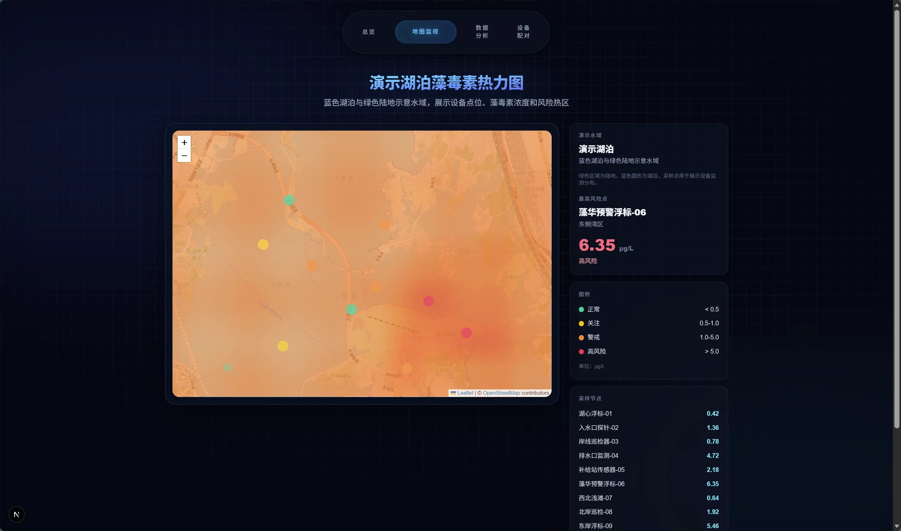
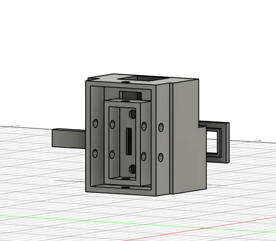
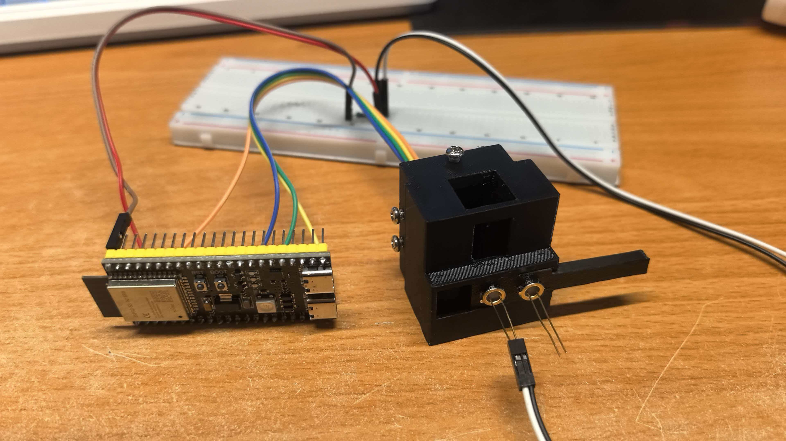
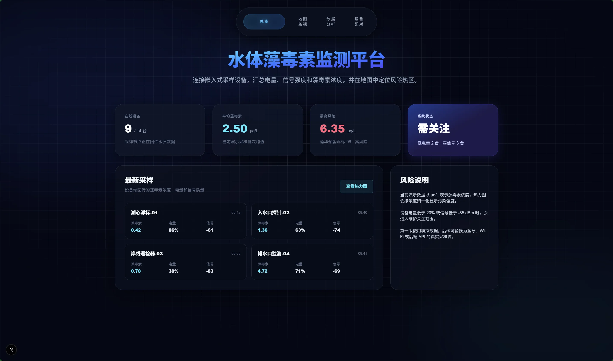
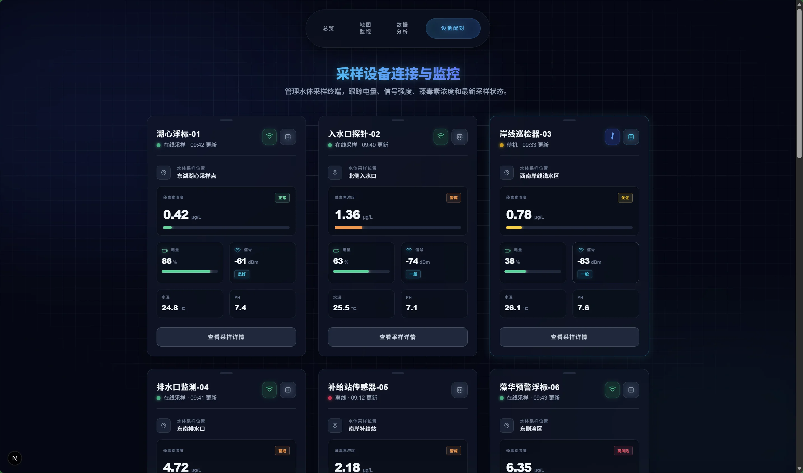
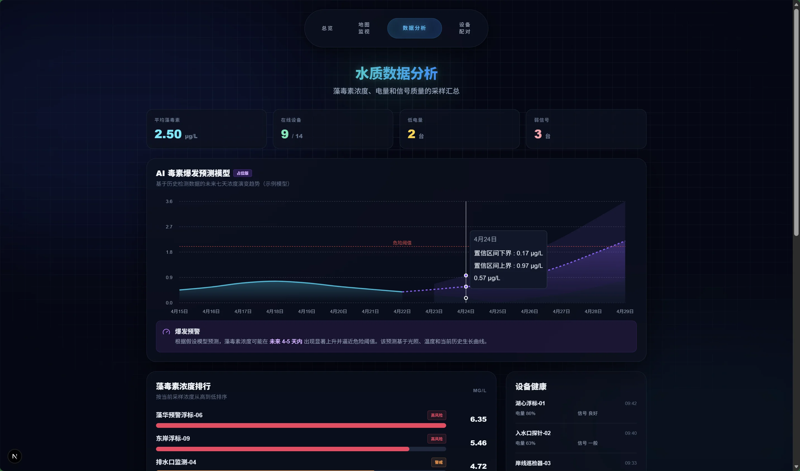

# iGEM Dry Team 项目实施计划方案（完善版）

## 0. 项目定位与总目标
项目目标是构建一套无人机投放工程菌检测节点的闭环系统，用于实时监测与预警水体藻毒素风险。

### 0.1 当前真实状态（2026-04-22）

| 模块 | 状态 | 关键进展 |
|------|------|---------|
| 数学建模 | 已完成全流程 | 3 数据集 (HABs/Lake Erie/SF Estuary) 清洗、XGBoost+LightGBM 集成训练、SHAP 解释，Lake Erie 分类 AUC=0.943 |
| 检测装置 | 面包板 Demo | 3D 结构设计 + 实物验证完成，PCB 版本待开发 |
| Web 平台 | Demo 展示 | 总览/设备配对/数据分析/地图页已搭建，实时数据流待接入 |
| 无人机系统 | 未开发 | 部件采购完成，闭环中断点在”任务执行与投放”环节 |

### 0.2 现实化阶段目标
1. M0（可演示）：三个 Demo 可稳定复现，统一输入输出协议。
2. M1（可联调）：检测端、模型端、网页端打通，支持模拟任务闭环。
3. M2（可外场）：无人机完成可控试飞与投放，形成真实外场最小闭环。
4. M3（可答辩）：闭环可重复运行，具备对照实验和完整评审证据。

系统核心闭环如下：
1. 预测模型输出时空风险与不确定性。
2. 调度系统生成飞行与投放任务。
3. 无人机执行任务并投放检测节点。
4. 节点回传实测数据与设备状态。
5. 模型增量更新并重新决策下一轮任务。

最终交付物：
1. 可运行的预测与调度引擎。
2. 可执行的无人机投放与检测链路。
3. 可展示的 Web 态势大屏与复盘系统。
4. 可答辩的 iGEM 评审证据包。

---

## 1. 计算生物学模块（辅助 Wet 组）
### 1.1 目标
用计算生物学手段降低 Wet 实验试错成本，提升工程菌构建效率。

### 1.2 输入
1. 藻毒素相关靶蛋白与候选受体序列。
2. 文献中已报道的结合位点与突变信息。
3. Wet 组实验反馈结果。

### 1.3 输出
1. 候选结合位点排序清单。
2. 候选突变策略建议。
3. 每轮建议的证据说明与风险标注。

### 1.4 关键里程碑
1. 完成毒素-受体候选库整理。
2. 完成一轮结构预测与对接筛选。
3. 输出可供 Wet 组直接测试的首批候选位点。

### 1.5 验收标准
1. Wet 组可依据清单直接开展实验，不需要二次解释。
2. 每个候选位点都附带来源、评分与不确定性说明。

---

## 2. 数学建模模块
### 2.1 子模块 A：藻毒素浓度预测
#### 目标
输出可解释、可部署的浓度预测与风险等级。

#### 输入
1. 历史水质、气象、毒素数据。
2. 实时节点回传数据。
3. 外部天气预报数据。

#### 输出
1. 未来 24-72 小时风险热力图。
2. 红黄蓝分级预警结果。
3. 预测不确定性评分。

#### 关键里程碑
1. ~~统一特征工程与数据字典。~~ ✅
2. ~~建立 XGBoost、LightGBM、Ensemble 基线对比。~~ ✅
3. ~~增加 SHAP 解释与不确定性输出。~~ ✅
4. ~~从 Demo 脚本升级为可重复运行的训练与推理流水线。~~ ✅
5. 接入实时节点回传数据，实现在线推理。
6. 实现增量更新与模型版本管理。

#### 当前进展

已完成三个数据集的全流程建模（数据清洗 → 特征工程 → 模型训练 → 评估 → SHAP 解释）：

**数据集规模：**

| 数据集 | 来源 | 样本数 | 特征维度 |
|--------|------|--------|---------|
| HABs Training | EPA NLA 全国湖泊调查 | 3,663 条 | 45 维 |
| Lake Erie | 伊利湖长期监测 | 2,659 条 | 23 维 |
| SF Estuary | 旧金山河口监测 | 437 条 | 25 维 |

**核心性能指标（Ensemble 测试集）：**

| 指标 | HABs Training | Lake Erie | SF Estuary |
|------|:---:|:---:|:---:|
| 分类 ROC-AUC | 0.847 | **0.943** | 0.811 |
| 分类 F1 | 0.674 | **0.894** | 0.615 |
| 回归 R² | 0.319 | **0.742** | 0.329 |
| 回归 RMSE (μg/L) | 4.83 | 1.40 | 0.43 |

**SHAP 关键驱动因子：** 叶绿素 a、总氮 (NTL)、水温、月份 (季节性) 在三个数据集中均为 Top 驱动因子。

详细评估报告见 `model/reports/dataset_evaluation_report.md`。

#### 待完成事项
1. 接入节点实时数据流，替代历史数据推理。
2. 构建在线推理 API，支持 Web 平台调用。
3. 增加预测区间输出（不确定性量化）。
4. 按时间序列划分验证，替代随机划分。

#### 当前模型输出示意

毒素浓度风险热力图：



### 2.2 子模块 B：空气动力学与扩散模型
#### 目标
实现投放命中修正与水体扩散评估。

#### 当前状态
仅处于方案设计阶段，尚未形成可验证原型。

#### 输入
1. 无人机飞行参数与载荷参数。
2. 风速风向与高度信息。
3. 水体流速与边界条件。

#### 输出
1. 投放风偏修正参数。
2. 检测节点覆盖半径评估。
3. 扩散趋势模拟结果。

#### 验收标准
1. 实测投放偏差显著低于无修正策略。
2. 扩散模拟与实测趋势方向一致。

---

## 3. 硬件模块
### 3.1 ESP32 检测节点
#### 目标
实现低功耗、稳定、可回传的数据采集终端。

#### 当前进度
已完成面包板 Demo 验证。

当前 Demo 证据图如下：

检测装置三维结构设计图 1：


检测装置三维结构设计图 2：



检测装置实物 Demo 图：



#### 后续任务
1. 完成 PCB 版本设计与焊接。
2. 实现离线缓存和断点续传。
3. 完成防水封装与连续运行测试。
4. 增加设备自检状态码。
5. 建立 72 小时连续运行稳定性测试。

#### 验收标准
1. 数据包完整率达到目标阈值。
2. 断网恢复后历史数据可补传。
3. 连续运行时长满足单轮任务需求。

### 3.2 无人机与投放装置
#### 目标
实现可重复、可校准、可追溯的投放流程。

#### 当前进度
无人机尚未开发成功，当前仅完成部件采购与初步方案讨论。

#### 后续任务
1. 第一步先完成无人机基础飞行成功标准定义（起飞、悬停、降落、返航）。
2. 完成空载试飞并记录至少 20 架次稳定日志。
3. 在空载稳定后再进行载荷试飞与返航安全策略验证。
4. 完成舵机或电磁投放机构联调，并建立投放偏差标定数据集。
5. 若第 2 步未达标，立即切换“人工布点 + 无人机模拟轨迹”备选流程，保证项目推进不断档。

#### 验收标准
1. 空载阶段：连续 20 架次无严重飞控异常。
2. 载荷阶段：悬停稳定性和返航逻辑通过测试。
3. 投放阶段：投放命中半径满足任务要求。
4. 安全阶段：故障触发时可自动中止并返航。

---

## 4. 任务调度与系统中台
### 4.1 目标
把模型结果自动转化为可执行任务，并实现全链路审计。

### 4.2 输入
1. 风险图与不确定性图。
2. 无人机状态和电量。
3. 天气窗口、禁飞区、人员值守信息。

### 4.3 输出
1. 任务单与航点序列。
2. 投放时序和中止条件。
3. 单任务复盘报告。

### 4.4 验收标准
1. 高峰时段任务生成可在可接受时间内完成。
2. 可行任务率与执行成功率满足阈值。
3. 每次任务都可回溯到模型版本和输入数据版本。
4. 在无人机未成功前，系统必须支持“模拟执行模式”，确保闭环算法可继续迭代。

---

## 5. Web 平台模块
### 5.1 目标
构建服务团队与利益相关方的统一可视化平台。

### 5.2 页面能力
1. 实时地图：无人机轨迹、投放点、节点在线状态。
2. 风险看板：浓度预测热力图与分级预警。
3. 复盘页面：预测值与实测值偏差、任务成功率。
4. 告警中心：设备离线、异常漂移、极端风险提示。

### 5.3 当前状态
当前为 Demo 页面，需优先完成以下两项最小化升级：
1. 接入真实或模拟实时数据流，不再仅展示静态样例。
2. 增加任务时间线与告警日志，支持评审追溯。

当前网页 Demo 界面如下：

总览页示意：



设备配对与监控页示意：



数据分析页示意：



### 5.4 验收标准
1. 桌面端和移动端均可稳定访问。
2. 核心告警可在目标时延内推送。
3. 关键图表可导出用于答辩与报告。

---

## 6. 模块间接口协议与数据流

### 6.1 系统数据流总览

```
检测节点 (ESP32) ──MQTT──→ 数据中台 ──HTTP──→ Web 平台
                                ↑                      ↑
                           数据库存储            模型推理 API
                                ↑                      ↑
                           历史数据 ─────────→ 预测模型
                                                     ↓
                                              风险预测结果
                                                     ↓
                                              任务调度引擎 ──→ 无人机/模拟执行
```

### 6.2 接口定义

#### 接口 A：检测节点 → 数据中台（上行数据）

| 字段 | 说明 |
|------|------|
| 协议 | MQTT (QoS 1) |
| Topic | `sensor/{device_id}/data` |
| 频率 | 每 5 分钟上报一次 |
| 数据格式 | JSON |

```json
{
  "device_id": "ESP32-001",
  "timestamp": "2026-05-01T10:05:00Z",
  "battery_mv": 3700,
  "status": "NORMAL",
  "readings": {
    "water_temp": 22.5,
    "ph": 7.8,
    "turbidity": 15.3,
    "chla": 12.6,
    "dissolved_oxygen": 8.2
  }
}
```

#### 接口 B：预测模型 → 任务调度 / Web 平台

| 字段 | 说明 |
|------|------|
| 协议 | HTTP REST API |
| 路径 | `POST /api/v1/predict` |
| 数据格式 | JSON |

```json
{
  "region": "lake_erie",
  "forecast_hours": 48,
  "input_features": { "...": "..." },
  "output": {
    "risk_level": "HIGH",
    "probability": 0.87,
    "predicted_concentration_ugl": 3.2,
    "confidence_lower": 1.8,
    "confidence_upper": 5.6,
    "model_version": "ensemble_v2.1"
  }
}
```

#### 接口 C：任务调度 → 无人机 / 模拟执行器

| 字段 | 说明 |
|------|------|
| 协议 | HTTP REST API |
| 路径 | `POST /api/v1/task` |
| 数据格式 | JSON |

```json
{
  "task_id": "TASK-20260501-001",
  "mode": "SIMULATED",
  "waypoints": [
    {"lat": 41.73, "lng": -83.04, "alt_m": 30, "action": "HOVER"},
    {"lat": 41.74, "lng": -83.05, "alt_m": 15, "action": "DROP"}
  ],
  "drop_count": 3,
  "abort_conditions": {
    "battery_pct_below": 20,
    "wind_speed_ms_above": 8.0
  },
  "model_version": "ensemble_v2.1",
  "input_data_hash": "sha256:abc123"
}
```

#### 接口 D：数据中台 → Web 平台（WebSocket 推送）

| 字段 | 说明 |
|------|------|
| 协议 | WebSocket |
| 事件类型 | `sensor_update` / `risk_alert` / `task_status` |

```json
{
  "event": "risk_alert",
  "timestamp": "2026-05-01T10:10:00Z",
  "region": "lake_erie",
  "risk_level": "HIGH",
  "message": "检测到高风险：MIC 检出概率 87%，预测浓度 3.2 μg/L"
}
```

### 6.3 设备状态码定义

| 状态码 | 含义 | 处理建议 |
|--------|------|---------|
| `NORMAL` | 正常运行 | 无需操作 |
| `LOW_BATTERY` | 电量低于 20% | 安排回收更换 |
| `SENSOR_WARN` | 传感器读数异常 | 检查探头，触发定标 |
| `OFFLINE` | 设备离线超 15 分钟 | 排查网络或硬件 |
| `WATER_INGRESS` | 检测到湿度异常 | 安排回收检查封装 |

---

## 7. 12 周执行排期（2026-04-21 ~ 2026-07-13）

> 注：模型模块已完成全流程（第 1-2 周的模型任务已提前完成），排期据此调整。

| 周次 | 日期 | 主要任务 | 交付物 |
|------|------|---------|--------|
| 第 1 周 | 04/21 - 04/27 | 冻结 Demo 版本，统一数据字典和接口协议，模型上线推理 API | 接口协议文档、推理 API |
| 第 2 周 | 04/28 - 05/04 | ~~模型训练流程~~ ✅ → 补充预测区间输出和在线推理联调 | 在线推理服务、不确定性量化 |
| 第 3 周 | 05/05 - 05/11 | 网页 Demo 接入实时流，打通任务时间线与告警日志 | 实时数据流、告警推送 |
| 第 4 周 | 05/12 - 05/18 | ESP32 进入 PCB 设计评审，完成通信与缓存联调 | PCB 设计图、缓存测试报告 |
| 第 5 周 | 05/19 - 05/25 | 无人机基础飞行调试：起飞、悬停、降落、返航 | 飞行日志、问题清单 |
| 第 6 周 | 05/26 - 06/01 | 空载 20 架次稳定性测试；若未达标则启动人工布点备选 | 稳定性报告或备选流程文档 |
| 第 7 周 | 06/02 - 06/08 | 任务调度最小版本：支持真实执行与模拟执行双模式 | 调度引擎 v0.1 |
| 第 8 周 | 06/09 - 06/15 | 投放机构台架联调，输出投放偏差标定方案 | 投放偏差数据集 |
| 第 9 周 | 06/16 - 06/22 | 首次半闭环演练（模型+调度+网页+模拟/真实执行） | 演练复盘报告 |
| 第 10 周 | 06/23 - 06/29 | 修复半闭环瓶颈，推进自动训练与版本回滚 | 修复清单、自动化流水线 |
| 第 11 周 | 06/30 - 07/06 | 外场最小闭环演练并形成失败复盘 | 外场报告、证据包 |
| 第 12 周 | 07/07 - 07/13 | 固化答辩证据包、对照实验结果与演示脚本 | 答辩完整资料 |

---

## 8. 风险清单与备选方案
1. 传感器漂移：触发信号为短时波动异常，缓解为定标与温补，兜底为邻近节点投票。
2. 网络不稳定：触发为丢包与延迟升高，缓解为本地队列，兜底为任务后集中回传。
3. 投放偏差过大：触发为命中率下降，缓解为风偏修正，兜底为近岸人工布设。
4. 续航不足：触发为任务中低电量，缓解为调度约束，兜底为分段任务。
5. 新水域泛化差：触发为误差抬升，缓解为迁移学习，兜底为规则阈值预警。
6. 标签延迟：触发为补标堆积，缓解为弱监督流程，兜底为冻结模型版本。
7. 防水失效：触发为湿度告警，缓解为浸泡测试，兜底为双层封装。
8. 调度超时：触发为任务生成延迟，缓解为启发式先求可行解，兜底为模板航线。
9. 禁飞限制：触发为审批失败，缓解为提前备案，兜底为岸基采样验证。
10. 公众疑虑：触发为负面反馈上升，缓解为透明沟通，兜底为先展示非活体流程。
11. 接口不一致：触发为联调频繁失败，缓解为接口契约，兜底为适配层转换。
12. 演示故障：触发为彩排不稳定，缓解为故障注入演练，兜底为离线回放方案。

---

## 9. iGEM 评审对齐策略
1. Innovation：强调预测-投放-反馈-再学习的闭环创新，而非单一预测模型。
2. Engineering：保留每轮设计、构建、测试、学习证据链，体现工程迭代。
3. Human Practices：引入环保部门、社区、渔业用户反馈并反哺技术决策。
4. Safety：同步覆盖生物安全与飞行安全，设置可执行中止和回滚机制。
5. Integrated Human Practices：把访谈结果映射为阈值、任务规则和界面信息层级。
6. Presentation：用一张总闭环图和一条真实任务时间线讲清系统价值。

---

## 10. 本周立即执行清单
1. 输出一页当前状态基线表，明确哪些是 Demo、哪些已可联调。
2. 冻结模型 Demo 输入输出字段，新增风险分级与不确定性字段。
3. 冻结网页 Demo 页面结构，优先接入实时流与告警日志。
4. 完成 ESP32 断网补传测试并记录失败场景。
5. 给无人机制定“成功标准四件套”：起飞、悬停、降落、返航。
6. 完成无人机首轮空载调试并输出问题清单。
7. 制定无人机未成功时的人工布点备选流程。
8. 输出任务调度模拟执行模式的最小接口定义。
9. 召开一次闭环联调会，逐段确认阻塞点和负责人。
10. 形成本周复盘文档，给出下周只做三件最关键事情。

---

