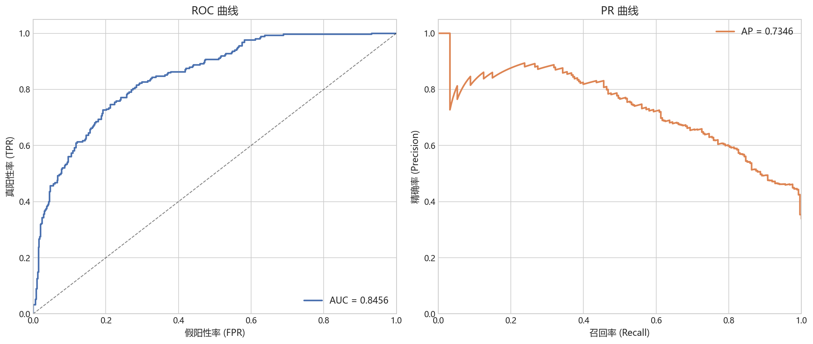
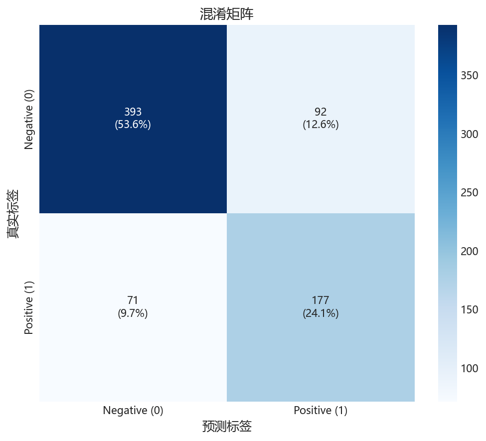
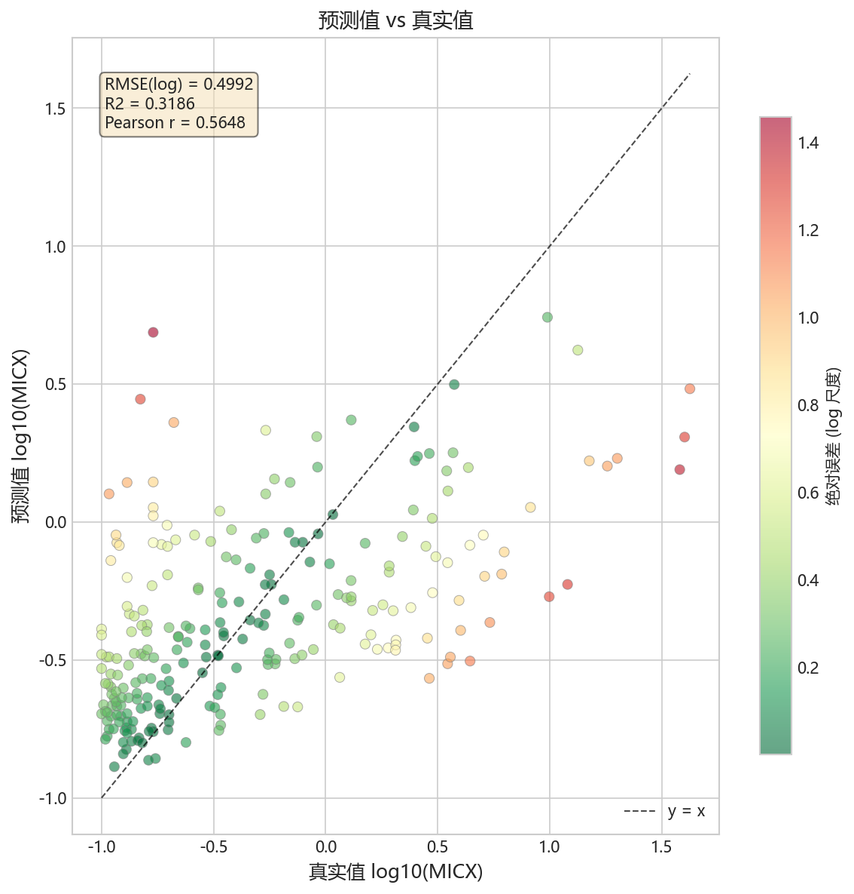
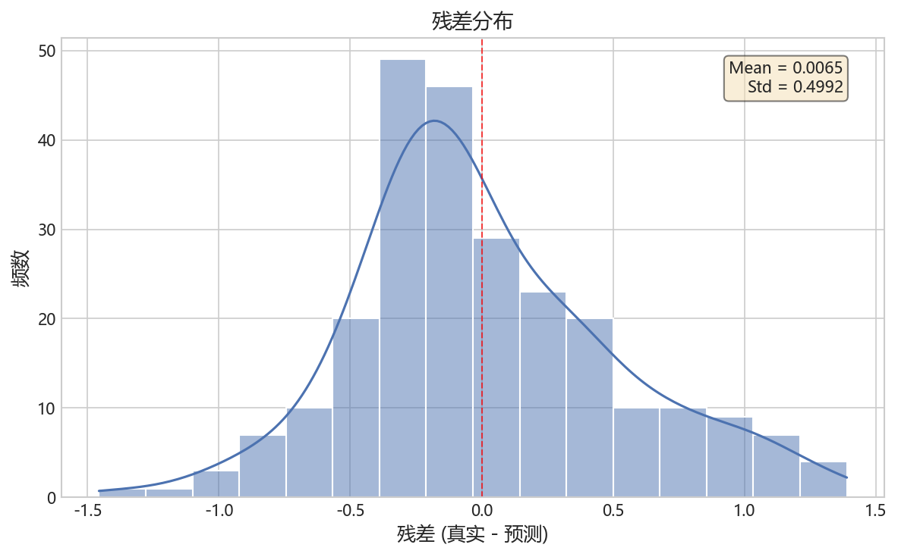
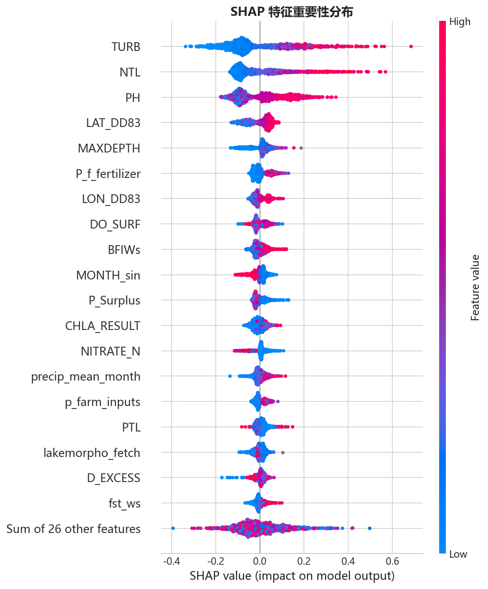
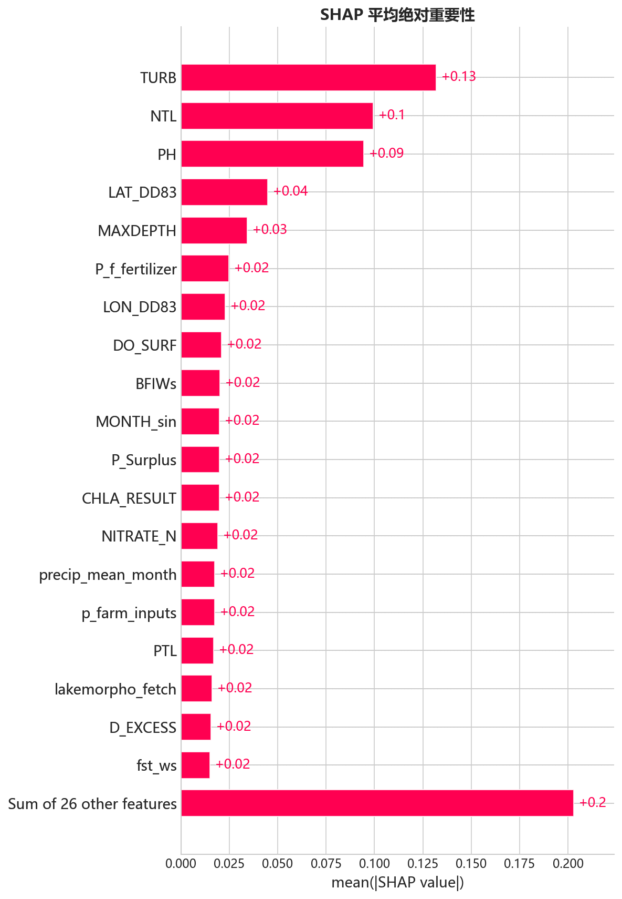
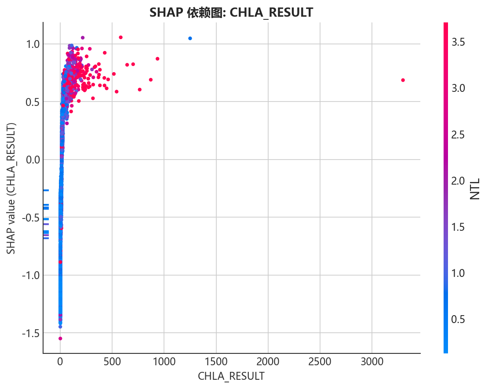
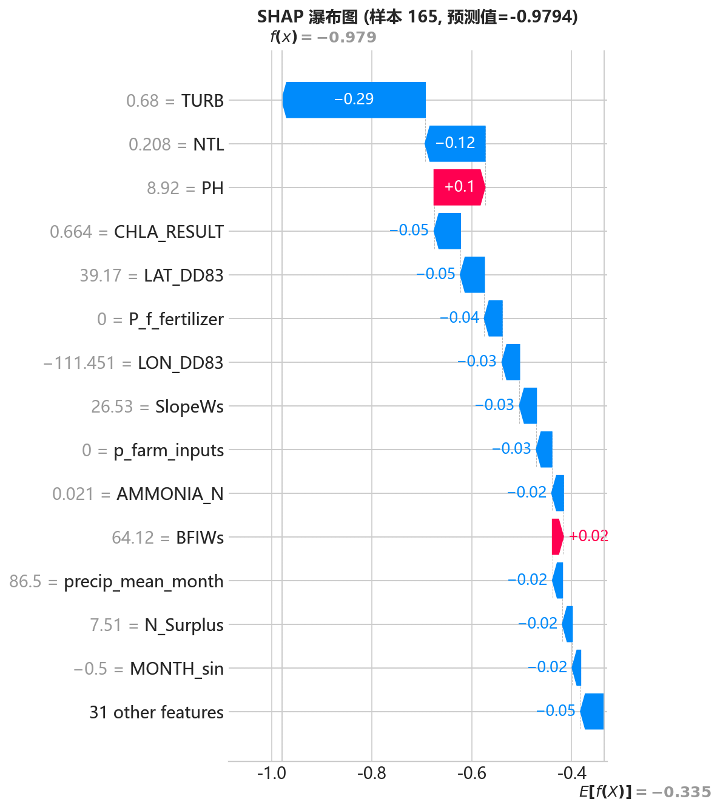

# CyanoHABs 蓝藻水华预测模型 — 数学建模报告

## 1. 项目背景

蓝藻水华（Cyanobacterial Harmful Algal Blooms, cyanoHABs）是全球性的水环境问题，产生的微囊藻毒素（Microcystin）威胁饮用水安全和生态系统健康。本项目基于美国 EPA 国家湖泊评估（National Lakes Assessment, NLA）2007/2012/2017 三轮调查数据，构建蓝藻水华预测模型，实现：

- **分类任务**：预测湖泊是否检测到微囊藻毒素（MICX_DET: 0/1）
- **回归任务**：预测微囊藻毒素浓度（log₁₀(MICX), μg/L）

## 2. 数据集

### 2.1 数据来源

主训练数据来自 `v2_habs_training_cleaned.parquet`（3,664 行 × 73 列），覆盖美国 NLA 三轮全国湖泊调查。

| 属性 | 值 |
|------|-----|
| 总样本量 | 3,664 个湖泊-采样事件 |
| 调查年份 | 2007, 2012, 2017 |
| 时间跨度 | 2007-05 ~ 2017-10 |
| 目标变量 | MICX（微囊藻毒素浓度），MICX_DET（检测标志） |

### 2.2 目标变量分布

- **MICX_DET**（分类）：0 = 2,422 (66%), 1 = 1,241 (34%)，缺失 1 条
- **MICX**（回归）：1,241 个有效值（66% 缺失），范围 0.1~225 μg/L，原始偏度 15.4，log₁₀ 变换后偏度 1.09

### 2.3 特征工程

从 73 列原始特征中，经以下处理得到 45 个建模特征：

1. **丢弃标识符**：SITE_ID, UNIQUE_ID, VISIT_NO, COMID, DATE_COL
2. **去除冗余 N/P 预算列**：15 个 N 预算列 → 4 个代表列，10 个 P 预算列 → 3 个代表列（消除 r > 0.7 的多重共线性）
3. **去除共线性**：KffactWs（与 AgKffactWs 高度相关），wet_ws（与 agr/dev/fst 共线性）
4. **衍生时间特征**：MONTH_sin, MONTH_cos（从采样日期提取月份，sin/cos 周期编码）
5. **分类编码**：AG_ECO3 → one-hot（3 类），P_Legacy_P_outlier → int

| 特征组 | 列数 | 代表变量 |
|--------|------|----------|
| 水质 | 12 | TEMPERATURE, PH, CHLA_RESULT, NTL, PTL, DO_SURF, TURB 等 |
| 气候 | 4 | EVAP_INFL, D_EXCESS, precip/temp_mean_month |
| 土地利用 | 3 | agr_ws, dev_ws, fst_ws |
| 地形 | 7 | lakemorpho_fetch, BFIWs, ElevWs, SlopeWs 等 |
| N 预算 | 4 | N_Surplus, N_Total_Inputs, N_Fert_Farm, N_livestock_Waste |
| P 预算 | 3 | P_Surplus, P_f_fertilizer, P_human_waste_kg |
| 聚合输入 | 4 | n/p_farm_inputs, n/p_dev_inputs |
| 位置 | 2 | LAT_DD83, LON_DD83 |
| 衍生 | 3 | MONTH_sin, MONTH_cos, P_Legacy_P_outlier |
| 分类 one-hot | 3 | AG_ECO3_xxx |

### 2.4 缺失值策略

- 水质核心特征缺失率 < 1.5%
- N/P 预算特征缺失率 ~15.4%（同一批湖泊缺失）
- **策略**：不做显式填充，XGBoost/LightGBM 树模型原生处理 NaN（学习最优缺失值分裂方向）

## 3. 模型设计

### 3.1 模型选型

采用 **XGBoost + LightGBM 集成学习**，理由：

- 树模型在表格数据上表现优异，对特征尺度不敏感
- 原生支持缺失值处理
- 可解释性强（特征重要性、SHAP 值）
- 训练速度快，适合迭代实验

### 3.2 数据划分

- **主策略**：分层随机划分 (80/20)，按 DSGN_CYCLE × 目标变量联合分层
- **交叉验证**：5-fold stratified CV，分类按 MICX_DET 分层，回归按 MICX 四分位数分层

### 3.3 超参数配置

| 参数 | XGBoost | LightGBM |
|------|---------|----------|
| n_estimators | 500 | 500 |
| max_depth | 5 | 5 |
| learning_rate | 0.05 | 0.05 |
| subsample | 0.8 | 0.8 |
| colsample_bytree | 0.8 | 0.8 |
| reg_alpha | 0.1 | 0.1 |
| reg_lambda | 1.0 | 1.0 |
| early_stopping | 50 rounds | 50 rounds |
| 类别不平衡处理 | scale_pos_weight=1.95 | is_unbalance=True |

### 3.4 集成策略

- XGBoost 和 LightGBM 独立训练
- 分类任务：预测概率平均
- 回归任务：log₁₀ 预测值平均

## 4. 训练结果

### 4.1 分类任务（MICX_DET: 毒素是否检测到）

**测试集表现：**

| 模型 | ROC-AUC | PR-AUC | Accuracy | F1 | MCC |
|------|---------|--------|----------|-----|-----|
| XGBoost | 0.8456 | 0.7346 | 0.7776 | 0.6847 | 0.5144 |
| LightGBM | 0.8448 | 0.7315 | 0.7708 | — | — |
| Ensemble | ~0.845 | — | — | — | — |

**ROC-AUC = 0.845** 表明模型具有良好的区分能力，能较好地识别检测到微囊藻毒素的湖泊。

**ROC 曲线与 PR 曲线：**

**混淆矩阵：**

### 4.2 回归任务（log₁₀(MICX) 浓度预测）

**5-fold 交叉验证平均指标：**

| 指标 | 值 | 含义 |
|------|-----|------|
| RMSE (log) | 0.5107 | 对数尺度均方根误差 |
| R² | 0.2873 | 方差解释率 |
| Pearson r | 0.5380 | 线性相关 |
| Spearman ρ | 0.5262 | 秩相关 |
| Within-factor-of-2 | 45.0% | 预测值在 2 倍范围内的比例 |
| MAE (原始) | 1.81 μg/L | 平均绝对误差 |

回归 R² = 0.29 表明微囊藻毒素浓度预测难度较高，这与 MICX 的高变异性和 66% 缺失率一致。Pearson r = 0.54 显示模型捕获了中等程度的线性关系。

**预测值 vs 真实值（Ensemble）：**

**残差分布（Ensemble）：**

## 5. SHAP 模型解释

### 5.1 全局特征重要性

**SHAP 蜂群图** 展示了每个特征对模型预测的影响方向和大小。红色表示高特征值，蓝色表示低特征值，横轴为 SHAP 值（正值推高预测，负值压低预测）：

**SHAP 柱状图** 展示了各特征平均绝对 SHAP 值的排名：

### 5.2 分类模型 Top 10 关键特征

| 排名 | 特征 | mean \|SHAP\| | 生态学解释 |
|------|------|--------------|-----------|
| 1 | CHLA_RESULT | 0.529 | 叶绿素 a 浓度反映藻类总生物量，是蓝藻水华的直接前兆 |
| 2 | NTL | 0.505 | 总氮浓度是蓝藻生长的关键营养盐驱动因子 |
| 3 | PH | 0.312 | 高 pH 值与藻类光合作用消耗 CO₂ 相关 |
| 4 | NITRATE_N | 0.177 | 硝酸盐是蓝藻可直接利用的氮源 |
| 5 | lakemorpho_fetch | 0.170 | 湖泊形态影响风浪混合和营养盐再悬浮 |
| 6 | TURB | 0.167 | 浊度反映水体悬浮物和藻类密度 |
| 7 | ElevWs | 0.168 | 流域海拔影响气候和土地利用模式 |
| 8 | SlopeWs | 0.166 | 流域坡度影响地表径流和营养盐输入 |
| 9 | DO_SURF | 0.154 | 表层溶解氧受藻类光合/呼吸作用影响 |
| 10 | LON_DD83 | 0.149 | 经度反映地理区域差异（气候带） |

### 5.3 回归模型 Top 10 关键特征

| 排名 | 特征 | mean \|SHAP\| | 生态学解释 |
|------|------|--------------|-----------|
| 1 | TURB | 0.132 | 浊度是毒素浓度的最强预测因子 |
| 2 | NTL | 0.099 | 总氮浓度驱动毒素产生 |
| 3 | PH | 0.095 | pH 值与藻类活动密切相关 |
| 4 | LAT_DD83 | 0.045 | 纬度反映气候带差异 |
| 5 | MAXDEPTH | 0.034 | 湖深影响分层和营养盐循环 |
| 6 | P_f_fertilizer | 0.025 | 农业磷肥输入是面源污染来源 |
| 7 | LON_DD83 | 0.023 | 经度差异 |
| 8 | DO_SURF | 0.021 | 溶解氧 |
| 9 | BFIWs | 0.020 | 基流指数反映地下水贡献 |
| 10 | MONTH_sin | 0.020 | 采样月份（季节效应） |

### 5.4 特征依赖图

SHAP 依赖图揭示了 Top 特征对模型预测的非线性效应。以叶绿素 a（CHLA_RESULT）为例，可以观察到：

当 CHLA_RESULT 值升高时，SHAP 值显著正向偏移，即高叶绿素浓度强烈指示微囊藻毒素的存在。这印证了藻类生物量与毒素产量的直接关联。

### 5.5 单样本解释（瀑布图）

瀑布图展示了模型对单个湖泊的预测是如何由各特征贡献叠加得到的。

以高毒素预测样本为例：

红色特征推高预测值，蓝色特征压低预测值，从基准值（E[f(x)]）出发逐特征叠加，最终得到该样本的预测值。

### 5.6 核心发现

1. **叶绿素 a 和总氮是最强预测因子**：CHLA_RESULT 和 NTL 在两个任务中均排名前 2，印证了营养盐-藻类-毒素的级联关系
2. **pH 值是重要间接指标**：高 pH 反映强烈的光合作用活动，是蓝藻暴发的间接信号
3. **湖泊形态和地理因素显著**：fetch、elevation、slope 等特征表明湖泊的物理特征对水华风险有系统性影响
4. **季节效应存在但非主导**：MONTH_sin 排名第 10，说明采样月份对毒素浓度有一定影响

## 6. 模型局限性

1. **回归 R² 较低 (0.29)**：微囊藻毒素浓度变异性大，受采样时间、深度、分析方法等多因素影响
2. **MICX 66% 缺失**：回归模型仅基于 1,241 个有效样本训练
3. **时间泛化性未充分验证**：三轮调查跨度 10 年，未做严格的时间 holdout 验证
4. **空间自相关**：邻近湖泊可能共享相似特征，独立同分布假设不完全成立
5. **未纳入实时监测数据**：模型基于离散采样，未整合连续传感器数据

## 7. 输出文件

### 模型文件 (`models/`)

| 文件 | 说明 |
|------|------|
| classification_ensemble.joblib | 分类集成模型 |
| regression_ensemble.joblib | 回归集成模型 |

### 图表文件 (`figures/`)

| 目录 | 文件 | 说明 |
|------|------|------|
| XGBoost/ | confusion_matrix.png | 分类混淆矩阵 |
| | roc_pr_curves.png | ROC + PR 曲线 |
| | predicted_vs_actual.png | 回归预测 vs 实际 |
| | residuals.png | 残差分布 |
| LightGBM/ | 同上 | 同上 |
| Ensemble/ | 同上 | 同上 |
| shap/ | shap_beeswarm.png | 全局特征重要性蜂群图 |
| | shap_bar.png | 平均绝对 SHAP 值排名 |
| | dependence/*.png | Top 特征依赖图 |
| | waterfall/*.png | 代表性样本瀑布图 |

## 8. 结论

本模型成功实现了基于环境特征的蓝藻毒素检测分类（ROC-AUC = 0.85）和浓度预测（Pearson r = 0.54）。模型揭示了叶绿素 a、总氮和 pH 值是蓝藻毒素的核心驱动因子，为湖泊水华风险评估提供了定量工具。
