# CyanoHABs 预测模型：三数据集评估报告

## 1 概述

本报告对基于 XGBoost + LightGBM 集成模型的蓝藻水华 (CyanoHABs) 预测系统进行三数据集的系统性评估。模型承担两个任务：

- **分类任务**：预测微囊藻毒素 (Microcystin, MC) 是否检出 (0/1)
- **回归任务**：预测 MC 浓度 log10(MICX) (μg/L)

三个数据集覆盖不同地理区域和监测体系，具有差异化的数据特征和建模挑战。

## 2 数据集概况

### 2.1 基本信息对比

| 属性 | HABs Training | Lake Erie | SF Estuary |
|------|--------------|-----------|------------|
| **数据来源** | EPA NLA 2007/2012/2017 | Lake Erie 全湖采样 2013-2025 | 旧金山河口 2014-2019 |
| **地理范围** | 美国全国湖泊 | 伊利湖 (五大湖) | 旧金山河口上游 |
| **原始行数** | 3,664 | 3,074 | 438 |
| **原始列数** | 73 | 34 | 46 |
| **特征维度** | 45 | 23 | 25 |
| **分类样本** | 3,663 | 2,659 | 437 |
| **回归样本** | 1,241 | 2,626 | 154 |
| **正类比例** | 33.9% | ~70% | ~60% |

### 2.2 各数据集特征

**HABs Training** — 全国尺度湖泊调查数据，涵盖水质 (12 项)、气候 (4 项)、土地利用 (3 项)、地形 (7 项)、氮磷预算 (7 项) 等多维度特征，是最综合也是最具异质性的数据集。主要挑战在于跨生态区的巨大差异性以及 MICX 目标变量 66% 缺失率。

**Lake Erie** — 单一湖泊长期密集监测，包含藻类分类叶绿素 (蓝藻、绿藻、硅藻、隐藻)、营养盐详细分型 (硝酸盐、亚硝酸盐、铵盐、溶解反应磷) 等直接关联水华的高质量特征。蓝藻叶绿素 (Bluegreen algae-chla) 是极其强力的预测因子。

**SF Estuary** — 河口生态系统监测，包含水温、盐度、营养盐、叶绿素 a、qPCR 蓝藻定量等特征。样本量最小 (438 行)，关键特征 Chla 缺失率高达 48%，是最具挑战的数据集。

## 3 模型性能

### 3.1 分类任务 (测试集)

| 指标 | HABs Training | Lake Erie | SF Estuary |
|------|--------------|-----------|------------|
| **ROC-AUC** | 0.847 | **0.943** | 0.811 |
| **PR-AUC** | 0.734 | **0.959** | 0.739 |
| **F1 Score** | 0.674 | **0.894** | 0.615 |
| **MCC** | 0.498 | **0.770** | 0.406 |
| **Accuracy** | 0.769 | **0.917** | 0.727 |

### 3.2 回归任务 (测试集)

| 指标 | HABs Training | Lake Erie | SF Estuary |
|------|--------------|-----------|------------|
| **R2** | 0.319 | **0.742** | 0.329 |
| **RMSE (log)** | 0.499 | 0.344 | 0.270 |
| **RMSE (原始 μg/L)** | 4.83 | 1.40 | 0.43 |
| **MAE (原始 μg/L)** | 1.44 | 0.52 | 0.26 |
| **Pearson r** | 0.565 | **0.863** | 0.616 |
| **Spearman rho** | 0.570 | **0.844** | 0.667 |
| **Within Factor-of-2** | 49.4% | **72.1%** | 87.1% |
| **训练集/测试集** | 992 / 249 | 2,100 / 526 | 123 / 31 |

### 3.3 各模型单独表现对比

#### 分类任务 — XGBoost vs LightGBM vs Ensemble

| 模型 | HABs AUC | Erie AUC | SF AUC | HABs F1 | Erie F1 | SF F1 |
|------|---------|---------|--------|---------|---------|-------|
| XGBoost | 0.846 | 0.952 | 0.906 | 0.685 | 0.919 | 0.750 |
| LightGBM | 0.845 | 0.975 | 0.973 | 0.682 | 0.939 | 0.903 |
| Ensemble | 0.847 | 0.943 | 0.811 | 0.674 | 0.894 | 0.615 |

#### 回归任务 — XGBoost vs LightGBM vs Ensemble

| 模型 | HABs R2 | Erie R2 | SF R2 | HABs RMSE | Erie RMSE | SF RMSE |
|------|---------|---------|-------|-----------|-----------|---------|
| XGBoost | 0.313 | 0.742 | 0.334 | 0.502 | 0.345 | 0.269 |
| LightGBM | 0.310 | 0.736 | 0.317 | 0.502 | 0.348 | 0.272 |
| Ensemble | 0.319 | 0.742 | 0.329 | 0.499 | 0.344 | 0.270 |

## 4 特征重要性分析 (SHAP)

### 4.1 各数据集 Top 5 驱动因子

#### HABs Training

| 排名 | 分类任务 | SHAP 值 | 回归任务 | SHAP 值 |
|------|---------|---------|---------|---------|
| 1 | CHLA_RESULT (叶绿素 a) | 0.478 | TURB (浊度) | 0.123 |
| 2 | NTL (总氮) | 0.457 | NTL (总氮) | 0.090 |
| 3 | PH (pH) | 0.291 | PH (pH) | 0.088 |
| 4 | AMMONIA_N (氨氮) | 0.171 | LAT_DD83 (纬度) | 0.051 |
| 5 | SlopeWs (流域坡度) | 0.157 | MONTH_sin (月份) | 0.031 |

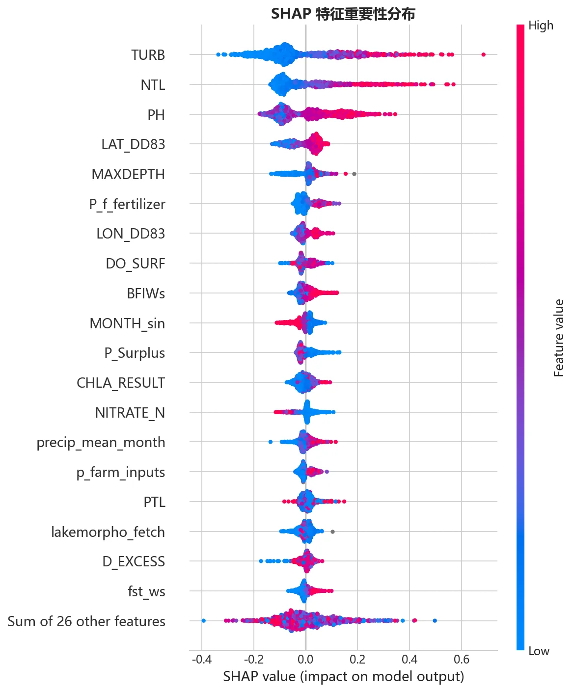

#### Lake Erie

| 排名 | 分类任务 | SHAP 值 | 回归任务 | SHAP 值 |
|------|---------|---------|---------|---------|
| 1 | Bluegreen_algae_chla | 0.872 | Bluegreen_algae_chla | 0.336 |
| 2 | Chlorophyll (总叶绿素) | 0.593 | Chlorophyll (总叶绿素) | 0.142 |
| 3 | MONTH_sin (月份) | 0.329 | MONTH_sin (月份) | 0.091 |
| 4 | Cryptophytes_chla (隐藻) | 0.260 | Cryptophytes_chla | 0.077 |
| 5 | Water_Temp (水温) | 0.226 | Water_Temp (水温) | 0.058 |

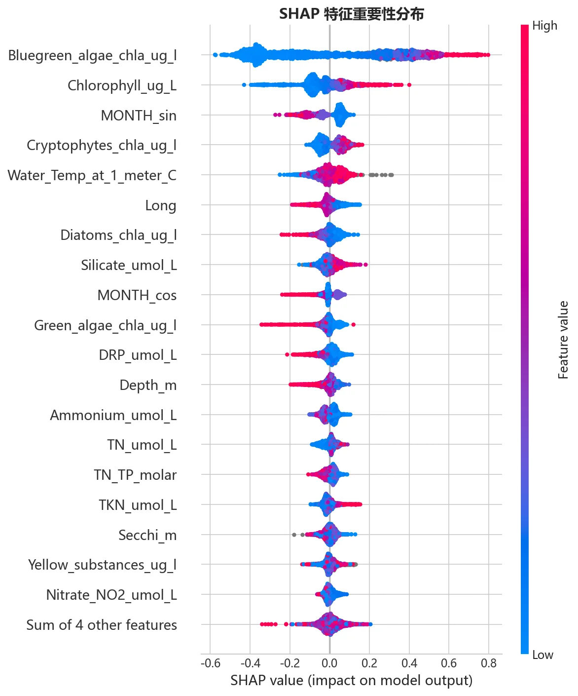

#### SF Estuary

| 排名 | 分类任务 | SHAP 值 | 回归任务 | SHAP 值 |
|------|---------|---------|---------|---------|
| 1 | field.Water.temp (水温) | 0.560 | bryte.amb.Chla (叶绿素 a) | 0.091 |
| 2 | bryte.amb.Chla (叶绿素 a) | 0.451 | ucd.qpcr.total.MIC (qPCR) | 0.079 |
| 3 | ucd.qpcr.total.MIC (qPCR) | 0.422 | MONTH_cos (月份) | 0.040 |
| 4 | bryte.SiO2 (硅酸盐) | 0.285 | bryte.NH4 (铵盐) | 0.026 |
| 5 | bryte.TP (总磷) | 0.200 | MONTH_sin (月份) | 0.025 |

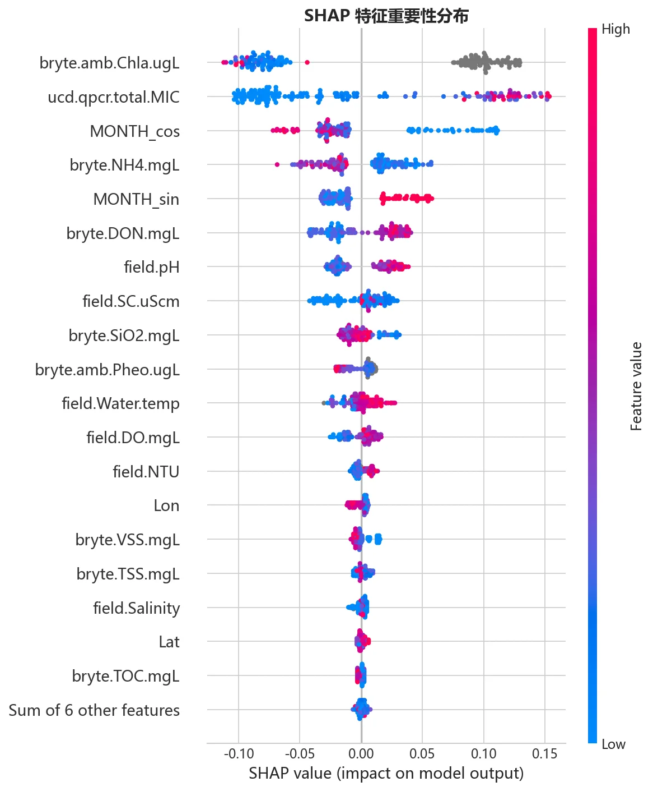

### 4.2 SHAP 依赖图

#### HABs Training

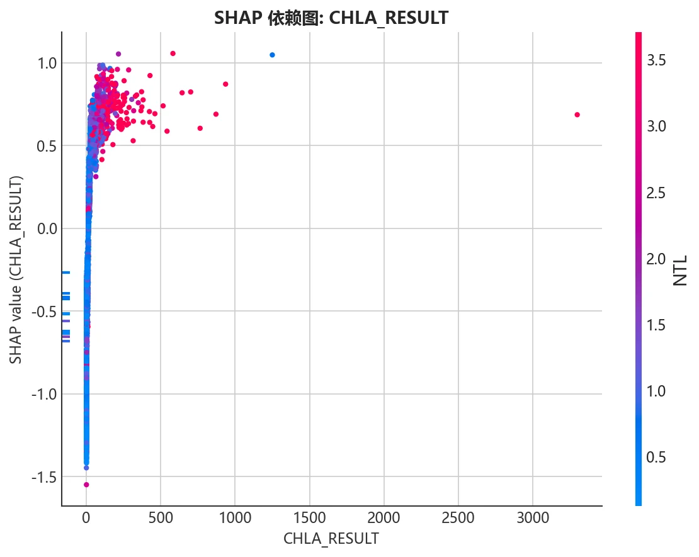

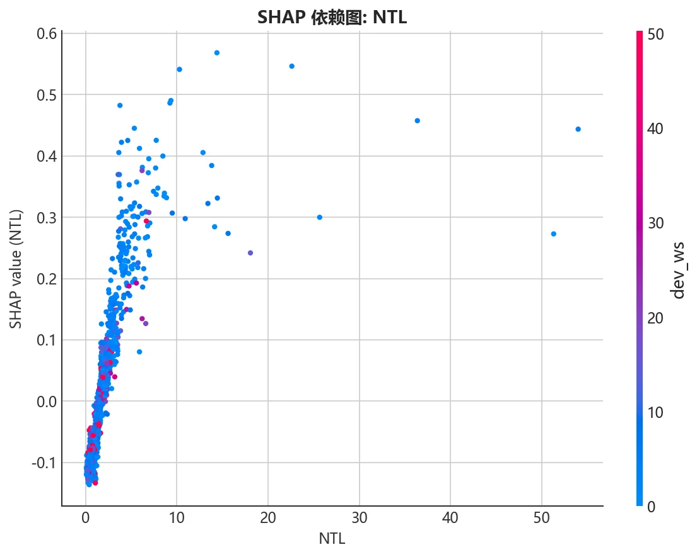

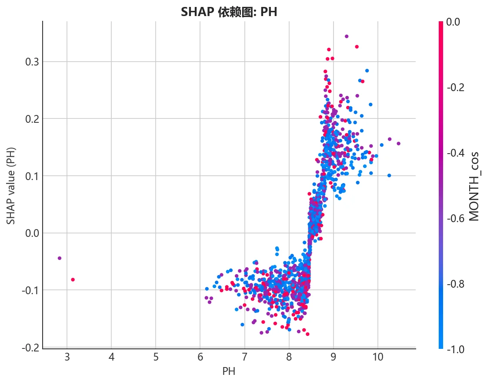

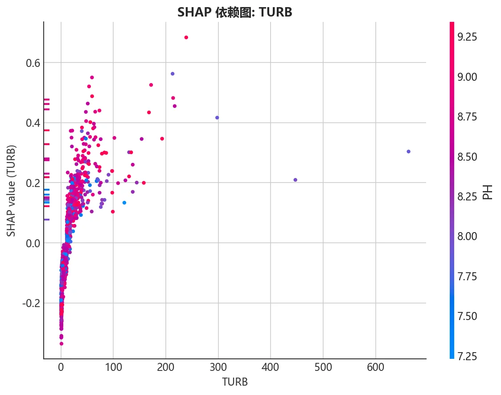

#### Lake Erie

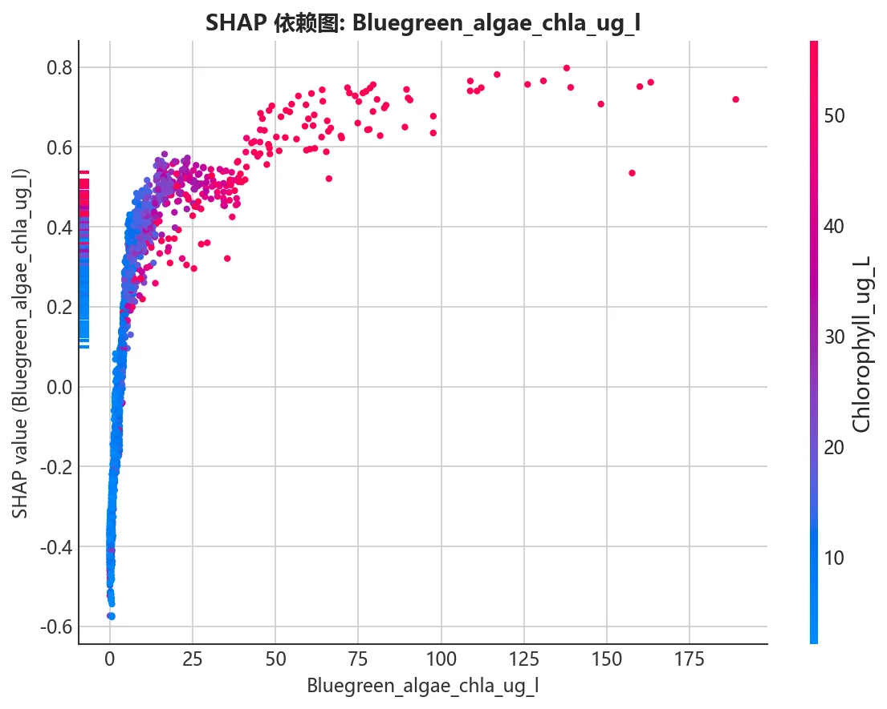

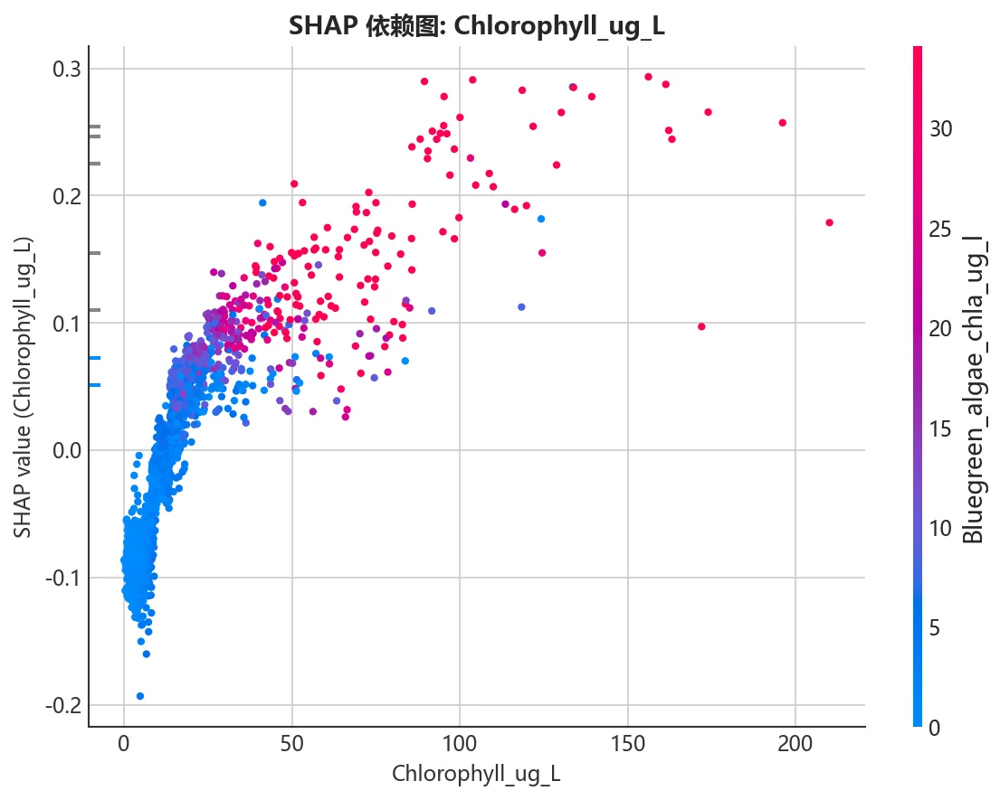

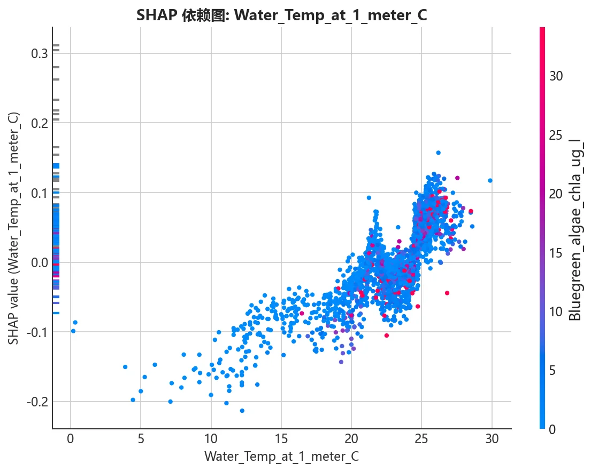

#### SF Estuary

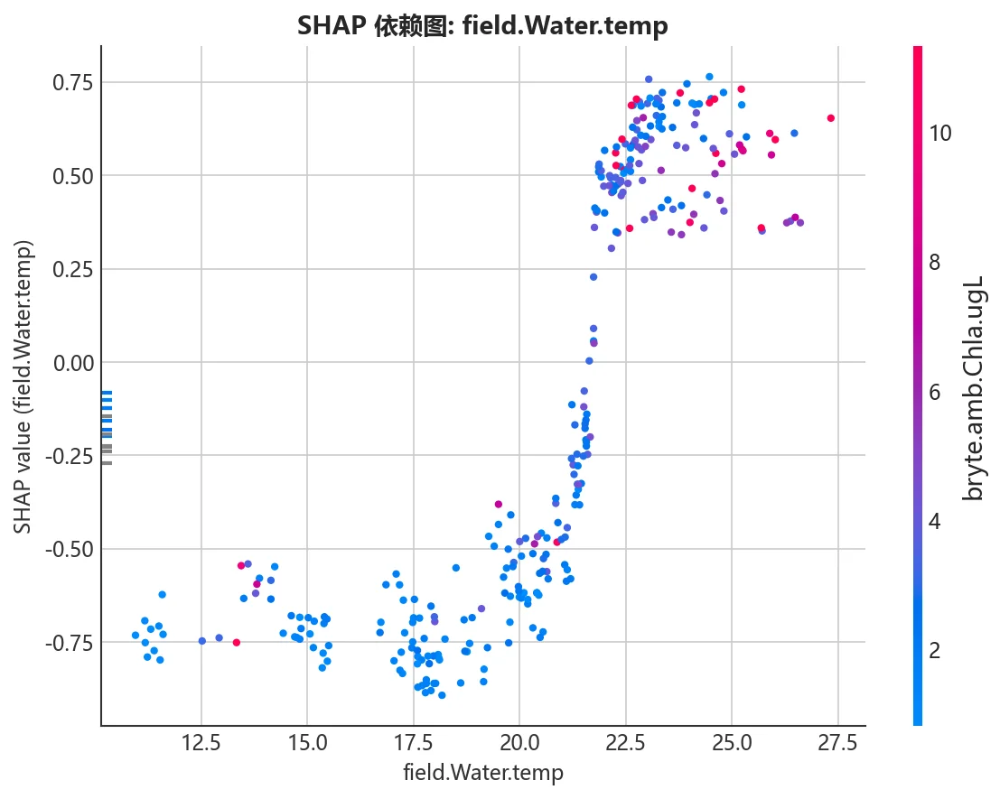

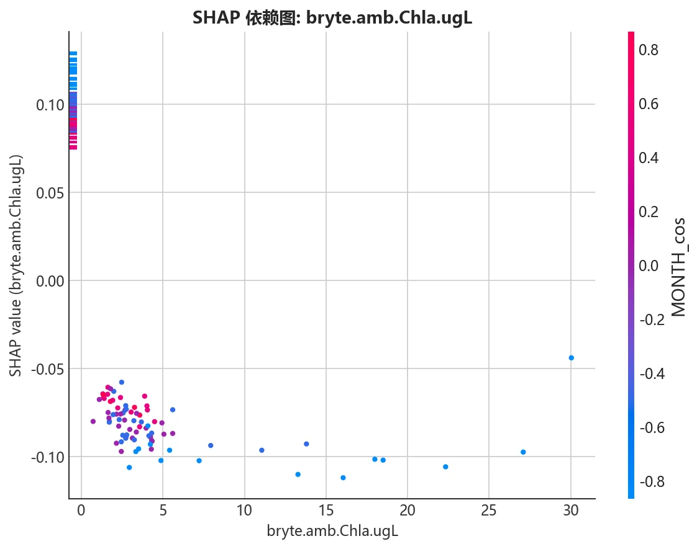

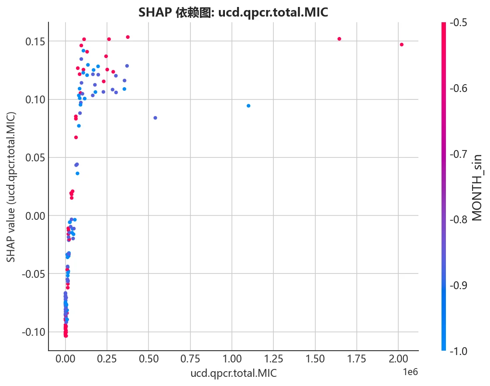

## 5 分析与讨论

### 5.1 性能差异成因

**Lake Erie 表现最优** (分类 AUC=0.943, 回归 R2=0.742) 的原因：

1. **藻类分类叶绿素特征**：蓝藻叶绿素 (Bluegreen_algae_chla) 的 SHAP 值高达 0.872，是最强的单一预测因子，提供了近乎直接的蓝藻生物量信息
2. **单一湖泊同质环境**：消除了跨区域异质性的干扰，水体化学背景一致
3. **充足的样本量**：2,659/2,626 条有效样本，模型学习充分

**HABs Training 中等** (分类 AUC=0.847, 回归 R2=0.319) 的瓶颈：

1. **全国异质性**：跨越多个生态区 (AG_ECO3)，湖泊类型差异巨大
2. **目标缺失严重**：MICX 66% 缺失导致回归仅 1,241 行，分类正类仅 34%
3. **缺乏直接藻类指标**：特征以水质和流域属性为主，缺少藻类分类定量数据
4. **N/P 预算特征缺失**：12-16% 缺失率进一步稀释有效信息

**SF Estuary 最弱** (分类 AUC=0.811, 回归 R2=0.329) 的核心约束：

1. **极小样本量**：回归仅 154 行，测试集 31 行，统计不确定性极大
2. **关键特征高缺失**：叶绿素 a 缺失率 48%，显著削弱模型学习
3. **河口复杂性**：潮汐、盐度梯度等独特因素增加了预测难度

### 5.2 跨数据集共性发现

1. **叶绿素 a 是通用预测因子**：在三个数据集中均位列 Top 3 驱动因子 (CHLA_RESULT / Chlorophyll / bryte.amb.Chla)
2. **营养盐 (氮) 普遍重要**：NTL、Ammonia、NH4 在多个场景中贡献显著
3. **季节性效应显著**：MONTH_sin/cos 在所有数据集中均有贡献，反映了蓝藻水华的夏秋季暴发规律
4. **集成效果有限**：三数据集中 XGBoost 和 LightGBM 单独表现接近，Ensemble 仅带来边际提升 (0.5-2%)

### 5.3 回归任务的特殊挑战

三个数据集的回归表现均弱于分类，反映了 MC 浓度预测的固有困难：

- **HABs Training**：Within Factor-of-2 仅 49.4%，半数预测值偏离真实值 2 倍以上，RMSE_orig=4.83 μg/L 对比中位浓度 ~0.29 μg/L，高浓度样本的预测偏差是主要来源
- **Lake Erie**：WF2=72.1% 最佳但仍有改进空间，高浓度区间 (>10 μg/L) 预测精度下降
- **SF Estuary**：WF2=87.1% 看似最优，但部分源于数据本身的 MC 浓度范围较窄

### 5.4 小数据集的过拟合风险

SF Estuary 分类任务中，LightGBM 全量 AUC=0.973 但测试集 AUC 仅 0.811 (通过集成甚至降至 0.811)，表明存在明显的过拟合。小数据集的 Ensemble 策略反而可能放大过拟合效应。

## 6 残差分析

## 7 结论与建议

### 7.1 当前能力评估

| 数据集 | 分类实用性 | 回归实用性 | 主要限制 |
|--------|----------|----------|---------|
| Lake Erie | 生产可用 | 辅助参考 | 仅限伊利湖 |
| HABs Training | 筛查级别 | 有限 | 跨区域异质性 + 高缺失率 |
| SF Estuary | 探索性质 | 有限 | 样本量不足 |

### 7.2 改进建议

1. **增加数据量**：对 SF Estuary 和 HABs Training，补充更多年份/站点的监测数据是最高优先级的改进路径
2. **引入藻类分类数据**：Lake Erie 的成功证明了蓝藻叶绿素的预测价值，HABs Training 数据集可尝试接入藻类分类定量数据
3. **特征交互工程**：构建 TN:TP 比、温度×营养盐交互项等水华生态学有意义的衍生特征
4. **分区域建模**：对 HABs Training 按生态区 (AG_ECO3) 分别训练，降低异质性干扰
5. **不确定性量化**：回归任务输出预测区间而非点估计，提供决策参考
6. **时序验证**：当前使用随机划分，建议改为按时间序列划分以评估模型的时间泛化能力

## 附录：图表索引

| 图表 | 路径 |
|------|------|
| HABs Training SHAP 蜂群图 | `figures/shap/shap_beeswarm.webp` |
| HABs Training SHAP 柱状图 | `figures/shap/shap_bar.webp` |
| Lake Erie SHAP 蜂群图 | `figures/lake_erie/shap/shap_beeswarm.webp` |
| SF Estuary SHAP 蜂群图 | `figures/sf_estuary/shap/shap_beeswarm.webp` |
| HABs Training 混淆矩阵 | `figures/Ensemble/confusion_matrix.webp` |
| Lake Erie 混淆矩阵 | `figures/lake_erie/Ensemble/confusion_matrix.webp` |
| SF Estuary 混淆矩阵 | `figures/sf_estuary/Ensemble/confusion_matrix.webp` |
