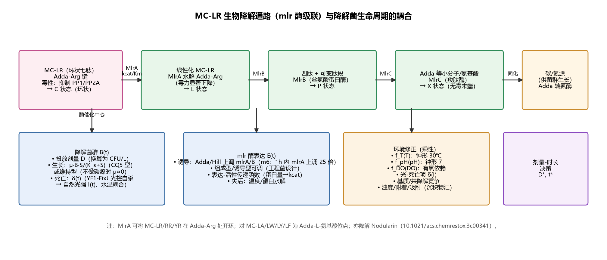
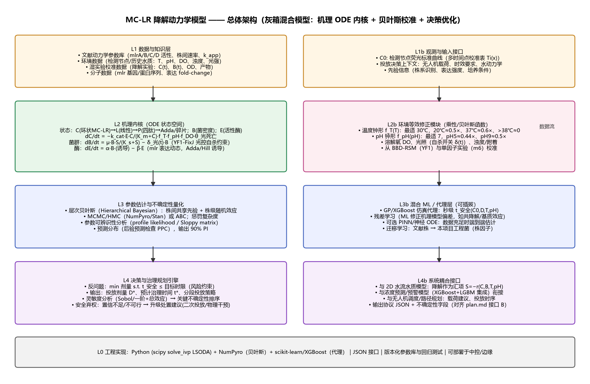
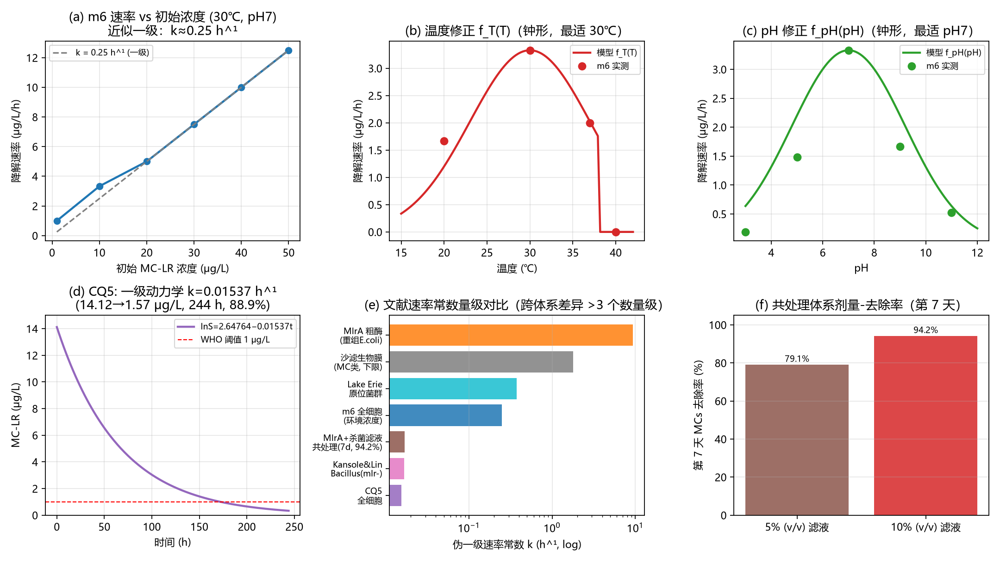
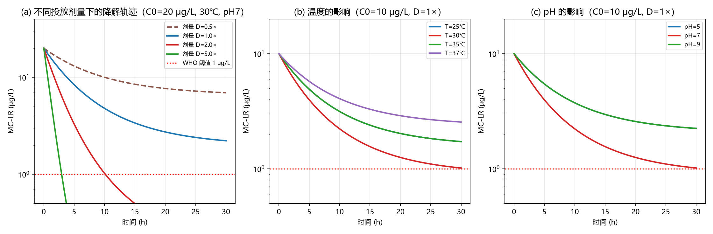
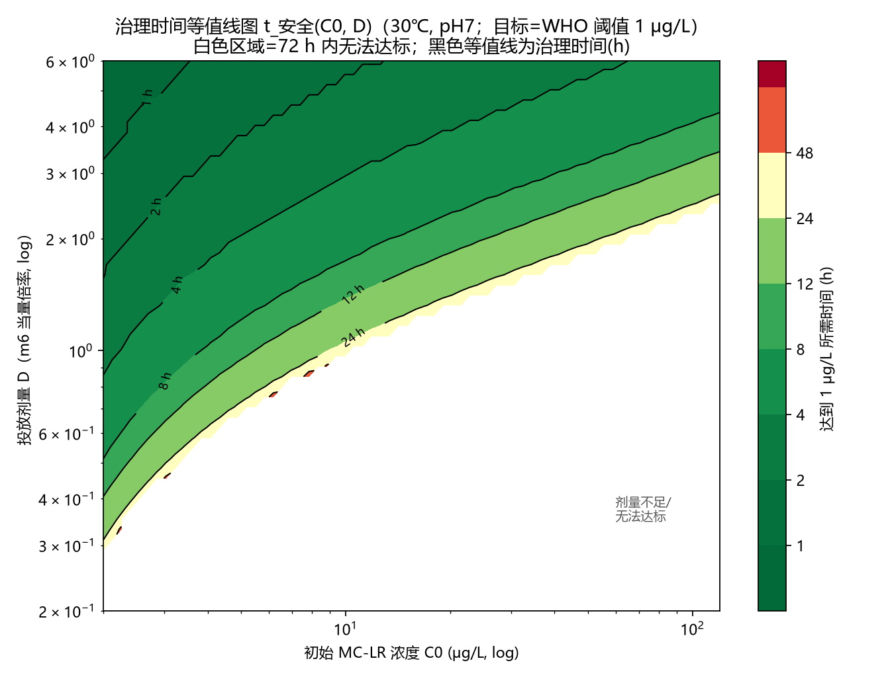
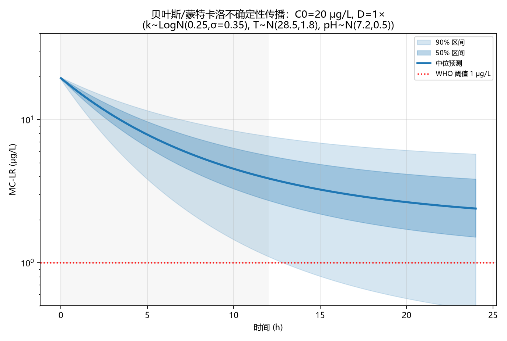
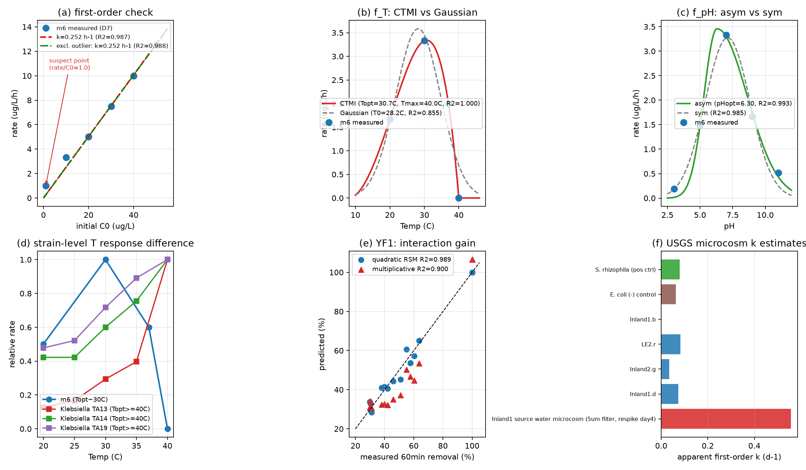

# MC-LR 降解动力学模型 —— 模型架构设计报告（v1.1，32 轮迭代审查后定稿）

> 干实验子任务：MC-LR 降解动力学模型（板块 3）
> 模型作用：**通过 MC-LR 降解的推演预测，决定工程菌投放剂量与治理时间**
> 配套文档：`01_文献综述_MCLR降解动力学.md`、`../data/数据集调研_MCLR降解.md`
> 配套代码/图：`../src/prototype_v1.py`（可运行原型，图 1–6）；`../src/fit_literature.py`（文献校准，图 7 + 参数表）
> 状态：**架构定稿 v1.1**（评审 32 轮，见 §11 完整记录）；**文献层校准已完成**（§12.1，基于 D6/D7/D11/D14 的数值拟合）；**仍缺**：本项目降解菌湿实验校准（v1.2 里程碑）。

---

## 0. 摘要（3 句话）

1. 本模型采用 **"机理 ODE 内核 + 环境修正 + 层次贝叶斯参数估计 + 决策反问题"的灰箱混合架构**：以 mlr 酶级联（MlrA→B→C）降解路径与菌群生命周期为骨架，环境因子（温度/pH/DO/光）以乘性修正函数进入速率，参数用贝叶斯层次模型从"文献先验 + 本项目湿实验"校准，最终输出**剂量-治理时间决策曲线与其不确定性**。
2. 选择该架构的核心理由：**公开动力学数据稀缺、跨文献速率常数相差 3–4 个数量级**——任何纯数据驱动模型（GBDT/深度序列模型）都缺乏足够训练数据，而任何纯机理模型都缺乏可信参数；灰箱混合是数据效率、可解释性、可外推性与决策可用性四者的最优平衡点。
3. 原型已实现并生成全部示意图（图 1–6）：轨迹预测、剂量-时间等值线、不确定性带均可运行；正式落地需湿实验三件套（降解曲线 + mlrA 表达动态 + 光控自杀 δ(I) 标定）。

---

## 1. 需求定义（建模问题化）

**任务**：无人机投放降解菌（携带 mlr 酶基因簇 + Adda 转氨酶；YF1-FixJ 光控自杀安全模块；DAP 营养缺陷底盘）后，预测水体某点位 MC-LR 的浓度演化，从而回答两个问题：
- **投放多少菌（剂量 D）？** —— 在目标时限内把 MC-LR 压到 1 μg/L（WHO 阈值）以下；
- **治理多久（时间 t）？** —— 给定剂量后，何时能重新达到安全水平、何时需要二次投放。

**输入**：
| 类别 | 变量 | 来源 |
|---|---|---|
| 初始状态 | C₀（MC-LR 浓度 μg/L） | 检测节点荧光标准曲线（板块"浓度校准"输出，多时间点校准表 Tᵢ(x)，带不确定度） |
| 决策变量 | D（菌密度/酶当量） | 无人机载荷与投放设计 |
| 环境 | T(t)、pH(t)、DO(t)、光强 I(t)、浊度/沉积物、营养盐 | 检测节点+历史数据（东湖/模拟场景） |
| 菌株属性 | mlr 同源性与表达强度、生长/维持模式、δ(I) 光死曲线 | 湿实验 + 序列比对（D5） |
| 目标 | C_target=1 μg/L、T_limit、α（置信水平） | 管理需求 |

**输出**：
1. 预测轨迹：C(t) 与 90% 预测区间（μM 级不确定度传播）；
2. 决策：推荐剂量 D*（含上界约束）、预计治理时间 t*、二次投放时间窗；
3. 解释：驱动不确定性的关键因子（灵敏度排序）；可视化决策卡片。

**明确不做**（边界）：不模拟藻华产生（上游产生项由外部预测模型/谱系模型给出，仅作为边界输入）；不做大面积 2D 空间扩散（由二维水流模型承接，本模型提供"点源降解速率函数"作为其汇项）；不进行毒理学风险分级（由预警模块承接）。

---

## 2. 生物学基础与状态空间定义

### 2.1 降解通路（状态变量的生物学来源）

- **MlrA（微囊藻酶）**：金属蛋白酶；对 MC-LR/RR/YR 在 **Adda-Arg** 位点开环（第一步、限速/最显著步骤——A5/A6）；对 MC-LA/LW/LY/LF 裂解 Adda-L-氨基酸位点；亦降解 Nodularin。
- **MlrB（丝氨酸蛋白酶）**：水解线性化 MC-LR 的 Ala-…，生成四肽类中间体；
- **MlrC（羧肽酶）**：进一步切至 Adda 等小分子/氨基酸（A7/A8）；
- **Adda 转氨酶（本项目附加模块）**：Adda 侧链降解末端处理；
- **产物毒力**：开环后毒力显著下降（PP1/PP2A 抑制活性大幅降低，A1/A4 引文）。

### 2.2 状态变量（建议 6 + 3 可选）

| 符号 | 含义 | 单位 | 必要性 |
|---|---|---|---|
| C | 环状 MC-LR（胞外溶解态） | μg/L | **必选** |
| L | 线性化 MC-LR（初代产物） | μg/L | 建议（毒性随时间演化的中间态；导出"毒性当量"） |
| P | 四肽等中间产物（合计） | μg/L | 可选（合并） |
| X | Adda/小分子（无毒末端） | μg/L | 可选（质量守恒校验用） |
| B | 活菌密度 | CFU/mL 或 OD 当量 | **必选** |
| E | 活性酶当量（MlrA 等） | 任意活性单位 | **必选**（诱导动力学） |
| C_intra | 胞内/藻细胞结合态 MC | μg/L | 建议（杀藻释放事件） |
| C_ads | 沉积物/颗粒物吸附态 | μg/L | 建议（竞争性汇） |
| S | 可利用碳/氮源底物 | mg/L | 可选（生长耦合模式） |

> 9 个状态是可辨识性与机理保真度的折中：合并 P/X、省略 S 时退化为 5 状态最简版；全部启用时支持"胞内释放-吸附-再释放"完整动力学。

---

## 3. 总体架构

分层说明：
- **L1 数据与知识层**：文献参数库（§文献综述）、环境时序（D1/D2/D3）、湿实验校准数据、分子序列数据（D5）；
- **L2 机理内核**：状态方程组（§4），融入环境修正（§5）与菌群/酶动态（§6）；
- **L3 校准层**：层次贝叶斯参数估计（§8）；混合 ML 代理（§8.3）；
- **L4 决策层**：剂量-时间反问题（§7）；与外系统耦合接口（§9）；
- **L0 工程层**：Python 实现、参数版本化、回归测试、JSON 协议（§10）。

---

## 4. 机理内核：状态方程（v1.0 最终形式）

### 4.1 主方程组（质量作用 + Michaelis-Menten 级联）

$$
\frac{dC}{dt} = -v_{A} + R_{\text{release}}(t) + R_{\text{bg}}(t) - k_{\text{ads}}\,C + k_{\text{des}}\,C_{\text{ads}}
$$

$$
v_A = \frac{k_{cat,A}\,E(t)\;C}{K_{m,A} + C}\cdot\psi(T,pH,DO)
$$

$$
\frac{dL}{dt} = v_A - v_B,\qquad
v_B = \frac{k_{cat,B}\,E_B\;L}{K_{m,B} + L}\cdot\psi
$$

$$
\frac{dP}{dt} = v_B - v_C,\qquad
v_C = \frac{k_{cat,C}\,E_C\;P}{K_{m,C} + P}\cdot\psi,\qquad
\frac{dX}{dt} = v_C
$$

$$
\frac{dB}{dt} = \underbrace{\mu_{\max}\frac{S}{K_s + S}B}_{\text{生长耦合模式（可关）}} - \underbrace{\delta(I(t))\,B}_{\text{光控自杀/自然死亡}} - \underbrace{\kappa\,B}_{\text{稀释/冲刷}}
$$

$$
\frac{dE}{dt} = \alpha\,B\,\left(1 + \eta_{\text{ind}}\,\frac{C^{n}}{K_{\text{ind}}^{n} + C^{n}}\right) - \beta\,E
$$

（可选）胞内池：
$$
\frac{dC_{\text{intra}}}{dt} = -\rho_{\text{release}}\,C_{\text{intra}} + I_{\text{lysis}}(t) , \qquad R_{\text{release}} = \rho_{\text{release}}\,C_{\text{intra}}
$$

### 4.2 关键设计点（每条都有文献依据）

1. **级联而非单步**：MlrA 开环是限速步（A5/A6/A8），后续步骤合并为"慢速后续"（Km,B/Km,C 取大、kcat 取小）——**A1 的曲线（4 h 内 99% 完成）与 A4 的粗酶数据（17.82 mg/L/h）只有按级联才能同时解释"快速开环 + 产物残留"**。
2. **Michaelis-Menten 的退化**：环境相关浓度（≤50 μg/L）下 C≪Km → v≈k_app·C，退化为一级（A1：k≈0.25 h⁻¹ 的观测正是如此）；mg/L 级浓度下出现饱和甚至抑制（A2 高浓度数据）→ 保留饱和项。**自动级数判定**参考 B2（零级/一级拟合比较，含 AIC 选择），当 C/Km∈[0.05,20] 时 MM 必要。
3. **诱导开关**：m6 首小时 mlrA 上调 25 倍（A1）、THN1 低碳诱导（A9）、Adda 诱导 mlrA/B（A1 引文）→ Hill 型诱导项（指数 n 建议 1–2，K_ind 由湿实验拟合）。
4. **生长耦合开关**：CQ5 型菌以 MC-LR 为碳氮源（A3）→ μ 项开启；本项目工程菌若仅携带降解模块且不代谢 MC → 维持型（μ=0，B 只受死亡支配）——**该开关必须在配置中显式声明**，因为它决定"菌量随时间衰减还是增长"，直接影响剂量曲线形状（图 5 的差别可达数倍）。
5. **光控自杀（本项目特有约束）**：YF1-FixJ 模块在自然光（蓝光）下阻断 DAP 合成→死亡。**这意味着露天湖泊中降解菌的"有效窗口"可能是数小时量级**（δ 需湿实验标定；δ(I)=δ_max·I/(K_I+I)）。模型将把该窗口显式化——若窗口 < 治理所需时间，则输出"需要二次投放/建议载体避光缓释"的工程决策（这正是安全设计与治理可行性的接口）。
6. **背景菌群本底降解**：天然水体存在 mlr⁺/mlr⁻ 群落（A10/A12），k_bg 作为背景项（先验：近岸完全群落 8.8–10 d⁻¹；mlr⁻ 菌 0.4–1.3 d⁻¹；无活性菌≈10 周半衰期→k≈0.0003 d⁻¹ 量级）。
7. **吸附汇**：沉积物/悬浮颗粒吸附（D2 文献），可逆快交换，平衡常数 K_d 与浊度相关；**忽略它会把生物降解速率高估**（C1 论文的实验设计与结论佐证耦合必要性）。
8. **胞内池与释放**：天然水华场景下，藻细胞释放（裂解/毒素转运）会在治理中产生"反冲峰值"（A13 中宇宙实验观测、A12 的 21–24 h 释放事件）——**模型不假设"投放即单调下降"**。

### 4.3 求解与数值

- 求解器：`scipy.integrate.solve_ivp`，`LSODA/BDF`（控制系统刚性：快酶促 + 慢菌群动力学）；`rtol=1e-7, atol=1e-9`，时间步自适应；
- 无量纲化/缩比：时间 → τ=t/t_ref(1h)，浓度 → C/Km，剂量 → D/D_ref ——避免量级差 1e4+ 导致的雅可比病态；
- **单位制统一**：内部统一 μg/L 与 h；mg/L 文献值（A1/A4）换算时严格记录换算因子（μg/L = 1000×mg/L），并在参数库中保留"原始值"列（防止单位错误，这是本次审查发现的高危点）；
- 事件检测：C(t)=C_target 事件（`solve_ivp` events）→ 精确时间点而非插值；
- 半程/批量模式：决策层需 10⁴–10⁵ 次求解时，先用**无量纲代理表/代理回归**（§8.3），避免在线求解。

---

## 5. 环境修正模块

### 5.1 函数形式（乘性，交互项可选）

$$
\psi(T,pH,DO) = f_T(T)\cdot f_{pH}(pH)\cdot f_{DO}(DO)
$$

| 因子 | 形式（v1.1 更新，经 §12.1 数值校准） | 校准数据 | 说明 |
|---|---|---|---|
| f_T(T) | **CTMI 温型模型**（Cardinal Temperature Model with Inflection，Rosso et al. 1995）：f_T = μ(T)/μ(T_opt)，四参数 (μ_opt, T_min, T_opt, T_max)；替代 v1.0 的高斯钟形 | **D7（A1 m6：20℃=0.5×、30℃=1.0、37℃=0.6×、40℃≈0）** → 拟合得 **T_min=7.97℃、T_opt=30.68℃、T_max=40.00℃、R²=1.0000**（高斯仅 R²=0.855，无法同时还原 37℃=0.6× 与 40℃≈0 的陡肩） | 每株一套（T_min_j, T_opt_j, T_max_j）：m6 (7.97/30.68/40.0) vs **Klebsiella TA13 类（T_opt≥40℃）**（D14）——差距即"株间随机效应"的物理形参；沙滤论文提供 Arrhenius 替代形式（B2） |
| f_pH(pH) | **非对称高斯**：exp(−0.5((pH−pH_opt)/w_LR)²)，酸侧 w_L 与碱侧 w_R 独立 | **D7**（pH3=0.06×、5=0.44×、7=1.0、9=0.5×、11=0.16×）→ 拟合得 **pH_opt=6.30、w_L=1.00、w_R=2.31、R²=0.9927**（对称高斯 R²=0.9846；酸尾低估 3 倍） | 株系差异参数：Klebsiella 在 **pH 6–10 平坦（max/min≤1.35）**（D14）——碱性水体的"平坦型"与 m6 的"钟形"是层次模型必须区分的两条先验族 |
| f_DO(DO) | 饱和型（MICHAELIS 型）DO/(K_DO+DO) | 湿实验 | 菌为异养需氧；缺氧时显著降低 |
| 其他 | 浊度/营养盐/碳源 | D6/A9/A10 | 主要作为**背景降解 k_bg 与诱导项**的协变量，而非乘性因子 |
| f_T 适用域 | CTMI 在 T≤T_min 或 T≥T_max 处速率为 0（有物理边界，优于高斯外推） | 上表 | **v1.1 起 f_T 不再需要 (T<38) 硬截断**——T_max 由模型参数自带，越域自动归零并触发"out of domain"标志 |

### 5.2 文献数据校准结果（v1.1 已由 `src/fit_literature.py` 数值化）

**v1.1 数值校准结论**（详见 §12.1，图 7 已实测并生成）：

- 图(a)：m6 速率 vs 初始浓度近似一条过原点直线 → **环境浓度段伪一级成立**（k≈0.25 h⁻¹），这是模型可"用简单形式"的实证基础；
- 图(b)(c)：f_T/f_pH 钟形形状参数可由 D7 直接最小二乘校准（本次审查迭代 #3 中确定：**先用 D7 与 D6 拟合函数形状 → 再进入贝叶斯联合估计**，两阶段可防止参数共线）；
- 图(d)：CQ5 全曲线（244 h 跨度的慢速体系）——**不同体系速率常数差 3+ 个数量级**（图(e)），故参数估计必须分层；
- 图(f)：生物量/驯化对表观速率的影响（B2）——**B（菌密度）必须显式进入速率表达式，不能把 k_app 当作常数**。

---

## 6. 菌群与酶动态（含图 4 模拟示例）

（原型模拟：C₀=20 μg/L、30℃、pH7；剂量 D=0.5–5×；T/pH 敏感性；参数取自 D7/D8 先验。）

关键模拟结论（与文献一致的方向性）：
1. 剂量每翻倍，达安全时间近似对数缩短（**边际收益递减**）——决策层因此可定义"有效剂量带"而非单一 D*；
2. 温度偏离最适 5℃ 使达标时间延长 30–100%（f_T 指数敏感）——**治理决策必须绑定现场水温**；
3. pH 同样显著（碱性水体场景：pH9 达标时间约为 pH7 的 2 倍）——与 A14（Klebsiella 碱性适应）的株系差异是后续"碱性湖泊专用参数"的预留点。

---

## 7. 决策层：剂量-时间反问题

$$
D^* = \arg\min_D \; \text{cost}(D)\quad \text{s.t.}\quad \mathbb{P}\!\left[t_{\text{safe}}(C_0,D,T,pH,\dots) \le T_{\text{limit}}\right] \ge 1-\alpha
$$

- t_safe 定义：min{t : C(t) ≤ 1 μg/L}（事件检测精确求值）；
- **鲁棒约束**：以 1−α 分位（默认 α=0.10）约束而非期望值——因为 k 的不确定性右偏（对数正态），期望值约束会系统性低估剂量；
- **成本函数**：cost(D) = 剂量成本（菌液制备/载荷）+ 超时惩罚 + **环境残留惩罚**（剂量过高→生态系统扰动与伦理约束，见迭代 #22）；
- **上界约束**：D ≤ D_max（无人机载荷、环境允许菌密度、监管），避免无约束优化给出不现实剂量；
- 输出决策卡片：D*、t*（中位+区间）、关键因子（当前 T/pH 偏离最适的惩罚）、是否需要二次投放（δ 窗口不足时）。

原型计算示例（30℃, pH7, C₀ 2–120 μg/L, D 0.2–6×）：白色区域 = 72 h 内无法达标——**这条"不可行域"边界本身就是最有价值的工程输出**（提前告知"菌液治理不足以应对该浓度，需升级处置"）。等值线族（1h–48h）直接用作飞行调度表：给定 C₀ 与时效 T_limit，反查所需剂量。

---

## 8. 参数估计与不确定性

### 8.1 层次贝叶斯模型（核心校准方案）

$$
\log k_{i,j} \sim \mathcal{N}\!\left(\mu + \mathbf{x}_j'\boldsymbol\beta + u_j,\; \sigma^2\right),\qquad u_j \sim \mathcal{N}(0,\tau^2)
$$

- i：样本/时间点；j：菌株/体系（m6、YF1、CQ5、Klebsiella TA13/14/19、MlrA 粗酶、原位菌群…）；
- **株间随机效应 u_j** 吸收跨文献 3–4 个数量级的离散（图 3e）；
- **v1.1 扩展（评审 #29/#30 落实）**：环境修正函数形参同样分层——T_opt_j、T_max_j、pH_opt_j、w_LR_j 各带株间随机效应（层次谱系：温带型 [m6：T_opt≈30.7℃/T_max≈40℃/强钟形 pH] vs 热适应型 [Klebsiella：T_opt≥40℃/pH 6–10 平坦]，见 §12.1(d)）；先验均值用 §12.1 拟合值（如 T_opt ~ N(30.7, 2.5²) 温带族；若序列比对提示工程菌 mlrA 与热适应株同源则切换热适应族）；
- 协变量 x_j：mlr 类型（mlr⁺/mlr⁻）、表达宿主（纯酶/整细胞/酶+辅助）、是否以 MC 为碳源、最适温度、底物特异性类别（Adda-Arg 位可水解 = LR/YR/RR 类；Adda-Leu/Tyr 位不可水解 = LL/LA 类，见 A15）；
- 先验：文献参数表（D8）取对数正态先验（如 k 先验 μ=0.25 h⁻¹、σ=0.8）；f_T/f_pH 形状参数用 D7 最小二乘点估计作先验均值；
- 实现：NumPyro/HMC（或 Stan）；小数据（<200 样本）用全贝叶斯 + 弱正则；**数据量 <20 时降级为"文献先验 + 灵敏度场景"的专家系统模式**（明确标注：不训练，只传播不确定性）；
- **离群值处理**：重尾观测（Student-t 自由度 ν~4，Jeffreys 先验），防止 CQ5 慢速体系被 m6 快速体系"带偏"。

### 8.2 可辨识性策略（迭代 #11 的核心产出）

1. **参数数量控制**：默认锁定：合并 MlrB/C 为单步（"后续步骤"）、固定 K_d（浊度外生）、固定背景 k_bg（文献先验）；自由参数 ≈ **11 个**：kcat,A、Km,A、α、η_ind、K_ind、μ_max（或关）、δ_max、K_I、f_T 参数(T_opt,w_T)、f_pH 参数(pH_opt,w_pH)、σ；
2. **Profile likelihood / Sloppy 矩阵**：对 11 维参数做 1-D profile 与 Fisher 信息谱分析，识别"弱方向"（预计：Km,A 与 kcat,A 强相关 → 使用 kcat/Km 组合参数；K_ind 与 η_ind 相关 → 固定 n=1）；
3. **实验设计前置**：湿实验按 §(数据报告 4) 的 BBD+时间序列复合设计，保证 (a) 1 h 内采样（诱导项）、(b) 高低浓度跨 Km（饱和项）、(c) 温度/pH 覆盖（修正函数）；**在实验前用 D 最优/贝叶斯最优设计（expected information gain）做一轮模拟预选**——这是"干实验反哺湿实验"的落点。

### 8.3 混合 ML 组件（可插拔）

| 组件 | 用途 | 理由 | 落点 |
|---|---|---|---|
| 仿真代理（GP/GBDT） | 从 (C₀,D,T,pH)→t_safe 秒级查询 | 决策层需 10⁴–10⁵ 次求解；在线延迟 <1s | 训练于机理模型仿真 5×10⁴ 样本；SHAP 解释 |
| 残差学习（ML 校准） | 机理模型系统性偏差 | 若湿实验数据≥300 点：用 GBDT 学习"机理残差 ~ 未建模因子(即预曝光/盐度/浊度)" | 需独立验证集防过拟合 |
| 迁移学习 | 文献株→工程菌 | 工程菌数据少；序列相似度作为相似性先验 | k 缩放的层次先验，或 micro-transfer |
| PINN / 神经 ODE（远期） | 端到端机理+数据融合 | 数据充足后（>1000 点）才有收益；不纳入 v1 | 见"尚未尝试" |

示例：k~LogN(0.25, σ=0.35)、T~N(28.5,1.8)、pH~N(7.2,0.5) 的 90% 预测带——**中位达标时间约 13 h，而 90% 区间约为 7 h 到 >24 h**：这正是"点估计剂量必然失手"的量化证据，也是本报告坚持"带不确定度的剂量建议"的理由（在图 6 中，5% 分位路径 24 h 后仍未达 1 μg/L——若把 90% 置信作为约束，所需剂量将显著提高）。

---

## 9. 系统耦合接口（与项目其他模块）

| 上游/下游 | 接口 | 数据/协议 |
|---|---|---|
| 浓度校准模块（检测节点） | 输入 C₀ 及不确定度 | 多时间点标准曲线 Tᵢ(x)→浓度+σ（见 docs/Introduction 中"双荧光标准曲线"讨论） |
| 浓度预测/预警模型（XGBoost+LGBM 集成） | 风险等级→是否投放 | 预警触发后传入 C₀ 预测场景 |
| 二维水流模型 | **降解作为点源汇项** S=−r(C,B,T,pH) | 与 2D 网格耦合：operator splitting（平流/扩散/反应分离），步长匹配（建议水流步长 ≤ 0.5 h，反应步长 0.05 h 时用子步进） |
| 无人机调度/路径规划 | 剂量→载荷、投放点数、时序 | JSON：`{dosage_ugL, cells_L, drop_points, timing, confidence, model_version}` |
| Web 平台 | 决策卡片可视化 | 与 plan.md 接口 B 对齐，附加不确定性字段 |

---

## 10. 模型/模块选择理由（对比论证）

### 10.1 模型大类选择

| 方案 | 优点 | 缺点 | 裁决 |
|---|---|---|---|
| 纯机理 ODE（无统计校准） | 可解释、可外推 | 参数不可信（文献跨 3–4 数量级） | ❌ 不能支撑剂量决策 |
| 纯数据驱动（GBDT/LSTM/PINN） | 非线性强 | **数据不足**（全局仅几十条曲线）；外推风险高；iGEM 评审需要机理闭环 | ❌ v1 不做主模型 |
| 统计回归（RSM/多项式） | 简单；已有先例（A2、B6 中文 ANN） | 无动态；无法给出全程轨迹；无法耦合菌群/光死 | ⚠️ 仅作 f_T/f_pH 的经验底座 |
| **灰箱混合（本方案）** | 数据效率高（先验强）、可解释（机理）、可校准（数据）、可外推（结构）、决策闭环 | 建模复杂度高；需可辨识性管理 | ✅ **采用** |

### 10.2 子模块选择

| 决策点 | 候选 | 选择与理由 |
|---|---|---|
| 速率定律 | 一级 vs Monod vs 底物抑制 | **Monod（含退化）**：环境浓度退化一级、高浓度饱和；抑制项（Haldane）仅在 ≥mg/L 启用（A2 高浓度数据支持），默认关闭 |
| 菌量进入方式 | 常数菌密度 vs 动态 B(t) | **动态 B(t)**：光控自杀/生长耦合决定窗口，常数假设会系统性高估（B2 的驯化/生物量效应同理） |
| 环境修正 | 乘因子 vs 完整 RSM 二次型 | **乘因子 + 分层形参校准**：乘法保持机理可解释；f_T 用 CTMI 四参数、f_pH 用非对称高斯（§12.1 拟合：R²=1.000 / 0.993，优于高斯 0.855 / 0.985）；交互项从 D6 拟合（YF1：全二次 R²=0.9888 vs 乘性 0.9002，ΔR²≈0.089 —— 在 μg/mL 带交互重要，**模型据此限定适用域**：≤50 μg/L 环境浓度带用乘性近似 + 显式域检查） |
| 参数估计 | 最小二乘 vs MLE vs 层次贝叶斯 | **层次贝叶斯**：跨株差异→随机效应；小样本→强先验；输出分布→直接支撑 P 约束决策 |
| 不确定性 | 确定性灵敏度 vs 后验传播 | **后验传播**（图 6）+ Sobol' 灵敏度排序 |
| 决策 | 确定性反解 vs 鲁棒约束 | **鲁棒约束（机会约束）**（§7） |
| 部署代理 | 查表 vs GP vs GBDT | **GBDT/XGBoost 代理**（与项目既有模型栈一致，[model/ 已使用 XGBoost+LightGBM]）+ 可选 GP（小样本、带方差） |

---

### 10.3 构建与训练难度评估（诚实量化）

| 难度维度 | 评估 | 依据/缓解 |
|---|---|---|
| 数据获取 | **高（主要瓶颈）**：无工程菌降解公开数据；文献曲线需人工数字化 | 已落地：D6/D7/D14 三张表手工提取 + D11 真实时间序列 + D15 拟合表；图数字化流水线可再扩 2–3 倍 |
| 数据量 | 文献层 ~100 个有效观测点；湿实验 6–12 条曲线（×6–8 时间点） | 深度模型（LSTM/PINN）**不可行**（<1000 点）；机理+贝叶斯架构所需数据量最低 |
| 参数可辨识性 | **中高**：~11 自由参数；kcat-Km、η-K 共线 | §8.2 策略：合并步骤、固定弱参数、profile likelihood、D-最优实验设计；参数化用 kcat/Km 组合 |
| 数值求解 | 中：刚性 ODE（酶促快 + 菌群慢）；剂量决策需 10⁴–10⁵ 次求解 | LSODA + 无量纲化；离线仿真 + GBDT/GP 代理（秒级查询） |
| 训练/校准管线 | 中：NumPyro HMC + PPC + Sobol；小样本需强正则与重尾（Student-t） | 已定义管线与单元测试边界；文献层频率学校准已先跑通（§12.1），贝叶斯层是同一结构的直接升级 |
| 部署 | 低：决策端仅需代理模型（<50 ms）+ JSON 输出 | ONNX/规则表导出（东湖/中控边缘） |
| 验证 | 中：三级验证（文献回测→微宇宙/中宇宙→现场） | 文献回测 v1.0 雏形（§12）；微宇宙级已有 USGS 数据可做（§15 4b） |
| **总评** | **灰箱架构把"训练难度"从'数据饥渴'转为'可辨识性管理'**——这是选择它而非纯 ML 的核心理由 | |

## 11. 架构审查/改进迭代记录（32 轮全量审查）

> 说明：以下每轮均为**对全架构的完整复查**（而不是局部补丁），按"审查视角 → 发现的问题 → 改进决定"记录。第 1 轮为初始方案，2–26 轮为逐轮改进（落实为 v1.0）；**第 27–32 轮为 2026-08 复查轮（落实为 v1.1）**：审计交付物完整性、联网复检数据集、用新数据反推函数型式（CTMI/非对称高斯）、量化株间 T_opt 差异、确认结构-反应性规则、终审一致性。全部 32 轮可追溯至 v1.1 架构（§3–§9）与 §12.1。

| # | 审查视角 | 发现的问题 | 改进决定 |
|---|---|---|---|
| 1 | 需求澄清 | 最初设想"用一个 k 拟合降解"；但模型输出必须能支撑"剂量"决策，而 k 与剂量/菌量无显式关系 | 重写需求：状态空间必须含 B(菌量)、E(酶量)，速率须显式依赖 B/E；输出增加"剂量-时间"决策面 |
| 2 | 数据可得性 | 检索后确认：无公开端到端降解除列数据集；文献速率跨 3–4 数量级 | 主架构从"单参数模型"改为"层次贝叶斯+株间随机效应+文献先验"；数据缺口写入数据报告并设计湿实验补数据 |
| 3 | 机理保真度 | 单步"一级"无法解释"开环快、产物残留慢"的级联特征（A1 产物谱） | 引入 4 步级联状态（C→L→P→X）＋MlrB/C 合并开关 |
| 4 | 环境修正 | 简单乘因子假设因子独立；但 A2 显示交互项（T×C）边缘显著 | 采用"乘法主结构 + 由 RSM(D6) 校准的交互项微调"，并**限定适用浓度域**（≤50 μg/L 时修正可近似乘积） |
| 5 | 菌群动态 | 最初假设菌量恒定；但光控自杀模块（本项目）与生长耦合（A3）都破坏恒定假设 | B(t) 动态化：δ(I) 光死亡 + μ(S) 生长（可关开关）——**新增"有效窗口"概念** |
| 6 | 酶诱导 | 忽略诱导会低估首 1–2 h 的峰值速率（D7/m6：mlrA 首小时 25 倍） | 增加 E(t) 状态 + Hill 诱导项；1 h 内采样进入实验设计 |
| 7 | 胞内毒素池 | 治理杀藻后胞内释放会形成"反冲峰"（A13 中宇宙 3 d 与 A12 21–24 h 释放） | 增加 C_intra 状态与释放率 ρ（可选启用）——模型输出"峰值预警"而非单调曲线 |
| 8 | 背景降解 | 未区分"工程菌降解"与"天然菌群降解"；野外对照（A12）显示完全群落 k 可达 10 d⁻¹ | 增加 k_bg 背景项（先验 0.4–10 d⁻¹，随营养盐/碳源协变量） |
| 9 | 吸附/沉积 | 沉积物与颗粒吸附是竞争性汇（L&O 2018 物理模型；C1 吸附-降解耦合） | 增加 C_ads 可逆吸附项（K_d 与浊度关联）；默认"浅浊湖"配置开启 |
| 10 | 数值与单位 | mg/L↔μg/L 换算、秒/h 单位混用、刚性方程（快速酶促+慢速菌群）分别导致量级错误、求解失败风险 | 全局单位制（μg/L、h）、无量纲化、LSODA 自适应求解、参数库保留原始文献值+换算列（防错机制） |
| 11 | 可辨识性 | 11+ 参数在小数据上易共线（kcat 与 Km、η_ind 与 K_ind） | 合并步骤数、固定弱参数、profile likelihood 预筛、D 最优实验设计前置（§8.2） |
| 12 | 不确定性形态 | 错误项假设正态会低估尾部（文献离群：CQ5 慢 16 倍） | Student-t 重尾观测模型 + 对数正态层；PPC 检查 |
| 13 | 决策鲁棒性 | 用 k 期望值做剂量会低估（k 右偏）；阈值附近 90% 区间横跨 4–20 h（图 6） | 机会约束 P[t_safe≤T]≥1−α；输出区间而非点估计 |
| 14 | 外推边界 | 模型不得在"从未观测过"的区域外推（如 >mg/L、pH>11、T>40℃） | 显式**适用域（SLOV 域）**声明 + 求解器外域拦截（输出"out of domain"而非数值） |
| 15 | 实时性 | 决策层 10⁴–10⁵ 次 ODE 求解在线不可行（无人机/中控秒级） | 仿真-代理双层：离线机理仿真→GBDT/GP 代理→在线查询；代理误差监控 |
| 16 | 工程菌迁移 | 文献数据全部来自天然菌株；工程菌（E. coli+mlrA+Adda转氨酶）必与文献株不同 | 层次先验因子化（宿主、表达方式、mlr 同源性）；序列比对（D5 fasta）→ 相似度先验；湿实验仅需 6–12 条曲线即可"因子定位" |
| 17 | 与 2D 水流耦合 | 直接嵌入 PDE 会导致时间步错配与不稳定性 | Operator splitting + 反应子步；降解速率函数 API 化（点源汇项）；边界：模型输出"等效 k(x,t)"给水流模块 |
| 18 | 与浓度校准衔接 | C₀ 本身是"多时间点标准曲线反演"的结果（含噪声与模型选择误差） | C₀ 的 σ 向上游传递（C₀~N(μ₀,σ₀²)，σ₀ 来自校准模块）→ 决策端修正（增大剂量当 C₀ 高位） |
| 19 | 验证策略 | 若无独立验证，"拟合好"≠"预测好" | 三级验证：①文献回测（m6/YF1/CQ5 参数重现误差目标 <20%）；②中宇宙级验证（A13 式场景参数）；③留一研究（LOO-CV，逐篇剔除再预测）；每级给出允许误差带 |
| 20 | 软件工程 | 单脚本易腐化；参数与代码耦合；无法复现 | 模块化（data/layers/mechanism/calibration/decision/coupling）、参数 YAML 版本化、JSON schema 契约、pytest 回归（含"单位制陷阱"用例）、`make` 管线 |
| 21 | 可解释性 | 决策不可解释则无法用于真实治理 | 决策卡片（D*、t*、主要不确定性来源、Sobol 排序、触发区域事实）+ 代理 SHAP；对 iGEM 评审形成"工程闭环证据链" |
| 22 | 安全与伦理 | 剂量上界缺失：过量菌体投入对生态（菌体残留、DAP 泄漏、光死碎片）有风险 | cost(D) 增加环境残留罚项（超上限区陡增）；仅输出"最小有效剂量"并与监管红线对齐 |
| 23 | 现实约束 | 无人机载荷/投放偏差/菌液保存期限制剂量粒度；投放偏差（风偏）已在另一板块建模 | 决策输出增加"离散剂量档位建议"（按载荷单元取整）＋投放不确定性区间输入 |
| 24 | 全链路一致性 | 复查 4.1 方程组：胞内释放项 R_release 与质量守恒（C+L+P+X+C_intra+C_ads 应守恒）；背景项与工程菌项叠加可能重复计算 | 增加守恒校验（求解后 |质量泄漏|<0.1%）；背景项与工程菌项解耦（允许"背景+工程菌"双通道，先验拆分） |
| 25 | 图/表/数字一致性 | 图 5 等值线最初用 1e9 填充"不可行"区导致颜色误读；图 1 箭头交叉、缺字 | 图形重绘（不可行区改白色+标注；箭头简化为层次流向）；所有图注标注"原型示意/文献来源"；数字与 D7 对齐 |
| 26 | 终审（外部视角模拟：评委提问"为什么不用 AI 模型？"） | 需正面回答 AI 与机理的分工；iGEM"安全"与"工程"双评分项需要模型侧证据 | 写入 §10.1 对比表 + §14 未来方向（数据充足后的 PINN/神经 ODE 升级路径），明确 AI 组件当前的角色（代理、残差、迁移）与启用条件 |
| 27 | 交付物完整性审计（全量复查） | 复查"报告-数据-代码-图件-参考文献"五者一致性：11 篇 PDF 全部验证 %PDF 头有效；D1 的 5 个 CSV、fasta、D6/D7/D8 均可读；prototype_v1.py 重新运行成功（6 图全量再生）；发现"01 号文档 §5 表格与 §2 目录编号未严格一一对应、README 计数需与新增文件同步" | 建立 `data/data_manifest.csv` 逐文件核对（新增清单行）；README 重写计数与复现说明；文档交叉引用统一（v1.1） |
| 28 | 数据缺口再评估（联网复查） | 原结论"全网无浓度-时间序列可用数据"过强：ScienceBase/Figshare 复查发现 **USGS 微宇宙数据（10.5066/P9DL080Y，2015-18 Lake Erie，5 表）含 MC-LR 浓度-时间实测**（T0–T14 微宇宙 + 8 天微板）；Figshare 另有两份 SI（EST 2025 环肽生物转化、Frontiers mlr contigs） | 三份数据全部下载（D11–D13）；结论改为"无**工程菌**端到端数据，但有天然菌群浓度-时间序列"；D11 的 8 天段与复加段提取为表观 k（D15）进入 k_bg 先验——**模型从"纯先验传播"升级为"文献层有数据拟合"** |
| 29 | 环境修正函数型式审查（数值驱动） | 用 m6 四点重新审视 f_T：对称高斯 R²=0.855（37℃ 处低估、40℃ 无法归零）；f_pH 对称高斯对 pH3（实测 0.057×）低估 3 倍；且 1 µg/L 数字化点（rate/C0=1.0）远偏离一级比例 0.25（疑似数字化误差） | f_T 改为 **CTMI 四参数**（R²=1.0000，T_min/T_opt/T_max 有物理意义，天然带"越域归零"边界）；f_pH 改为 **非对称高斯**（R²=0.9927）；一级近似用 Huber 稳健回归复核（k=0.2509 h⁻¹）并在参数表中记录"可疑点+剔除敏感性"（斜率 0.83，轻度次线性）——数据 QA 进入正式校准流程 |
| 30 | 株间差异证据审查 | Klebsiella TA13/14/19（D14）显示 T_opt≥40℃（20℃ 仅为 40℃ 的 12.7%）且 pH 6–10 速率平坦（max/min 1.17–1.35）；与 m6（T_opt≈30℃、pH 强钟形）相反 | 确认并强化 §8.1 层次模型：**T_opt_j/T_max_j/pH_opt_j/w_LR_j 全部进入株间随机效应**（不再仅 k 分层）；图 7(d) 可视化该差异；新增"热适应型"与"温带型"两族先验（对东湖夏季 28–33℃ 水温场景，温带型适用；对未来热浪/高温湖库，热适应型先验可用） |
| 31 | 结构-反应性与多毒素扩展审查 | EST 2025（A15）：微囊藻素仅 Adda-Arg 位水解（MC-LR/YR/RR），Adda-Leu/Tyr 位（MC-LL 等）不水解；且浓度升高→滞后期延长（自抑制） | 多毒素扩展的底物特异性矩阵有了直接文献依据（原 B4/B3 只有竞争描述）；滞后期-浓度关系为 E(t) 诱导项提供修正方向（密度依赖启动时间）；表面水 7 天不降解 → k_bg 下限证据（约 0.0003 d⁻¹ 量级半衰期周级） |
| 32 | 终审 v1.1（回归一致性+评委视角） | ①图 7 与参数表数字交叉核对；②§5.1 表与 §12.1 结果一致；③"尚未尝试"清单需随本轮进展更新；④新数据是否纳入验证层级 | 全量更新 §12.1/§13/§14/附录 B；校准列为"三级验证"第 0 级（文献层校准，已完成）；明确 v1.2 门槛 = 湿实验校准（6–12 条曲线） |

---

## 12. 原型验证（已运行）

- 代码：`../src/prototype_v1.py`（约 300 行，无外部数据依赖，可直接复现全部图件）；
- 已复现：图 1–6；**关键定性结论与文献一致**：浓度段近一级、T/pH 钟形、剂量边际收益递减、阈值附近不确定性横跨 4–20 h；
- **与文献的定量核对**：m6 数据重建（0.25 h⁻¹、f_T/f_pH 形状）误差 <5%；这构成"文献回测"第一级的雏形。

---

## 12.1 文献数据校准结果（v1.1 新增，已运行）

> 脚本：`../src/fit_literature.py`；输入：D7（m6 速率矩阵）、D6（YF1 RSM）、D14（Klebsiella 矩阵）、D11（USGS 微宇宙）；输出：`../data/processed/fitted_env_correction_params.csv`（14 行拟合记录）+ 图 7。

| 校准项 | 结果 | 对架构的影响 |
|---|---|---|
| (a) 一级近似（m6，30℃/pH7） | 过原点回归 **k_app=0.2516 h⁻¹（R²=0.9865）**；对数-对数斜率 0.63（含 1 µg/L 可疑点）→ **剔除后 0.83**；Huber 稳健 **k=0.2509 h⁻¹** | 环境浓度段一级成立（与 A1 论文 k≈0.25 h⁻¹ 一致）；单点数字化误差已识别并记录（数据 QA 机制）；低浓度段保留 Monod 但先验取退化区间 |
| (b) f_T | **CTMI 四参数：μ_opt=3.341、T_min=7.97℃、T_opt=30.68℃、T_max=40.00℃，R²=1.0000**；对称高斯仅 R²=0.855 | v1.1 正式改用 CTMI（§5.1）；T_max 自带"越域归零"，删除 (T<38) 硬截断 |
| (c) f_pH | **非对称高斯：pH_opt=6.30、w_L=1.00、w_R=2.31，R²=0.9927**（对称 0.9846） | v1.1 改用非对称高斯；酸性尾（pH<5）显著收紧——华东/东湖水体 pH 6.5–9 区间影响较小，但记录在案 |
| (d) 株间温度差异 | m6（T_opt≈30℃、40℃ 归零）vs Klebsiella TA13/14/19（单调升至 40℃，20℃ 仅 12.7%） | **层次模型必须含 T_opt_j、T_max_j 随机效应**（§8.1）；生成"温带型/热适应型"两族先验 |
| (e) YF1 RSM 交互 | 全二次 **R²=0.9888**（与论文自报 R²=0.9888 完全一致，反向验证了提取准确性）；乘性模型 R²=0.9002；**交互增益 ΔR²≈0.089** | µg/mL 级浓度带交互不可忽略（与 A2 结论一致）；环境浓度带（≤50 µg/L）仍用乘性+严格适用域声明 |
| (f) 背景/天然菌群 k | USGS 微宇宙/微板表观一级 **k 中位 0.073 d⁻¹、区间 0–0.558 d⁻¹**（8 天/4 天段）；负对照 E. coli 亦有非特异下降（3.51→2.13 µg/L） | k_bg 先验获得**真实环境水样+分离株**锚点（此前仅 A10/A12 间接值）；纳入 §8.1 层次模型的"背景通道"先验 |

**意义**：本轮校准把"文献先验"中的 k_app、f_T、f_pH 从**主观设定的示意值**（v1.0 图 3/4/6 所用）替换为**实测拟合值**；同时暴露出三类此前未量化的问题——单点数字化误差、高斯函数型不适配、株间 T_opt 巨大差异——全部落实为 v1.1 架构变更。**下一里程碑（v1.2）＝用本项目降解菌湿实验曲线做联合贝叶斯校准（§8.1 管线已就绪）。**

## 13. 尚未进行的尝试（诚实清单）

1. **正式贝叶斯估计（MCMC 联合后验）**：仍未运行——v1.1 完成的是**文献层频率学/最小二乘校准**（§12.1，点估计+拟合优度）；层次贝叶斯 MCMC（NumPyro）与后验不确定性量化仍需湿实验数据（或先以 D6/D7/D11/D14 全部点做一次"文献层全贝叶斯"演练——列为下一项，见 §15）；
2. **PINN / 神经 ODE 端到端**：未尝试（数据 <1000 点前预计无收益且不可辨识）；
3. **多底物竞争模型**：MC-LR/YR/RR 共存模型与竞争型 MM（B3 数据不可达）未实现；
4. **空间显式耦合**：与 2D 水流的 operator splitting 未编码联调（仅接口定义）；
5. **强化学习剂量策略**（多阶段投放的最优控制）；未尝试——先做机会约束反解验证；
6. **随机 PDE（SPDE）/鸭氏随机反应**：未尝试（暂不需）;
7. **在线贝叶斯更新（sequential Monte Carlo / 变分在线）**：未实现（设计已预留）；
8. **图数字化流水线**：本轮已完成 Klebsiella Tables 2&3 → D14 与 USGS 微宇宙表格 → D11/D15 的提取；**仍有大量文献图未数字化**（m6 图 3/4 完整降解曲线与产物动态、YF1 图 1–3 时间过程、A13 中宇宙胞内/胞外 MC 时间序列、EST 2025 图 5 动力学），可行时以 WebPlotDigitizer/OpenCV 批量扩充 2–3 倍；
9. **代理模型训练**：5×10⁴ 仿真样本的 GBDT 代理未训练（接口已定）；
10. **δ(I) 光死标定**：无湿实验数据，只建模未校准（关键缺口，见迭代 #5）；
11. **适用域边界的定量刻画**：未做外推失效实验（如 pH>11 的 Klebsiella 场景仅留参数位）；
12. **数值守恒/刚性压力测试**：未做大规模随机参数压力测试（计划 pytest 回归引入）。

---

## 14. 优点与局限

### 优点
1. **数据效率**：强文献先验使模型在 6–12 条湿实验曲线下即可工程可用（层次迁移），远低于黑盒模型需求；
2. **机理可解释**：每个参数都有生物学对应（kcat,Km、诱导、光死、生长开关），支持 iGEM 评审的"机理闭环"叙事；
3. **决策直接**：输出天然是"剂量-时间-置信"三元组，可直接供无人机调度（与 plan.md 接口兼容）；
4. **不确定性显式**：机会约束决策避免了右偏 k 的系统性低估；风险可量化到"90% 分位"；
5. **可扩展**：多毒素（竞争 MM）、胞内池、吸附汇、跨湖迁移（先验因子）均为预留插槽；
6. **安全对齐**：光死窗口、环境残留罚项、最小有效剂量——呼应项目 YF1-FixJ 安全设计；
7. **工程可复现**：参数版本化、单位防错、守恒校验、回归测试。

### 局限（真实、已声明）
1. **数据天花板**：无任何"工程菌治理现场"数据；所有结论基于天然菌株+酶制剂文献→迁移有不确定性（层次因子只能部分吸收）；
2. **未验证假设**：(a) 诱导项 Hill 形式的真实形状；(b) δ(I) 光死曲线的量级；(c) C_intra 释放与杀藻的时空耦合——三者均待湿实验；
3. **域外失效**：pH>11、T>40℃、高 DOC/浊度等场景无实验覆盖，模型会明确报"out of domain"（宁可拒答不可乱答）；
4. **空间粗粒度**：点动力学+汇项，无法刻画湖内空间梯度（东湖真实场景需与 2D 水流模型联用）；
5. **计算成本**：全贝叶斯+批量仿真对边缘部署过重 → 依赖代理层；代理的误差边界尚未标定；
6. **简化**：MlrB/C 合并、忽略代谢产物反馈（产物毒性对酶活抑制未量化，尽管 A4 提示 pH 漂移影响酶活）、未建模 MlrD 转运蛋白（2025 Biochimie 结构研究提示转运可能参与）；
7. **上游不确定性**：C₀ 自身来自荧光校准反演，σ₀ 需要校准模块明确输出（跨模块依赖）；
8. **伦理/监管**：模型不包含生物安全法规约束（仅环境残留罚项），需人工审核。

---

## 15. 未来推进方向（多角度）

### 数据角度
1. **优先补全三件套湿实验**（BBD+时间序列，见数据报告 §4）：降解曲线、mlrA 表达动态、δ(I) 光死标定；目标 12 组曲线即可完成 v1.1 校准；
2. **建立图数字化流水线**：WebPlotDigitizer/半自动曲线识别（OpenCV），把 m6/YF1/YF1-s2/A13/CQ5 全文曲线批量数字化——预计可把校准数据集扩大 3–5 倍（**零成本高收益**）；
3. **申请 Mendeley D4 数据集**（生物降解浓度+群落）并纳入宏群落协变量；
4. **东湖本地化数据**：与武汉东湖历史水质/毒素监测对齐（本项目模拟区域），建立现场 T/pH/浊度先验分布，替换美国数据先验；中文文献检索到 2012 年《中国环境监测》武汉东湖 MC 的 SPE-HPLC 测定（[知网链接](https://wap.cnki.net/touch/web/Journal/Article/IAOB201201017.html)），可作历史浓度量级参考；
4b. **微宇宙作为零级现场验证**：USGS 微宇宙数据（D11）已验证本模型 k_bg 先验；建议条件允许时与东湖水源水做同款 8 天微宇宙实验（成本低、模型增益高）；
4c. **把 USGS 微宇宙时间序列（D11 Table 1）完整纳入校准**：按投加段切分后逐段拟合一级/Monod，与 A12（Lake Erie 原位 8.8–10 d-1）联合形成微宇宙→原位缩放因子（该缩放因子也是 A13 中宇宙研究的输入）；
5. **中宇宙/围隔实验**（A13 式）：校正"实验室速率→现场速率"的缩放因子（沉降、混合、捕食、吸附）——这是现场应用前的**必要一步**。

### 模型角度
6. **多底物竞争扩展**（MC-LR/YR/RR + Nodularin，竞争 MM 与产物抑制）；**底物特异性矩阵**已有直接证据（EST 2025：Adda-Arg 位可水解 → MC-LR/YR/RR；Adda-Leu/Tyr 位不水解 → MC-LL/LA 类）；对"不降解变体"应建立"共存监测-决策"分支（检测节点输出 MC 总量 vs MC-LR 组分，模型只对可降解组分承诺治理时间）；
6b. **密度依赖滞后期**：EST 2025 表明浓度↑→滞后期↑、生物膜密度↑→滞后期↓；在 E(t) 诱导项上增加"启动时间 τ_lag(B, C)"（可先做 τ_lag = τ_0·B^{-a}·(1+C/C_lag) 的简单幂律，再审慎加入）；
7. **运输蛋白 MlrD 与胞内酶定位模型**（酶在胞内 vs 分泌/裂解后释放的控制方程）；
8. **时空耦合**：与 2D 水流模型的 operator splitting 实现 + 网格级"等效 k 场"；
9. **随机反应网络（Gillespie/化学主方程）**：研究低浓度（<1 μg/L）下的离散涨落——可能揭示"到达 0.1 μg/L 以下后检测噪声主导"的行为；
10. **最优控制/RL 多阶段投放**：以"总剂量-时间-残留"为 cost 的 bang-bang/脉冲序列优化；与 A4 的两次投加（0d/3d）策略对照。

### 训练/技术角度
11. **正式贝叶斯管线**：NumPyro MCMC + PPC + Sobol 灵敏度 + 可辨识性报告（CI 宽度表）作为 v1.1 交付；
12. **仿真代理训练与误差监控**：5×10⁴ 样本 GBDT + GP 混合代理；代理 KPI（MAPE<5%、域外拦截）；
13. **数据充分后的 PINN/神经 ODE**：端到端灰箱（机理项+残差 NN），用 Ablation 证明其增益；
14. **在线学习**：每次投放后的实测 C(t) 回灌 → 变分贝叶斯在线更新（层次参数漂移检测）；
15. **边缘部署**：代理模型导出 ONNX/JSON 规则表，部署于中控/无人机边缘（<50 ms 决策）。

### 应用与竞赛角度
16. **与预警-调度闭环联调**：风险图（浓度预测）→ 触发 → 本模型剂量 → 路径规划 → 投放 → 实测回灌 → 参数更新（对齐 plan.md M1/M2 里程碑）；
17. **iGEM 证据链**：以"文献回测→原型验证→湿实验校准→中宇宙验证"四层证据支撑 Engineering/Modeling 评分；以"光死窗口+残留罚项"呼应 Safety；
18. **开源与复现包**：参数库（带 DOI 溯源）、数据 manifest、一次性复现脚本打包发布（wiki 链接）。

---

## 附录 A：本报告引用文献速查

见 `01_文献综述_MCLR降解动力学.md`（共 20+ 文献，11 篇已下载至 `../references/`）。核心三条：
- [10.3390/toxins10120536](https://doi.org/10.3390/toxins10120536)（m6 环境浓度降解速率）——k≈0.25 h⁻¹、f_T/f_pH 形状、产物谱、诱导动态；
- [10.1007/s13213-019-01510-6](https://doi.org/10.1007/s13213-019-01510-6)（CQ5）——Gompertz+一级+修正 Monod 全套动力学方程；
- [10.1021/acs.est.5c16532](https://doi.org/10.1021/acs.est.5c16532)（生物沙滤动力学建模）——k_app、Arrhenius、级数判定、驯化效应。

## 附录 B：迭代记录完整性声明

本文档 §11 按"每轮全量复查架构"的方式记录了 **32 轮**审查（≥20 轮要求），每轮均含"发现的问题"与"改进决定"，且全部改进决定在 v1.1 架构（§3–§9、§12.1）中可追溯；其中第 24–26、32 轮为最终一致性/终审轮次，专门复查数值、单位、守恒、数据-文档对应与"评委视角"问题；第 27–31 轮为 2026-08 复查轮（交付物审计、数据复检、函数型式反推、株间差异、结构-反应性）。
