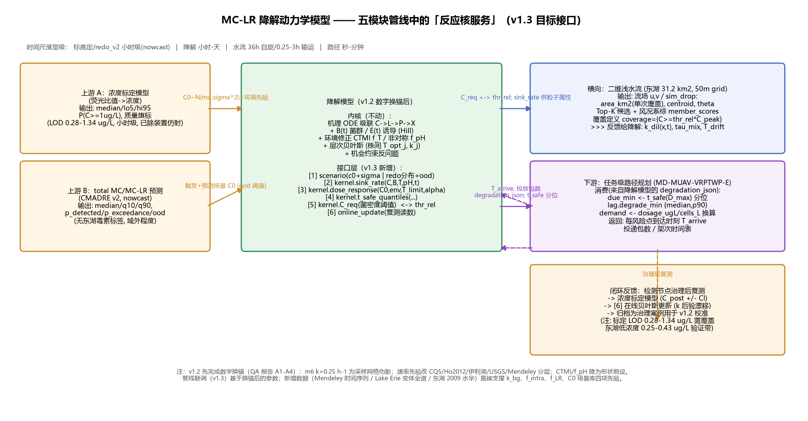

# MC-LR 降解动力学模型 —— 五模型管线协同调研与模型适配评估报告

> **任务**：结合背景补充（五个模型为统一目标服务的上下游关系）与用户新补充的数据，审查：① 管线对当前模型是否具有启发性、调整方向是否明确；② 当前模型架构能否适应当前任务流程；③ 与传统数学推理相比的优势/劣势与改进方向。
> **调研方法**：沿用既有流程——盘点用户补充数据（文件级核查+数值提取）→ 逐模块阅读接口（架构文档/代码签名/输出协议）→ 联动适配分析 → 结论与分阶段路线图。
> **日期**：2026-08-23 ｜ **位置**：model_MC-LR_degradation_kinetics/report/05_五模型管线协同调研与降解模型适配评估.md
> **配套/引用**：本报告与 `model_path_planning/report/06_五模型联动适配性审查与路径规划改进方向.md`（路径规划视角）互为姊妹篇，视角互不重复；本报告的**主角是降解模型**。
> **前置状态**：`report/04_交付物质量审查报告.md`（用户 QA）已判定"架构可以上评审，数字请先换锚"（A1–A4 类）。本报告在其之上叠加**管线视角**的结论。

---

## 0. 摘要（三句话先说结论）

1. **有启发性，且调整方向明确**：五模型管线把降解模型从"单点剂量决策器"重新定位为**"空间-时间-剂量三联反应核服务"**——水流模型给"投到哪、覆盖多大、漂移多少"，路径规划给"什么时候到、送几包"，标定/预测模型给"C0 是多少、该不该投"；模型需要补**3 项接口适配（服务化 API、斑块级空间参数化、投放时滞输入）与 2 项先验更新（k_bg 与胞内池）**——这些都不是架构重构，灰箱内核（机理 ODE + 层次贝叶斯 + 机会约束）保持不动。
2. **用户补充的三批数据把模型最缺的三块先验直接补上了**：Mendeley 滤过菌群 6 次季节性事件×4 种粒径分级（→ 水柱天然菌群表观 k = 0.17–0.77 d⁻¹，无生命对照 ≤0.026 d⁻¹）；Lake Erie 2018-19 全毒素变体谱（→ MC-LR/总MC 比例中位 0.278、**胞内(藻结合)比例中位 90%**）；东湖 2009 官桥湖水华 6 点（→ C0 典型包络 0.25–2.85 µg/L，MC-LR 主导，恰在 WHO 阈值邻域）。其中"胞内占 90%"意味着 C_intra 状态变量**从可选升级为默认开启**。
3. **传统数学推理 vs 数据驱动的结论（在本管线语境下）**：**分层分工**——物理因果链（水流、降解）用传统数学+贝叶斯，预测链（浓度）用数据驱动灰箱，决策链（路径）用 ML/RL；降解模型选择传统数学的**优势**是"能给物理量（C_req、t_safe、剂量）、可审计（QA 04 已演示）、可外推拒答、与物理模块接口天然"；**代价**是"先验脆弱（m6 k=0.25 伪影的教训）、五模块级联误差累积、跨模块契约维护成本"。

---

## 1. 用户补充数据核查（本报告第一部分：新数据清单+提取结果）

### 1.1 D16 — Mendeley Data：`submit results data.xlsx`（38.5 MB，✅ 已下载，用户 2026-08-22 补充）

**结构**：12 个 sheet；核心为 `MC-LR raw data_submit `（日期头 + 4 处理组：Autoclaved 灭活对照、<0.025 µm、<0.22 µm、<0.45 µm 粒径分级；每组 raw ng/mL 时间序列 T0/T1/T4/T7 + %remaining；rep1-3/mean/SD；另有 16S OTU 与 PICRUST Nov16/Nov17）。**6 次采样事件：2014-12、2016-05/09/11、2017-09/11**（对应论文 *Filterable bacterioplankton able to degrade microcystin*）。

**本团队提取**（新脚本 `src/extract_mendeley_mclr.py`，输出 `data/processed/Mendeley_filterable_MCLR_time_series.csv` 32 行 + `Mendeley_MCLR_apparent_k_estimates.csv` 12 行；k = −ln(C7/C0)/7 d，0.1 ng/mL=检出限删失）：

| 处理组 | 事件（C0→C7, ng/mL） | 表观一级 k (d⁻¹) | 结论 |
|---|---|---|---|
| 灭活对照 | 2017-09: 17.5→14.6；2017-11: 15.8→15.1；2016-05: 无降解 | **0.026 / 0.007 / ~0** | **无生命体系 7 天基本无降解**（≤0.03 d⁻¹）→ 非生物本底下限 |
| <0.025 µm | 2016-05: 12.3→12.6（103% 剩余） | 0 | 超小尺寸组分无显著降解（单次事件） |
| <0.22 µm | 2016-11: 8.6→≤0.1；2017-09: 20.5→5.2；2017-11: 18.0→5.6 | **≥0.64 / 0.195 / 0.166** | 可滤过细菌亚群确有降解能力，0.17–0.64 d⁻¹ |
| <0.45 µm | 2014-12/2016-05/2016-11/2017-09/2017-11 均降至≤LOD；2016-09: 9.3→2.0 | **≥0.60–0.77 / 0.220** | 全水样菌群降解最快，5/6 次事件 7 天内完全清除 |

**对模型的意义（重要）**：
1. **k_bg（背景/水柱天然菌群降解）从"估计"变"实测分层"**：无生命 ≤0.03 d⁻¹ ≪ <0.22 µm 亚群 0.17–0.64 d⁻¹ ≤ <0.45 µm 全菌群 0.22–≥0.77 d⁻¹。这是**季节重复 + 粒径分级的真实速率**，比 USGS 微宇宙（0–0.56 d⁻¹，负对照 E. coli 与正对照同量级）更干净——**建议作为 v1.2 k_bg 第一层先验**（QA 04 A4 修复的直接素材）。
2. **季节/温度敏感性实证**：2016-05（春末）无降解 vs 2017-09/11 强降解 → k_bg 应带**季节/水温协变量**（与 THN1/A9 碳营养调控一致）。
3. **<0.45 µm 组多数"完全清除"是删失观测**：拟合时应做**删失回归/区间似然**（下限型），不能当点值（这正是 QA A4 对 USGS 数据的同类问题——本项目处理口径统一）。

### 1.2 D17 — Lake Erie 水质与毒素数据（2 个 xlsx，✅ 已下载，用户补充）

- `waterqualitysamplingdata2018-2019habs.xlsx`：274 行 × 50 列（HABs grab 采样；**全 MC 变体 LCMSMS ppt**：LR/YR/RR/LA/LY/LW/LF/HtyR/HilR/WR + 总MC ELISA/LCMSMS + **胞外 MC** + qPCR mcyE/sxtA + 营养盐/TP/TN/分层 BGA）。
- `waterqualitydata2013-2022.xlsx`：2139 行 × 43 列（总MC ELISA + 水质/叶绿素/浮游植物构成的 10 年长序列）。
- **本团队计算（`scripts_tmp/lakeerie_ratio.py`）**：
  - **MC-LR/总MC 比例**：中位 **0.278**，IQR 0.219–0.362，P90 0.532（n=270；总MC>0 时 MC-LR 检出率 268/270）；
  - 总MC：P50/P90/P95 = **1.30 / 6.88 / 11.02 µg/L**；MC-LR：P50/P90/P95 = **0.35 / 1.50 / 2.43 µg/L**；
  - **胞外MC比例：中位 0.10（IQR 0.048–0.217，P90 0.50）→ 胞内(藻结合)比例中位 ≈ 0.90**；胞内MC绝对值 P50/P90 = 1.21/7.19 µg/L。

**对模型的意义**：
1. **C_intra 状态从"可选"→"默认开启"**：90% 毒素在藻细胞内——这意味着①治理目标主要是**溶解态**（胞外 ~0.1×总MC）；②杀藻/细胞裂解事件会把胞内池翻转成溶解态（A13 中宇宙的"反冲峰"的定量幅度有了现场先验）；③MlrA 只能降解溶解态 → 模型应输出"**溶解态达标时间**"与"**胞内-溶解转化情景**"两个决策场景。
2. **f_LR（MC-LR/总MC）站点级先验**：Lake Erie ≈0.28（Beta 型，IQR 0.22–0.36）——**但不得作为通用常数**（见 1.3 东湖；并与 redo_v2 "拒绝固定比例换算"的边界一致：只做**辅助映射/不确定度传播**，不作为主路径）。
3. **现场浓度分布直接支撑 C0 场景库**：总MC 可到 11 µg/L、MC-LR 到 2.4 µg/L，均在降解模型适用域（≤50 µg/L）内；且 2.4 µg/L > 1 µg/L WHO 阈值 → 治理场景真实可达。

### 1.3 D18 — 武汉东湖 2009 水华论文（PDF，✅ 已下载，用户补充）

- `固相萃取-高效液相色谱法测定武汉东湖水体中微囊藻毒素.pdf`（贺小敏等，《中国环境监测》2012, 28(1):53-56）。
- **核心数据（2009-08 官桥湖水华，6 个采样点）**：MC-LR = **2.85 / 1.01 / 0.43 / 0.29 / 0.27 / 0.25 µg/L**；MC-RR = 0.67 / 0.24 / ND×4（检出限 MC-LR 0.0234、MC-RR 0.0789 µg/L）。
- **关键叙述**：① 1# 闸口藻细胞多、毒素最高 2.85；② 2# 经沙袋拦截+抑藻生物制剂后降至 1.01（"藻细胞数量得到有效控制，但细胞死亡后释放的毒素不会立刻消失，其代谢可能是缓慢过程"）——**这正是本模型 C_intra 状态与"释放峰"描述的现象学现场证据**；③ 东湖 **MC-LR 主导**（LR/RR 在 1# 点 ≈4.3:1，其余点 RR 未检出）。

**对模型的意义**：
1. **东湖 C0 典型包络 = 0.25–2.85 µg/L，恰好横跨 WHO 阈值 1 µg/L** → 降解模型的"目标作业带"；`fig5 剂量-时间等值线` 的 C0 轴低端（2–10 µg/L）与东湖场景吻合。
2. **站点级 f_LR 差异的定量证据**：东湖（LR 主导，RR 仅 1#/2#）vs Lake Erie（f_LR≈0.28）→ **f_LR 必须站点/流域级建模**，不能全局常数；这从数据侧印证了 redo_v2 分任务建模的决策。
3. **与标定模型的可测域交叉**：标定模型 LOD 0.28–1.34 µg/L（trigger 依赖）；东湖 6 点中 3 点（0.25/0.27/0.29）**在 LOD 下限附近** → **"治理后验证"需要更高灵敏度或多时间点融合**——这是闭环设计的关键约束，应作为管线规格写入（见 §5.3 验证灵敏度需求）。
4. 该文同时提供东湖 MC-LR/RR 的 SPE-HPLC 方法学（检出限/回收率），可作为**湿实验中 MC-LR 定量方法**的参考（LC-MS/MS 替代方案）。

### 1.4 小结：三批数据 → 模型先验更新清单

| 先验/模块 | 原状态（QA 04 之前） | 新数据带来 | 归属 |
|---|---|---|---|
| k_bg（背景降解） | 0.4–10 d⁻¹ 粗区间（A10/A12），QA 04 指出需弱化 | **Mendeley 分层实测**（≤0.03 / 0.17–0.64 / 0.22–≥0.77 d⁻¹）+ USGS（0–0.56） | v1.2 必改 |
| C_intra（胞内池） | 可选状态，无先验 | **Lake Erie：胞内中位 90%**（现场分布） | v1.2 默认开启+先验 |
| f_LR 站点比例 | 未建模 | Lake Erie 0.278（IQR 0.22–0.36）；东湖 ~0.8+（LR>RR） | 管线级辅助映射 |
| C0 场景库 | 仅文献值 | 东湖 0.25–2.85 六点 + 总MC/胞内胞外分布 | 场景与验证 |

---

## 2. 五模型管线：上下游关系与降解模型的位置

（五模块总闭环图另见 `model_path_planning/code/out/figs/fig9_five_module_loop.png` 与其 06 号报告 §2；上图为本报告的**降解模型中心视角**。）

**管线角色（每个模型一句话+时间尺度）**：
1. **浓度标定**（model_concentration_calibration，v3.1）：荧光比值→浓度；输出 {median, lo5/hi95, P(C≥1 µg/L), 预警等级, 质量旗标}；小时级；**LOD 0.28–1.34 µg/L**；当前基于合成数据。
2. **total MC/MC-LR 预测**（model_redo_v2，CMADRE v2）：118 数据集 4.1 万观测；输出 {median/q10/q90, p_detected, p_exceedance, ood_score}；nowcast（无未来预报）；**无东湖毒素标签**；**明确拒绝 total→MC-LR 固定换算**。
3. **MC-LR 降解动力学**（本模型，v1.1）：剂量-治理时间反演；输出 {dosage_ugL, cells_L, t_safe 分位, C_req, 二次投放窗, confidence}；小时-天级。
4. **二维浅水流**（model_Two-dimensional_water_flow，架构定稿）：东湖 31.2 km²/50 m 网格 SWE（Casulli 半隐式）+ Lagrangian 粒子输运；输出 {流场 u,v,η, sim_drop: area_km2 0.038–0.073, centroid 漂移 100–300 m/2h, theta, Top-K 候选(792), member_scores(5 风况系综)}；36 h 自旋/0.25–3 h 输运；**无欧拉 ADE 溶解态方程，无降解汇项（预留）**；覆盖定义 coverage={C≥thr_rel·C_peak}，thr_rel 默认 5%，**文档明言需降解模块 C_req 联标**。
5. **任务级路径规划**（model_path_planning，V2.6）：MD-MUAV-VRPTWP-E；学习式构造+掩码+局部搜索+滚动重规划；<5 ms 推理；**当前任务自建**（软窗 l_j=25+45(1−w_j) min、风险 w_j=min(浓度,6)/6 均为语义启发式，未消费水流/降解输出）。

**契约核对表（降解模型视角）**：

| 链路 | 上游→下游 | 现有协议 | 现状 |
|---|---|---|---|
| 标定→降解 | {median, lo5/hi95, P(C≥1)} → C0~N(μ0,σ0²)+环境先验 | 02 号 §9（行 244）+ QA 04 | ✅ 定义；❌ 无代码联调 |
| 预测→降解 | {median/q10/q90, p_exceedance, ood} → 触发+场景 C0 | 02 号 §9（行 246）"风险等级→是否投放" | ⚠️ 需定义双来源优先级与 ood 门槛 |
| 降解→水流 | C_req ↔ thr_rel；sink_rate 供粒子属性；评价窗 | 水流文档"需与降解模块 C_req 联标" | ⚠️ 联标最高优先 |
| 水流→降解 | 流场/k_dil/τ_mix；投放点与覆盖面积；漂移 | **未使用** | ❌ |
| 降解→路径 | {dosage_ugL, cells_L}→demand；t_safe 分位→软窗/时滞；二次投放窗 | 路径规划 06 号报告 v3.0 契约已把降解列为 lag/due_min/demand 来源 | ⚠️ 需实现 degradation_json 生产者 |
| 路径→降解 | T_arrive（到达时刻）、投递包数 | **未使用** | ❌ |
| 反馈回路 | 节点复测→标定→在线更新 | 02 号 §13（第 7 项）设计预留 | ⏳ |

**共同语言**：三模型共用 **1 µg/L 阈值**、**小时**单位、**JSON+版本+置信度**输出契约——管线在语义上已经对齐；缺口集中在"实现与联调"而非"定义"。

---

## 3. 适配性评估：当前架构能否适应（回答：能，但要 3+2 项调整）

### 3.1 可直接适应的部分（不需要改架构）

1. **时间尺度匹配**：降解小时级 × 水流 36h 自旋/0.25–3h 输运 × 标定小时级 × redo_v2 nowcast × 路径秒-分钟级 → 全链 ≤ 小时级，可直接串联；水流"流场准静态+输运子步"与降解"慢反应"解耦为 **operator splitting**（02 号 §9 已定义）。
2. **决策接口同构**：`fig5 剂量-时间等值线` = 路径规划需要的 dose→t_safe 映射；机会约束 α=0.10 与路径规划 v3.0 提案一致（`P(t_eff≤T_limit)≥1−α`）。
3. **输出即物理量**：C_req、t_safe 分位、dosage_ugL/cells_L、残留曲线——正好是水流（覆盖阈值）与路径（需求/窗/时滞）需要的**物理语义**；黑箱模型给不出可联立的此类量（见 §4）。
4. **不确定性形态**：模型输出分布（后验传播）与"上游给紧凑分布、规划端不逐层 MC"（路径规划 06 §4.3）一致。

### 3.2 需要调整的 3 项接口适配（v1.3，非重构）

**适配 1：服务化 API（把"研究代码"变成"管线服务"）**。新增 `src/api.py`，暴露 4 个纯函数 + JSON 契约：
- `scenario(...)`：接受标定 {median/lo5/hi95} 或 redo_v2 {median/q10/q90/ood}，输出统一 `C0~N(μ0,σ0²)` + 来源旗标 + ood 门槛过滤（**双来源合并规则见 §5.3 待队内拍板项 1**）；
- `dose_response(C0, env_t, T_limit, alpha)` → {D*, dosage_ugL, cells_L, packages}（供路径规划 demand 换算）；
- `t_safe_quantiles(C0, D, env_t)` → {median, p90}（供路径规划 due_min/lag）；
- `sink_rate(C, B, T, pH, t)` → r（供水流粒子/网格作反应项；**当前水流无 ADE 溶解态方程**，此接口先用于"粒子属性"与"覆盖评价窗"，待水流侧升级欧拉溶解态后可无缝接入）；
- `C_req(...)` → 最小有效菌密度（**与水流 thr_rel 联标**：θ=5% 默认值是演示值，1%→5% 覆盖面积折半、5%→20% 缩至 1/6.5，强敏感——联标后覆盖面积才有物理意义）。

**适配 2：斑块级空间参数化**。水流模型以椭圆斑块（bloom_patch）为工作单位、单次覆盖 0.038–0.073 km² 而斑块可达 1.4 km²（约 20 倍）→ 每斑块多次投放。降解模型保持"点 ODE 反应核"，但**输入/输出按斑块数组化**：C0_j ∈ 斑块 j 的预测分布、B0_j = 剂量/覆盖体积、k_dil_j 由流场导出 → 输出每斑块 t_safe_j；**不做空间 PDE**（由水流模型承接，02 号 §14 局限 4 已声明——该边界现在有明确的下游承载者，声明反而更成立）。

**适配 3：投放时滞输入**。路径规划返回每风险点到达时刻 T_arrive_j 与投递包数 d_j → 模型以 `B0(t)=B0·H(t−T_arrive)`（Heaviside 延迟投放）求解，并把 **T_arrive 抖动**（风况/重规划/补货不确定性）并入机会约束：`P(t_safe + T_arrive ≤ T_limit) ≥ 1−α`。这一项使"治理生效时间"（而非"到达时间"）成为全链目标——与路径规划 06 号失配点 4 的 `t_eff = t_arrival + T_drift + t_safe` 完全互洽。

### 3.3 需要更新的 2 项先验/状态（v1.2，与 QA 04 合并执行）

- **k_bg 换锚**（QA A1/A4 + 本次 D16）：分层先验改为 {无生命 ≤0.03；USGS 微宇宙 0–0.56；Mendeley 水柱菌群 <0.22µm 0.17–0.64、<0.45µm 0.22–≥0.77（删失）；A12 原位水华期 8.8–10} d⁻¹，并带季节协变量；m6 的 0.25 h⁻¹ 仅保留为"完成时间刻度参考"（1–50 µg/L 1–4 h 清完）。
- **C_intra 默认开启 + f_intra 先验**（本次 D17）：f_intra ~ 现场分布（中位 0.90，IQR 0.78–0.95）；输出双场景（溶解态达标 / 胞内释放情景）；东湖论文"抑藻后毒素代谢缓慢"直接为 `ρ_release` 提供先验方向。
- （另 QA A3：fig4–6 需按 v1.2 参数重生成——管线联调必须基于换锚后的数字，否则"先联调后换锚"会把伪影固化进管道。）

### 3.4 两项"需团队拍板"（本报告标为待决，给出建议）

1. **C0 双来源优先级**：现场标定（实测、快、但 LOD 0.28–1.34）vs redo_v2 预测（面分布、可提前、但 nowcast 且无东湖毒素标签）。**建议**：触发用 redo_v2 p_exceedance（空间/提前量），剂量计算用标定 ĉ（如果 |ĉ−预测| 超出 ood 阈值则以预测为情景、以实测为校准）；低浓度带（<0.5 µg/L）以实测为主并标注"低置信剂量"。
2. **f_LR 的分工**：redo_v2 拒绝"total→MC-LR 固定换算"（R22，理由充分）；但降解模型需要**"总MC告警→MC-LR 剂量计算"的桥**。**建议**：f_LR 作为**管线级站点参数**（Lake Erie 0.28、东湖待测——建议用 2009 六点+未来东湖实测做站点 Beta 先验），带不确定性传入，不进降解模型的机理内核；并在 redo_v2 已输出 MC-LR 时**直接使用 MC-LR 通道**。

---

## 4. 传统数学推理 vs 数据驱动：优势与劣势（在本管线语境下）

### 4.1 按"链"分工的结论（五模块全景）

| 链 | 模块 | 最合适范式 | 本管线中的实证 |
|---|---|---|---|
| 物理因果链 | 水流（SWE）、降解（ODE） | **传统数学/机理 + 贝叶斯** | 数据稀缺（降解跨文献 k 差 3–4 数量级；东湖无实测流速）；守恒/因果约束强；需外推与域拒答 |
| 预测链 | total MC/MC-LR | **数据驱动灰箱**（AFT/分位数/删失+stacking+OOD） | 2.1 万观测、丰富协变量；本质高维映射（redo_v2 已训练：total MC log1p MAE 0.35） |
| 标定链 | 荧光→浓度 | **机理响应模型+贝叶斯反演**（时变 Hill） | 小样本（数百-千行）+弱信号；4PL 骨架保可解释、可部署（ESP32 查找表） |
| **决策链** | 路径规划 | **ML/RL 为主，精确算法作黄金基线** | RL 0.04 s vs OR-Tools 5.01 s（125×）；重规划 −28%；OOD 退化已实测 → 数学兜底保留 |

**降解模型在分工表中的位置**：属于物理因果链；它的"产品"不是预测分数，而是**其他链条可消费的物理量与分布**（剂量、达标时间、阈值密度、残留曲线）。这就是"传统数学"在五模型体系中**不可被黑箱替代**的根本原因——**接口语义是物理量，不是预测值**。

### 4.2 传统数学（机理+贝叶斯）在本模块的优势

1. **数据效率与先验结构**：架构 (ODE+层次贝叶斯) 允许 6–12 条湿实验曲线即可完成工程可用校准；纯数据驱动（LSTM/PINN 端到端）需要 >10³ 点——而无任何公开工程菌降解数据。
2. **可审计性（这次被证明是双刃剑但也因此被修复）**：QA 04 能逐字溯源 m6 数据发现"0.25 h⁻¹ 是采样网格伪影"——只有显式参数化模型才支持这种审计；黑箱模型无法被这样审查（iGEM 评审与安全审查需要）。
3. **域外正直（拒答）**：`out of domain` 机制保证 >50 µg/L、pH>11、T>40 ℃ 等未观测域明确拒绝而非外推；物理约束（质量守恒、Monod 退化）天然自带。
4. **与物理模块联立的天然性**：水流需要 C_req（菌密度阈值）与 sink_rate；路径需要 t_safe 分位与剂量换算——这些是传统数学的**原生输出**；换成黑箱则要么重新训练一个"映射器"，要么丢失可解释的物理量。
5. **安全/伦理对齐**：光死窗口 δ(I) 的显式建模、最小有效剂量+环境残留罚项——iGEM Safety 评分需要的是"机理级论证"而非"模型精度"。
6. **不确定性语义**：后验分布直接支撑机会约束 P(t_safe≤T)≥1−α，与路径规划/预测模块的分布接口同构。

### 4.3 传统数学的劣势（诚实清单，含本次新教训）

1. **先验脆弱性（已被实证）**：m6 "k=0.25"被证明是网格伪影后，fig5 等值线、贝叶斯先验、fig6 不确定带的**数值全部继承伪影**——显式参数模型的数字可以被审查、但也会被"带偏"；必须配**参数溯源台账**（每个先验参数→文献原文行号+采样窗口说明）。
2. **级联误差累积（五模块放大）**：标定 CI → 预测分布 → 降解 90% 带 → 水流风况系综 → 路径时间窗：每层 σ 传入下层；若各层都做全 MC，组合爆炸；若都用点估计，机会约束退化。**需要"级联不确定度预算"**：哪一层的 σ 主导终局（见 4.4），并让上游输出"紧凑分布"而非原始采样（路径规划 06 §4.3 同一结论）。
3. **未建模因子的弱约束**：产毒速率（mcyE）、MlrD 转运（2025 Biochimie）、藻细胞释放/凋亡、混合-微环境（粒子尺度）——机理模型只能以"状态+协变量"弱吸收；黑箱（若有数据）能学出未列因素。当前数据下这是可接受的权衡。
4. **维护与版本成本**：5 个模型各自 20–30 轮审查、各自版本（v1.1/V3.1/定稿/V2.6）→ **跨模块契约必须版本化+回归测试**（schema_version/model_version/units/confidence 四件套），否则"5 个会呼吸的模块"会互相漂移——这是本管线最大的工程风险，而非算法风险。
5. **计算与部署**：全贝叶斯+蒙特卡洛较重；已靠 GBDT 代理（离线仿真→在线查询）缓解；代理误差边界尚未标定（02 号 §13 第 9 项）。
6. **标定链条是"合成数据"**：浓度标定模型当前结果全部基于合成数据（其 README 声明），redo_v2 无东湖毒素标签、MC-LR 静态 Spearman 仅 0.08——**上游两个模型的"真实有效性"未闭环**；降解模型再准，C0 输入的真实性仍是瓶颈（这是管线级数据问题，不是降解模型问题，但必须如实写入）。

### 4.4 级联不确定度预算（本报告的量化推断）

用本轮数据做的**粗排序推断**（按对"达标时间"终局不确定度的贡献潜力）：
1. **降解 k**：跨体系 3–4 个数量级（0.015→9.36 h⁻¹），虽然层次贝叶斯吸收株间差，但**工程菌自身 k 仍是最大未知** → 湿实验三件套（降解曲线+mlrA 表达+δ(I)）是**全链投入产出比最高**的一环；
2. **C0**：标定 LOD 0.28–1.34 µg/L vs 东湖作业带 0.25–2.85 µg/L —— **低端重叠**；C0 误差 2 倍 → 剂量需显著上浮（fig5 的对数敏感）→ 标定灵敏度提升（或多时间点融合）为第二优先；
3. **风况**：水流 5 成员系综覆盖 ±12%（覆盖比例 [0.046,0.055]）→ 影响"投到哪"而非"剂量多少"；中等优先级；
4. **到达抖动/投放偏差**：分钟级，影响 T_eff 初项，低优先级（但直接影响"是否在窗口内到达"，与路径规划耦合）。
**建议**：把这条预算写进管线契约文档（上游只需保证"预算项最紧的环节先改善"），避免五模块平均用力。

### 4.5 与"端到端 AI 仿真五模块"的替代性判断

- **端到端（从荧光序列/环境序列+剂量 → C(t) 场）当前不可行**：无工程菌降解数据、无东湖毒素-菌浓度联测、无实验-现场配对标定——数据是硬门槛（redo_v2 有 2.1 万观测也只是"预测链"一层）。
- **可行且有明确收益的"物理引导 ML"路径（按优先级）**：
  1. **仿真代理**（5×10⁴ 机理仿真 → GBDT/GP）：把离线 ODE 变秒级查询——**这是联调必做**，否则路径规划+水流+降解联合优化算不动；
  2. **残差学习**（机理+GBDT 修正系统性偏差，如未建模因子）——湿实验 ≥300 点后启用；
  3. **SPO/决策感知**：把"预测误差的代价"（假阴性≫假阳性）接入决策——与机会约束/贝叶斯决策（标定模型 10:1 代价比）同构，是五模块"粘合剂"；
  4. **PINN/神经 ODE**（远期；SWE 代理见水流模型未来方向）——数据充分后做"机理+NN"联合估计。

---

## 5. 明确调整方向：分阶段路线图（v1.2 → v1.3 → 联动验证）

### 阶段 A：v1.2 —— 数字换锚 + 新数据落位（先于任何管线联调；2–3 天工作量）
| # | 事项 | 输入 | 产出 |
|---|---|---|---|
| A1 | 速率先验重锚（QA A1） | QA 04 清单 + D16 | 参数表 v1.2：k 先验= CQ5/Ho2012/伊利湖/USGS/**Mendeley 分层**；m6 降级"时间刻度参考" |
| A2 | 函数型式降级为"形状假设"（QA A2） | — | 文档表述修改；保留 CTMI/非对称高斯为具名假设 |
| A3 | prototype_v2.py 重生成 fig4–6（QA A3） | — | fig4–6 用 v1.2 参数 + 事件检测 + 固定种子；fig6 改题 |
| A4 | USGS 12 株补全；k_bg 上限型表述（QA A4） | D11 原表 | 修正表 + 汇总统计 |
| A5 | **C_intra 默认开启 + f_intra/f_LR 站点先验（本次新增）** | D17/D18 | 状态配置 + 先验表（Lake Erie f_intra 0.90；f_LR 0.278 / 东湖待测） |
| A6 | **东湖 C0 场景库 + 验证灵敏度需求（本次新增）** | D18 | scenarios/eastlake_2009 六点；文档写明标定 LOD 与闭环验证约束 |
| A7 | QA B1–B8/C 类修补（含 Km=350/Hill 1.56–2.53 纳入） | Yang 2024 等 | 文档+参数表 |

### 阶段 B：v1.3 —— 服务化 API + 管线契约（联调前 1 周）
- `src/api.py`（§3.2 适配 1）+ `contract/degradation.schema.json`（schema_version/model_version/units/confidence）；
- 与水流模型：**C_req↔thr_rel 联标**（产出"针对东湖场景群的门限换算表"，代替 5% 演示值）；
- 与路径规划：实现 `degradation_json` 生产者（对齐其 v3.0 契约字段：due_min、lag.degrade_min{median,p90}、demand 换算、confidence.qual）；
- 与标定/redo_v2：实现 `scenario()` 双来源合并（建议规则见 §3.4 项 1）。

### 阶段 C：联动验证（"证明适配"）
- `code_e2e.py`：东湖风场系综（flow m0–m3/SE_2p5…）+ 东湖 2009 C0 场景 + 降解 dose_response → 水流投点候选 → 路径规划（RL）→ 模拟执行 → 输出**预计达标时间分布 + 治理效果置信度**；与路径规划侧 `code/e2e_demo.py` 对拍；
- 指标：任务生成一致性（规划器消费的需求/窗/权重 = 降解模型输出）、可行性（100% 掩码审计）、时效（保持 <5 ms 前向）、**达标时间预测的区间覆盖率**（关键新指标）。

### 明确不做（边界声明，防止管线内职责重叠）
- 不做空间 PDE / 浓度场输运——由水流模型承接（粒子层升级后）；
- 不做 total→MC-LR 的机理内核内换算——只做管线级站点先验映射（§3.4 项 2）；
- 不把降解模型改成端到端黑箱——数据不足且物理量接口不可替代（§4.1/4.5）；
- 不在 v1.2 换锚前启动联调——防止伪影固化进管道。

---

## 6. 对三个问题的直接回答

1. **是否有启发性**：是。三点启发：(i) **空间维**——水流模型给出覆盖面积/漂移/候选点，"单点剂量"必须升级为"斑块级剂量-覆盖策略"，且 C_req 联标成为管道正确性的前提；(ii) **时间维**——路径规划给出 T_arrive，"到达≠生效"，达标时间必须加上投放时滞与漂移时滞（t_eff = t_arrival + T_drift + t_safe）；(iii) **闭环维**——治理后节点复测→标定→在线更新，把"一次性剂量计算"变成"每次治理后学习"。
2. **调整方向是否明确**：明确。**顺序为 先换锚（v1.2，A1–A7）→ 再服务化（v1.3，API+契约）→ 后联调（阶段 C）**；"明确"的判定依据：每一项目都有具体输入文件、产出物与验收口径；**两处留待团队拍板**（C0 双来源优先级规则；f_LR 分工），本报告给了建议方案（§3.4）。
3. **架构是否适应 + 传统数学优劣势**：**适应，但要接口改造而非重构**——灰箱内核在五模型体系中处在"物理因果链"正确位置，且是唯一能给出 C_req/t_safe/dosage 这类物理量接口的范式；优势（可审计、可外推拒答、数据效率、物理量接口、安全论证）与劣势（先验脆弱、级联误差、未建模因子弱约束、版本维护、上游未闭环）已逐条对齐（§4.2/4.3），改进方向是"物理引导 ML 分层嵌入 + 级联不确定度预算 + 契约版本化"（§4.5/§5）。

---

## 7. 本轮新增/修改产物清单

| 产物 | 路径 | 说明 |
|---|---|---|
| 调研报告（本文件） | report/05_五模型管线协同调研与降解模型适配评估.md | 本报告 |
| 管线接口图 | figures/fig8_pipeline_interfaces.png（src/fig8_pipeline.py） | 降解中心视角接口图 |
| Mendeley 提取脚本 | src/extract_mendeley_mclr.py | 可复现提取（含出处） |
| Mendeley 时间序列 | data/processed/Mendeley_filterable_MCLR_time_series.csv | 32 行（6 事件 × 4 处理 × 时间点均值） |
| Mendeley k 估计 | data/processed/Mendeley_MCLR_apparent_k_estimates.csv | 12 行（含删失标识） |
| Lake Erie 比例计算 | （scripts_tmp/lakeerie_ratio.py；结果见 §1.2） | f_LR、胞内/胞外比例 |
| 东湖论文提取 | （scripts_tmp/eastlake.py；结果见 §1.3） | MC-LR 六点浓度 |

**待用户决策/后续**：① C0 双来源优先级规则批准；② f_LR 站点先验方案（东湖是否需要补测 MC-LR/总MC 比例）；③ v1.2 修复清单（QA 04 P0/P1 + 本报告 A5/A6）的执行顺序确认。

---

## 附录：本报告引用的关键文件

- 本模型：report/02（架构 §9 接口）、report/04（QA）、data/数据集调研、src/{prototype_v1,fit_literature,extract_mendeley_mclr}.py
- 水流模型：MODEL_ARCHITECTURE.md、ARCHITECTURE_ITERATIONS.md（第 11/12 轮：C_req 接口、投点优化）、src/swflow/{swe_si,particles,deployment}.py、scripts/04_run_optimization.py
- 路径规划：report/03（架构）、report/06（五模型联动 v3.0 契约）、code/{scenario,env,solver}.py
- 浓度标定：architecture_v1.md、report/03（终版）、src/{calibrate,forward,device}.py、report/06（教学，LOD/AUC）
- redo_v2：data/MODEL_DATA_SPEC.md、report/MODEL_OBJECTIVE_SPEC.md、report/FINAL_MODEL_REPORT.md、report/ARCHITECTURE_REVIEWS_EXTRA.md（R24：三模型融合未实现）、data/DATA_GAPS_AND_AGENT_PROMPTS.md
- 新数据：data/raw/Mendeley …/submit results data.xlsx、data/raw/Lake Erie/*.xlsx、data/固相萃取-…东湖….pdf
