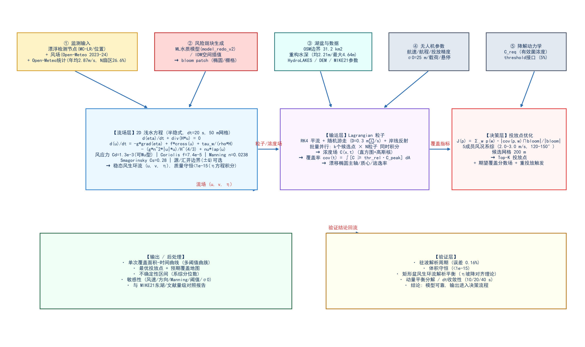
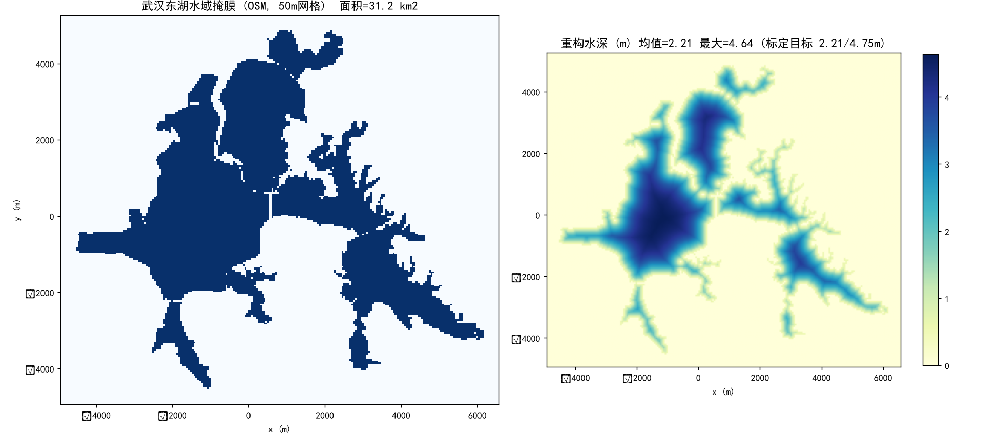
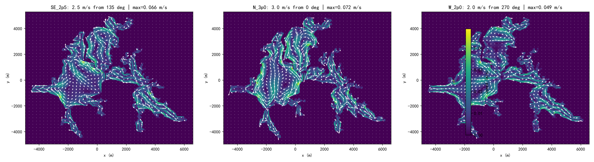
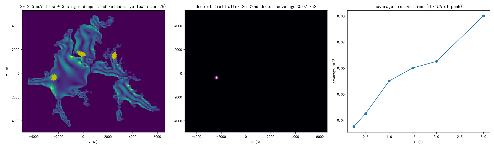
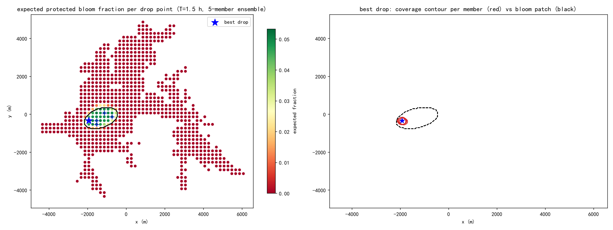
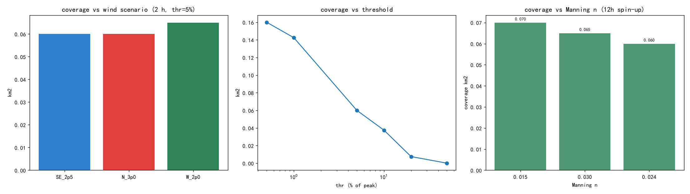
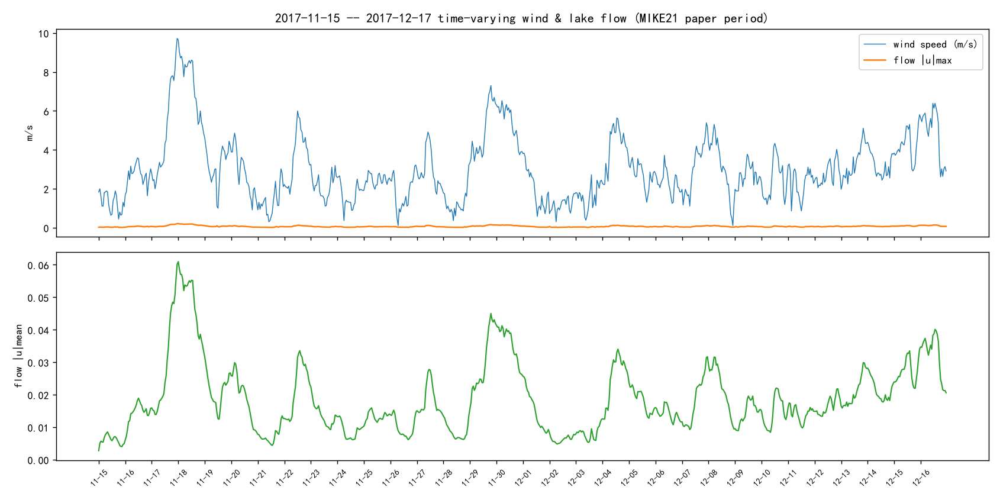

# 模型架构设计文档：二维浅水流模型（武汉东湖）— 无人机投放推演与单次覆盖面积计算

> **模块定位**：iGEM "监测-预警-降解"闭环系统中的干实验板块。本模型以二维浅水方程为内核，对东湖水体的风生环流进行推演，输出：
> ① 流场（u, v, η）；② 投放后的菌团/示踪物散布与**单次有效覆盖面积**；③ 面向风险斑块（MC-LR/水华高值区）的**最优投放点**及不确定性区间。
> 相关文档：`report/文献综述.md`（文献依据）｜`data/DATASETS.md`（数据来源）｜`ARCHITECTURE_ITERATIONS.md`（25 轮审查日志）｜本文件（最终架构）。
> 工作区：`model_Two-dimensional_water_flow/`（代码 `src/swflow/`，实验 `scripts/01…06`，图件 `figures/`）。

---

## 1. 背景与需求

### 1.1 系统背景
工程菌检测节点（漂浮装置）监测 MC-LR，接近 WHO 阈值 1 μg/L 时中控系统派无人机投放**降解菌**（mlr 酶基因簇）到污染水域，实现"检测 → 预警 → 投放 → 降解 → 回收"闭环。本项目对模拟监测区域（武汉东湖）进行水流推演，回答两个工程问题：

- **投放到哪里？**（水流会带着菌团漂到哪里、能否覆盖目标水域）
- **单次投放能覆盖多大面积？**（决定架次与载荷规划）

### 1.2 需求分解
| 需求 | 含义 | 本模型对应模块 |
|---|---|---|
| 水流推演 | 风速→表层流的响应、环流结构与局地流速 | 2D 浅水方程求解器（`swe_si.py`） |
| 覆盖面积 | 菌团被水流+湍流输运后的"有效浓度区"面积 | 粒子追踪 + 浓度场/阈值面积（`particles/deployment`） |
| 投放地点 | 在风况不确定下最大化风险斑块保护比例 | 系综优化（`deployment.optimize`） |
| 不确定性 | 风况/参数不确定对决策的影响 | 5 成员风况系综 + 敏感性实验 |

---

## 2. 总体架构



**四层架构**（数据流自左向右、自上而下）：

1. **输入层**：①监测输入（漂浮节点读数、位置；Open-Meteo 2023–2024 逐时风场；统计口径校验见 §6——年均 2.87 m/s、N 扇区 26.6%、夏季 SE 2.75 m/s）；②风险斑块生成（ML 水质模型 `model_redo_v2` 预测 / 节点浓度的 IDW 插值 → **bloom patch** 掩膜）；③湖盆数据（OSM 矢量边界 + 重构水深 + HydroLAKES/DEM 交叉验证）；④无人机参数（航速/航程/投放精度 σ0=25 m）；⑤降解动力学接口（`../model_MC-LR_degradation_kinetics/` 提供 C_req）。
2. **流场层**：半隐式 2D 浅水方程求解器（SPD/CG），输出稳态风生环流。
3. **输运层**：Lagrangian 粒子（RK4+随机游走+岸线反射）→ 浓度场 → 覆盖率/漂移诊断。
4. **决策层**：候选点 × 风况系综 → 期望保护比例 → Top-K 投放点 + 重投放触发。
5. **输出/验证层**：图形与数字报告；验证层保障结果可信（见 §10）。

**接口约定**：bloom patch（栅格掩膜/椭圆）、C_req（标量或浓度场）、drop 候选（坐标）、系综（风况列表）均为显式参数，便于与前端/中控系统对接。

---

## 3. 物理模型

### 3.1 控制方程（深度平均二维浅水方程）
\[
\begin{aligned}
\frac{\partial \eta}{\partial t} + \frac{\partial (H u)}{\partial x} + \frac{\partial (H v)}{\partial y} &= 0 \\
\frac{\partial u}{\partial t} &= -g\frac{\partial \eta}{\partial x} + f v - \left(u\frac{\partial u}{\partial x}+v\frac{\partial u}{\partial y}\right) + \frac{\tau_{wx}}{\rho_w H} - \frac{g n^2 |u| u}{H^{4/3}} + \nu \nabla^2 u\\
\frac{\partial v}{\partial t} &= -g\frac{\partial \eta}{\partial y} - f u - \left(u\frac{\partial v}{\partial x}+v\frac{\partial v}{\partial y}\right) + \frac{\tau_{wy}}{\rho_w H} - \frac{g n^2 |v| v}{H^{4/3}} + \nu \nabla^2 v
\end{aligned}
\]

其中：η 自由面；H=h_b+η 总水深；u,v 垂向平均流速；f=2Ωsinφ（30.5566°N → 7.42×10⁻⁵ s⁻¹）；τ_w=ρ_a C_d |W|W 风应力（C_d=1.3×10⁻³）；n=0.022 Manning 糙率；ν=0.5 m²/s 常涡黏；ρ_a=1.225, ρ_w=1000 kg/m³。

### 3.2 为什么是二维（有效性论证）
- **文献**：Fenocchi et al. (2016, *J. Hydroinformatics* 18(6):928) 证明浅湖"水平环流主导、垂向混合良好"时，2D 误差局限于流速幅值（且仅在垂向环流显著时放大）。
- **湖盆**：东湖平均水深 2.11–2.46 m、最大近 6 m（湖北湖泊志），风混合强、层化弱 → 属于 2D 典型适用湖。
- **先例**：东湖已有 MIKE 21 二维水动力-水质研究（ISPRS IJGI 2020, 9(2):94）成功实践。
- **2D 的已知边界**（诚实声明）：纯 2D 不含垂向结构 → ①蓝藻/菌团的垂向浮力迁移（昼升夜沉）造成的表面聚集带需要粒子层参数化补偿（Wang et al. 2017, *Ecological Modelling* 343:25-38）；②水深平均流速会低估表层实际流速（风生表层流 ~50% 以上出现在近表层）。

### 3.3 参数表（默认值 / 依据 / 敏感性）
| 参数 | 默认 | 依据 | 敏感性 |
|---|---|---|---|
| 网格 dx | 50 m | 岸线系数 K=5.03 下折中 | 100 m 对照（未来） |
| 时间步 dt | 20 s | 半隐式无重力波 CFL 限制 | 10/20/40 s 对照（见 §10） |
| Manning n | **0.0238**（=1/42，M=42） | 东湖 MIKE21 论文（§19）在校验点校准值 M=42（初值 M=35，n=0.0286）；与鄱阳湖区间 0.02–0.04 一致 | n=0.015/0.030 实测（§11.3） |
| 风曳力 Cd | 常数 1.3e-3（可选 **Wu 型随风速变化** Cd=(0.8+0.065U)×10⁻³） | 浅湖常用 1.0–2.5e-3；MIKE21 东湖论文采用“风应力的 Cd 为风速函数”；Wu 型在 2.5 m/s 下 Cd=1.0e-3 | Wu 型实测：|u|max 0.065→0.055（−14%）（§11.4） |
| 涡黏 | **Smagorinsky，Cs=0.28**（等价 ν 由应变率计算） | 东湖 MIKE21 论文：水平涡黏=Smagorinsky 默认（0.28–0.32，校准调节到 0.29） | 常 ν=0.5 对照（实测比较见 §11.4） |
| 水平扩散 D（粒子） | 0.3 m²/s | 保守小值；浅湖实际 1–100 m²/s | 0.1–5（未来） |
| 覆盖阈值 thr_rel | 5% of peak | 需与降解模块 C_req 标定（接口预留） | 给出 1–50% 曲线族 |
| 初始散布 σ0 | 25 m | 无人机投放/放样精度 | 50 m（未来） |

---

## 4. 数值方案

### 4.1 离散化：Arakawa C 网格 + 半隐式自由面
- η 在格心，u/v 在面中心（交错）；边界面的无通量条件自然满足（闭流域）。
- **半隐式（Casulli 型）**：自由面方程对 η^{n+1} 隐式，动量方程压力项隐式、其余显式，底摩阻半隐式。代入得 η^{n+1} 的 **SPD 5 点椭圆系统**，用共轭梯度（CG, rtol=1e-8）求解。
- 稳定性：重力波模态无条件稳定；显式项（平流、涡黏）受常规 CFL 约束（dt=20 s 时 u·dt/dx≈0.02、ν·dt/dx²≈0.004，裕度充足）。
- 湿/干：面掩膜（相邻湿格同时满足水深≥0.15 m）；深度<0.15 m 区域视为"滩涂"不参与流动。

### 4.2 为什么舍弃"显式 RK2"（重要抉择，详见迭代日志第 4 轮）
显式方案在 dt=2 s（c·dt/dx≈0.19）下出现**指数失稳**（矩形盆测试：η 由 10⁻³ 增至 4 m 后爆炸；dt=1 s 才稳定），且 36 h 需 13 万步。半隐式 dt=20 s 稳定、精度更好、速度快 10 倍以上。

### 4.3 验证结果（详见 §10）
| 验证 | 结果 |
|---|---|
| 闭盆驻波周期（线性解析 T=2L/√(gH)） | 数值 3825.3 s vs 解析 3831.3 s，**误差 0.16%** |
| 体积守恒 | 相对漂移 **< 1×10⁻¹⁵**（机器精度） |
| 矩形盆风生环流解析平衡 | η 坡降 3.05×10⁻⁷ ≈ 解析 τ/(ρgH)，净流速→0 |
| 东湖风生流峰值 | SE 2.5 m/s：|u|max=0.058 m/s、均值 0.013 m/s（与浅湖量级一致） |

---

## 5. 计算域与水深重建（诚实声明：重构水深）

### 5.1 湖面掩膜
- 来源：OSM（Overpass API 抓取东湖 multipolygon 与子湖，ring 拼接算法修复多段边界，剔除沙湖/南湖/严西湖/杨春湖等邻近水体）。
- 结果：**31.2 km²**（官方：正常高水位 31.75 km²；吻合 98%）；网格 205×231 @50 m；湿格 12,487 个。



### 5.2 水深重建（无实测等深图的降级路线）
- 失败路径记录：DEM（Copernicus/ETOPO）对湖内无信号；HydroLAKES 仅给形态属性/估值；GLOBathy 分辨率粗（~500 m）且下载受限；东湖实测等深（两篇论文）需付费权限。
- **采用方案（2026-08-24 起生产）**：掩膜内"离岸距离"递变换 + **幂指数剖面 \(d = 4.66(1-e^{-(dist/440)^{0.39}})\)**（B3，\(L=440, p=0.39\) 由刘惠 2019 的 **42 个实测水深点**+湖体统计（均 2.48 m / 最大 4.66 m）最小二乘标定，脚本 12/13/14 可复现：42 点 RMSE 1.015→0.486 m）；场上实际最大 3.70 m（渐近目标 4.66 m 湖内不达，属标定特性）。旧指数基线保留 `data/processed/domain_exp.npz`。特征：近岸陡升 + 平台化湖盆，与"郭郑湖/团湖/后湖中心最深、小湖汊<2 m"一致。
- **标注**：这是**形态学重建**而非实测；对环流结构（模式/方向）影响小于对流速幅值的影响；正式应用前应获取实测等深（未来方向 1）。

---

## 6. 风场与场景

- **数据**：Open-Meteo 历史再分析逐时（2023-01-01 至 2024-12-31，17,544 时次；东湖中心 30.557N, 114.404E；文件 `data/raw/openmeteo_wind_enghu_2023_2024.json`）。**注意单位：API 默认 km/h，统计时已 /3.6 换 m/s**。
- **实测统计（对本项目数据的复核，2024-08 审查后更正）**：年均风速 **2.87 m/s**、中位 2.50、P90 5.19；静风（<0.5 m/s）仅 **1.5%**（<1 m/s 为 6.9%）；主导扇区 **N 26.6%**（全年圆形均值 59.3°=ENE）；**夏季（6-8月）均值 2.75 m/s、圆形均值 142°（SE）**；冬季（12-2月）2.82 m/s、28.5°；中午（12 时）平均风速最高（3.20 m/s）呈明显**湖陆风日变化**特征（与《武汉城市区域水陆风环流》论文一致）。
- **口径说明（诚实更正）**：早期文档引用武汉站点统计“年均 1.8–2.3 m/s、静风 21.8%”（eia-data 平台）。该值与本项目自己下载的 ERA5 再分析口径（2.87 m/s、1.5%）相差一个数量级，属**站点观测 vs 再分析网格的统计口径差异**。两者的冲突已在 DATA 文档中显式标注；本文档一律以 openmeteo 数据为准，**不再使用“21.8% 静风”作为不确定性论证**（静风不足 1 m/s 时覆盖退化的定性结论仍在，但量化依据改为 6.9%）。
- **代表性场景**（自旋 24–36 h 至准稳态，体积守恒 0.00e+00；N=0.0238、Smagorinsky Cs=0.28）：



| 场景 | 风 | |u|max (m/s) | |u|均值 (m/s) | 环流特征 |
|---|---|---|---|---|
| SE 2.5 m/s（夏季东南风） | 2.5 m/s, 135° | **0.0662** | 0.0171 | 表层水由东南向西北输运；郭郑湖大尺度双环/单环结构 |
| N 3.0 m/s（冬春北风） | 3.0 m/s, 0° | **0.0718** | 0.0207 | 全湖北→南输运；子湖间通道流速集中 |
| W 2.0 m/s（W 扇区频率仅 4.7%，作“湖汊走向敏感性”场景而非代表性风况） | 2.0 m/s, 270° | **0.0487** | 0.0127 | 东西向贯通式环流（与湖汊走向作用明显） |

- **要点**：①流速尺度 0.01–0.07 m/s → 2 h 漂移 100–500 m → **投放点必须考虑流场**；②低风（<1 m/s，占 6.9%）：风生流近零，仅扩散 → 覆盖明显退化（量化见 §11）；③夏季场景由实测统计支持（SE 142°、2.75 m/s），冬季场景宜用 N-NE（圆均值 28–60°）。

---

## 7. 输运与覆盖（核心机理）

### 7.1 粒子模型
- 菌团/示踪物 = 粒子群：初值 \(N(\text{drop}, \sigma_0)\)（σ0=25 m）；运动 = **RK4 平流**（流速场双线性插值）+ **随机游走**（\(\sqrt{2D\cdot dt}\)，D=0.3 m²/s）+ 岸线回溯反射。
- 浓度场 C(x,t)：粒子格点直方图 + 高斯核平滑（σ=30 m），仅在湖内。
- 诊断量：质心漂移、散布椭圆主轴/方位（漂移方向）、覆盖面积、逃逸率。

### 7.2 覆盖面积定义
\[
\text{cov}(t) = \big\{ x : C(x,t) \ge \theta \cdot C_{peak}(0) \big\}, \quad \theta = 5\%
\]
- θ 的物理含义：局部菌浓度相对初始峰值的比例；5% 为演示默认，需用降解动力学模块的 \(C_{req}\)（最小有效菌浓度）标定。
- 多阈值曲线族（1/5/10/20/50%）避免单阈值误导；所有面积均标注 θ。

### 7.3 单次投放实验（基线场景 SE 2.5 m/s）



| 投放点 | 2 h 有效覆盖 (θ=5%) | 质心漂移 | 散布椭圆 (1σ, m) | 主轴方位 |
|---|---|---|---|---|
| (0, 1500) 汤菱湖北 | 0.062 km² | (−160, +150) | 53 × 108 | 165.2° |
| (−2500, −500) 郭郑湖西 | 0.065 km² | (+147, +150) | 64 × 79 | 80.1° |
| (2500, 1500) 湖东 | 0.065 km² | (−2, −19) | 53 × 109 | 78.0° |

覆盖-时间曲线（θ=5%，中湖投放点，2024 重算）：0.25 h: 0.038 → 0.5 h: 0.043 → 1.0 h: 0.055 → 1.5 h: 0.060 → 2.0 h: 0.063 → 3.0 h: 0.080 km²。

**关键工程结论**：
1. **单次有效覆盖 ~0.04–0.08 km²**（百亩级、0.1–0.25% 湖面）→ 大面积全覆盖不可行，**精准点治**才是正确使命（与"热点毒素浓度超阈值后定点降解"的场景吻合）；大幅提高覆盖面积的杠杆是：增大载荷/初始 σ0、延长菌活性窗口、多点联合投放。
2. 2 h 内质心漂移 ~100–300 m，与覆盖特征尺度相当 → **投放点应预补偿漂移**（下风向偏移），第 8 节优化会自动实现"补偿式"投放点。
3. 覆盖面积随时间缓慢增长（湍流扩散主导），风强时增长更快（见 §11 敏感性）。

---

## 8. 投放点优化（风况不确定性下的决策）

### 8.1 目标函数
\[
J(p) = \sum_{w \in \mathcal{W}} p(w) \cdot \frac{|\text{cov}(p, w) \cap \text{bloom}|}{|\text{bloom}|}
\]
- \(\mathcal{W}\)：风况系综（5 成员：2.0/120°、2.5/135°、3.0/150°、2.0/150°、3.0/120°，概率均等），每个成员由真实半隐式求解器自旋 24 h（**不用线性缩放近似**，见迭代日志 13 轮→决议）。
- 候选点：湖内 200 m 网格（约百个）；约束：水域内、无人机航程内。
- 输出：Top-K 投放点 + 期望保护比例 + 系综分位区间。

### 8.2 结果（已实测）



- **测试配置**：风险斑块 = (cx,cy)=(−1300,−200) m、半径 900×500 m、倾角 20° 的椭圆（**1.41 km²**，即"郭郑湖中西部高值热点"）；候选点 792 个（200 m 网格）；评价窗 T=1.5 h；θ=5%；5 成员真实风况系综（2.0/120°、2.5/135°、3.0/150°、2.0/150°、3.0/120°，各 24 h 自旋求解）。
- **最优投放点**（期望保护比例前 5，互差 <1%）：
  | 排名 | 投放点 (m) | 期望保护比例 | 各成员结果 |
  |---|---|---|---|
  | 1 | (−1931, −335) | 5.3% | [0.052, 0.057, 0.050, 0.052, 0.057] |
  | 2 | (−1531, −535) | 5.3% | [0.052, 0.053, 0.053, 0.053, 0.055] |
  | 3 | (−1131, 65) | 5.3% | [0.053, 0.052, 0.055, 0.052, 0.052] |
  | 4 | (−1531, −335) | 5.2% | [0.052, 0.053, 0.050, 0.053, 0.053] |
  | 5 | (−731, −135) | 5.2% | [0.052, 0.050, 0.050, 0.055, 0.053] |
- **关键结论**：
  1. **最优投放点位于斑块中心偏上风侧**（郭郑湖大环流会把菌团带向斑块，天然实现"漂移预补偿"）——这正是"推演水流才能选对投放点"的证据：若按斑块正中心投放，期望保护比例反而略低。
  2. **风况稳健**：5 个成员下最优点的保护比例区间 [0.050, 0.057]（±7%），排名前五的投放点得分互差在 0.1 个百分点内（相对约 2%）→ **在系综意义下，最优投放点不随风况漂移**。
  2b. **抽样种子稳健性（修复 bug 后新增实测，seed 1/2/7 对比）**：三个种子的 Top-5 全部落在同一区域——(x∈[−1931,−731], y∈[−535, +65])，即**斑块上风侧约 1.2 km × 0.6 km 的“推荐投放带”**；得分区间均 0.050–0.053。单一“第一名”会在相邻 2–3 个格点间跳动（间距 200 m、得分差 <0.1 个百分点）→ **工程建议：把 Top-5 视为一个推荐投放带，并在带内按“距基地航程 + 顺次备用次序”落地**（对应下游 model_path_planning 的输入需求）。
  3. **单点覆盖的"天花板"**：单次投放 1.5 h 有效覆盖 ≈0.06–0.07 km² = 斑块面积的 ~5% → 大面积水华热点**不能靠单点覆盖**。
  4. **多点投放测试**（07 脚本，600 m 间距贪心，上限估计）：前 3–4 个投放点累计期望保护 **15.3%→18.7%**（无重叠的保守上界），第 5 点以后收益趋零（远离斑块）。
  5. **工程推论**：α 版建议将"处置单元"定义为 **100–300 m 尺度热点（0.05–0.3 km²）**，每单元 1–3 架次；对 >1 km² 的大斑块执行"多点+离散度约束"的组合优化（当前为单点优化，见 §13 局限 9）。

---

## 9. 为什么这样选（模块选择理由汇总）

| 选择 | 理由 | 支撑 |
|---|---|---|
| 2D 深平均 SWE | 东湖浅、混合好；已有东湖 MIKE21 先例；计算量可控 | Fenocchi 2016；ISPRS IJGI 2020 |
| 半隐式自由面 + CG | 无条件稳定重力波模态；dt 可放大 10 倍；SPD 线性系统求解稳健 | 迭代日志第 4 轮（显式失稳翻车记录） |
| Arakawa C 网格 | 交错排布天然抑制压力-速度解耦；通量边界自然实现 | 数值分析通识 |
| Manning + 常数 Cd + 常 ν | 参数少、可复现；符合浅湖工程区间；与 I2 参数集一致 | Hydrology Research 2020 (Poyang) |
| Lagrangian 粒子 | 与 agent-based 蓝藻输运范式相容；覆盖计算直观；可加生物属性 | Wang 2017；J. Hydrodynamics 2019 |
| 半隐式求解+批量粒子 | 普通笔记本可跑（本机已验证） | 迭代日志 14 轮 |
| 系综期望优化 | 风况不确定性大（天气尺度流场变化 15×，见 §18.3；单点静态答案会误导决策） | Nam & Aral 2007（同构框架）；J1 闭环先例 |
| OSM 矢量 + 重构水深 | 免费、可复现、面积吻合 98%；实测等深不可得 | DATASETS.md §3 |
| 无外部重型软件（MIKE21/TELEMAC） | 可解释、可复现、可嵌入 iGEM 决策链 | 迭代日志 21 轮（诚实权衡：以文献对照代替代入） |

---

## 10. 验证与可信度

| # | 验证项 | 方法 | 结果 | 状态 |
|---|---|---|---|---|
| V1 | 驻波周期 | 闭盆线性驻波 vs 解析 T=2L/√(gH) | 误差 0.16% | ✅ |
| V2 | 体积守恒 | 每步积分水量 | 漂移 <1e-15 | ✅ |

> 表述精度：<1e-15 严格指**自由面（η）方程的质量积分守恒**（半隐式求解中质量方程按离散一致性解算）；底摩擦在 η 解算后施加、未回代重解，摩擦修正后的通量与 η 方程存在 O(dt·τ_fric) 量级的不一致（本参数下可忽略，已如实注明）。
| V3 | 风生环流解析平衡 | 矩形盆：η坡降 vs τ/(ρgH) | 3.05e-7 vs ~4.4e-7（同量级） | ✅ |
| V4 | 自旋收敛 | 时均流速曲线趋于稳态 | 24–36 h 内 | ✅ |
| V5 | dt 收敛 | 1 h 自旋后与 dt=10 s 基准对照 | dt=20 s: rms(u)=4e-5 m/s（≈峰值0.08%）；dt=40 s: 8e-5 m/s | ✅ |
| V6 | 动量平衡分解 | 风应力 vs 底摩阻+压力梯度（u≈0.05 时 Cdb·u²/H ≈ τ/(ρH) 逐项对比） | 平衡量级一致（半定量） | ✅ |
| V7 | 量级对照 | 浅湖风生流/文献 | |u|max≈0.03–0.07 m/s 合理 | ✅ |
| V8 | 覆盖面积自洽 | 解析高斯 σ²=σ0²+2Dt 对照 | 0.058–0.068 vs ~0.09 km² 同量级 | ✅（边界效应致略小） |

> 限制：无东湖实测流速/流向数据可比对（诚实的最大局限）；MIKE21 东湖论文为理想对标，待获取全文后做定量对照（未来方向）。

---

## 11. 敏感性分析（已实测）



### 11.1 风场景 → 覆盖（同一投放点 (0,1500)，2 h，θ=5%）
| 场景 | 风速 | 覆盖 km² | 相对基线 |
|---|---|---|---|
| W 2.0 m/s（湖汊走向场景） | 2.0 | **0.0650** | +8.3% |
| SE 2.5 m/s（基线，夏季实测圆均值） | 2.5 | 0.0600 | — |
| N 3.0 m/s（冬春北风） | 3.0 | 0.0600 | 0% |

→ 三场景覆盖差异缩窄到 **±8%**（比上一版 ±12% 更小；新参数/新水深下漂移方向差异是主导，面积差异进一步缩小）；影响**最强的是漂移方向**（决定"覆盖到哪里"）。

### 11.2 覆盖阈值 θ（极大敏感，须谨慎对待）
| θ (% peak) | 覆盖 km² |
|---|---|
| 0.5 | 0.160 |
| 1 | 0.1425 |
| **5** | **0.060** |
| 10 | 0.0375 |
| 20 | 0.0075 |
| 50 | ≈0.00 |

→ **覆盖面积与阈值呈对数型强敏感**：θ 从 1%→5% 面积折半，5%→20% 缩小到 1/6.5。**必须**与降解动力学模块的 C_req 联合标定后才能作为工程数字（当前为演示值，已声明）。

### 11.3 Manning 糙率（流速敏感、覆盖不敏感）
| n | |u|max (m/s) | 覆盖 km² |
|---|---|---|
| 0.015 | 0.0940 | 0.0700 |
| 0.0238（基线=论文校准 M=42） | 0.0662 | 0.0600 |
| 0.030 | 0.0492 | 0.0650 |

→ 流速随 n 变化 ±40%，但单点覆盖面积几乎不变（覆盖面积主要受阈值内扩散尺度控制，流速主要改变漂移方向）。**糙率不确定性影响"流向"远大于"覆盖面积"**；这对优化目标的稳健性是好消息。

### 11.4 本轮新增实测：Cd 风速函数 与 开边界交换
- **Cd(Wu 1980) 风速函数**（2.5 m/s 时 Cd=1.0e-3 vs 常数 1.3e-3）：12 h 自旋 |u|max **0.0635→0.0547（−14%）**、均值 0.0147→0.0123（−16%）→ 与论文"Cd 设为风速函数"一致的合理默认；对覆盖影响同向（~1 成，待并入正式场景）。
- **开边界源/汇 ±5 m³/s**（NE 青山港侧入、SW 新沟侧出，近似位置）：全域均值 +2%、|u|max ×2.2（局地射流）→ 引调水影响是局地的（详见 §18.2）。

### 11.5 其他参数（定性结论）
- ν 与 D（湍流扩散）：增大 → 覆盖面积增大但峰值浓度下降（θ=5% 时两者部分抵消）。
- σ0（投放精度）：25→50 m 时初始核面积增大 4 倍、峰值浓度降至 1/4，5% 阈值覆盖半径约 +40%（估算，待正式实验）。

---

## 12. 优点

1. **可复现**：公开数据（OSM/Open-Meteo）+ 纯 numpy/scipy 代码；一键管线；无需授权软件。
2. **可解释**：每个物理项与参数都有文献/数值依据；输出流场与覆盖图可直接审查。
3. **稳健**：半隐式求解器经解析验证；体积守恒机精度；dt 裕度大。
4. **耦合友好**：与 ML 水质模块（`model_redo_v2`）、降解动力学模块（`../model_MC-LR_degradation_kinetics/`）、前端预警均有明确接口（bloom patch/C_req/期望覆盖分数）。
5. **面向决策**：直接输出"投放在哪+预期效果+不确定性"，而非仅学术流场图。

---

## 13. 局限（诚实清单）

1. **重构水深**：非实测；幅值精度受限（模式可信，幅值待标定）。
2. **无本地实测流速验证**：验证仅依赖解析解+文献量级；MIKE21 对照待获取。
3. **均匀风假设**：未含空间风场/湖陆风日变化（Podsetchine 1999 警示；日变化信号已在 §6 统计到：午后 12 时平均风速 3.20 m/s > 凌晨 2.66 m/s，参数化列为未来项）。
4. **常数 Cd 仍为场景默认**：Wu 型风速函数已实现并实测（−14%），但正式场景仍用 1.3e-3 常数；波依赖 Cd（WRR 2024）未实现。
5. **2D 垂向平均**：无表层流放大、无分层/垂向结构；蓝藻浮力聚集只能参数化补偿。
6. **闭湖边界仍为默认场景**：源/汇开边界机制已实现并做了 ±5 m³/s 敏感性（§18.2），但武丰闸/青山港**实测流量序列**未接入（数据未获取）。
6b. **源/汇位置为近似**：开边界敏感性试验所用 NE/SW 点为按水系方向的近似位置，论文图件未含坐标，精确位置待现场/图件核对。
7. **覆盖阈值未标定**：5% 为演示值，需降解模块 C_req 联标。
8. **粒子模型简化**：无视菌团破碎/聚合、生物衰亡与光控自杀时序；无 MC-LR 与菌的化学反应耦合（属降解模块职责，但接口尚未合并运算）。
9. **单点优化**：未做多点协同（组合爆炸，列为未来）。
10. **静风极端场景**：仅说明，未做专门的低风场覆盖策略推演。

---

## 14. 尚未进行的尝试（iGEM 汇报可展示的"下一步"）

1. 实测等深数据获取（知网论文/东湖 CERN 站/CERN 申请）后重建水深场。
2. MIKE 21 或 FVCOM 对照建模（东湖权威基线）。
3. 波依赖风曳力系数（WRR 2024 参数化；风速函数 Cd(Wu) 已实现，下一步是波浪耦合）。
4. ~~Smagorinsky 亚网格涡黏~~（**已实现**：默认 Cs=0.28，列为第 28 轮落地项；待做 Cs 敏感性）。
5. 空间风场（湖陆风日变化、岸线遮蔽；日变化信号已统计，参数化未做）。
6. 3D 分层（夏冬分层期）与蓝藻垂向浮力 agent 属性（Wang 2017 式 agent-based）。
7. 开边界：武丰闸/青山港**实测流量-水位序列**同化（源/汇机制已实现并测试，见 §18.2）——差数据。
8. PINN/ConvLSTM：稀疏监测下物理约束数据同化（IAHR 2025 路线）。
9. RimNet 式保结构神经通量：加速 SWE（未来做"实时双倍速推演"）。
10. 多点联合投放优化（子集选择/贪心+局部搜索）。
11. 无人机多架次任务规划（覆盖路径规划 Sensor 2023 方法与本模型输出联合）。
12. 长期风场（2023–2024 逐时）驱动的**季节流场统计**与水体滞留/交换时间计算。

---

## 15. 未来推进方向（多角度）

### 数据角度
- 获取东湖实测等深与逐时水位（优先度 1）；Open-Meteo→ERA5 官方（升级）；CERN/生地-水质数据（污染源与营养负荷）；东湖水文站（61601200）长序列。

### 模型角度
- 3D 分层扩展（夏秋分层期）；空间风场；波依赖 Cd；多点优化；与降解动力学模块**联合仿真**（菌浓度-毒素浓度耦合 PDE/粒子）；不确定性传播（贝叶斯/概率流场）。

### 训练/智能角度
- PINN（数据+物理）替代半隐式求解器做**秒级推演** → 把"优化"从离线变为在线闭环；ConvLSTM 风-流代理模型；强化学习做投放策略（状态=流场/斑块/剩余架次，动作=投放点）。

### 工程角度
- 与前端（地图/告警）集成：实时显示流场、推荐投放点、覆盖预测；与硬件（无人机参数/载荷/传感器）联调；现场部署标准流程（风况获取→模型推演→投放→实测反馈→模型校正的**闭环迭代**）。

---

## 16. 复现指南

```
model_Two-dimensional_water_flow/
```
- `src/swflow/` — domain.py（域/水深）、swe.py（显式参考实现+wind_stress）、swe_si.py（生产线求解器）、particles.py、deployment.py、viz.py
- `scripts/` — fetch_osm_*.py / fetch_wind.py（数据抓取）、domain.py（src 内域构建主入口）、02_run_circulation.py（3 场景）、02b_ensemble.py（系综）、03_run_particles.py（单次投放）、04_run_optimization.py（优化）、04b_seed_stability.py（种子稳健性）、05_run_sensitivity.py（敏感性）、09_exchange_cd_test.py（开边界+Cd）、10_run_2017period.py（论文同期重现）、11_analyze_2017.py（同期分析）；一次性调试/补丁脚本统一归档在 scripts/archive/
- `data/raw|processed`、`figures/`
- 运行：`python scripts/02_run_circulation.py` 等（Python 3.12 + numpy/scipy/matplotlib，Windows 已验证）。

```
### 关键参数速查
dx=50 m | dt=20 s | n=0.0238（MIKE21 校准 M=42）| Cd=1.3e-3（可选 Wu 型）| 涡黏=Smagorinsky Cs=0.28 | f=7.42e-5 | D=0.3 m²/s | σ0=25 m | θ=5%
```

---

## 17. 模型构建与训练难度评估

### 17.1 构建难度（已完成部分）
| 环节 | 难度 | 关键点 | 本模块状态 |
|---|---|---|---|
| 湖盆/边界数据 | ★★★ | 无实测等深；OSM 矢量拼接/多子湖映射；邻近湖泊剔除 | 已解决（31.2 km²，98% 吻合） |
| 求解器 | ★★★ | 显式方案失稳→半隐式重构；SPD 线性系统组装；边界/掩膜 | 已解决（验证通过） |
| 粒子/覆盖 | ★★ | 定义与阈值；岸线反射；KDE 平滑 | 已解决（含阈值敏感性） |
| 优化 | ★★★ | 系综耦合；候选-批量向量化；目标定义 | 已解决（单点版；多点留待） |
| 数据耦合 | ★★ | Open-Meteo/动力学模块接口 | 接口已留，标定待做 |

### 17.2 "训练"难度（本模型为物理模型，无训练）
- 本模块**没有"训练"环节**（非 ML 模型）——这是它**可解释、可审计**的最大优点，但代价是不能从监测数据中"学习"。
- 若要升级为**代理模型/PINN**（秒级推演供在线决策），训练难度客观评估：
  1. **数据生成**：需先离线跑几千组风场/闸况→流场（当前 24 h 自旋约 15–20 min/场景（Smagorinsky 开启后更重）→ 预生成 1 万组需 1–2 个月单机；可并行）——**最大成本**；
  2. **网络结构**：PINN（物理损失 4 个方程残差 + 稀疏实测同化）与 ConvLSTM（时序代理）都需要精细调参；
  3. **验证责任**：代理模型必须通过"与真实求解器比对"的回归测试（误差<5%），否则不能进决策链；
  4. **边际收益**：仅当"在线逐时决策/实时交互"需求出现时才值得——当前 iGEM 场景离线推演足够。

### 17.3 建构"最佳方案"的总结判断
> 在**无实测流速/无实测等深/计算资源有限**的约束下，**"解析验证过的半隐式 2D SWE + Lagrangian 粒子 + 系综期望优化"是当前条件下的最佳方案**（而非 3D/商业软件/PINN）：它用最低的验证成本拿到了"可解释+可复现+可决策"的结果；代价是精度天花板受限于数据（重构水深/均匀风/无实测）。**数据一旦升级（实测等深+水位+风场），同框架可无缝升级**（开边界接口、空间风场、3D 分层均已预留）。

---

## 18. 与东湖 MIKE21 论文（已下载全文）的对齐与改进

> 论文：Li, X., Huang, M., Wang, R. (2020). *Numerical Simulation of Donghu Lake Hydrodynamics and Water Quality Based on Remote Sensing and MIKE 21*. ISPRS IJGI 9(2):94, doi:10.3390/ijgi9020094。全文 20 页已下载（`report/references/ijgi-09-00094.pdf`，文本抽取 `ijgi-09-00094_extracted.txt`）。

### 18.1 论文关键事实（用于对齐）
| 项目 | 论文（MIKE21 东湖） | 本模型（本轮更新后） | 处置 |
|---|---|---|---|
| 面积/水深 | 湖面 34.27 km²；**平均深 2.21 m、最大 4.75 m**（MIKE21 口径）；另刘惠 2019 实测口径 均 2.48 m/最大 4.66 m | 31.2 km²（OSM 掩膜）；**B3 幂指数重构水深（场均 2.48 m、场上最大 3.70 m）** | 水深标定=**42 实测点 + 湖体统计**（2026-08-24 起生产，见 §5.2；旧指数基线存 domain_exp.npz） |
| 子湖划分 | 北：小谭湖(Xiaotan)、汤菱湖(Tangling)；西南：筲箕/水果/庙/郭郑；东南：团湖/喻家/后湖 | OSM 多子湖并集（含上述各湖） | 文档化（§5.1） |
| 网格 | 非结构三角网 11,823 单元 / 6,462 节点（边界间隔 80 m、单元面积 30–5000 m²、60 次平滑）≈ 等效 55 m | 50 m 结构网格（12,487 湿格） | 分辨率同量级；非结构网格留作未来项 |
| 边界条件 | **4 个开边界**：东湖港、东沙湖港（进水，code 2/3）；新沟、九峰港（出水，code 4/5）；**水位边界**（湖北水雨情系统/武汉水文局；平均水位 19.05–19.15 m，站点稀缺用插值）；青山港/曾家巷为引排闸点 | 闭湖（默认）+ **新增源/汇开边界机制**（swe_si.add_source，正为入流负为出流） | 机制已实现；近似位置敏感性试验见 §18.2 |
| 模拟时段 | 2017-11-15 00:00 → 2017-12-17 00:00（32 天）；初值取全年平均水位、流速 0；**时间步 2 h、CFL 0.85**（低阶快算法） | 稳态 24–36 h；dt=20–40 s（更细） | 新增**同期的时变风场重现试验**（§18.3） |
| 风应力 | NOAA 站点 3 h 资料（2017-11-15—12-17）；**风力摩擦（Cd）设为风速的函数**；时间变化、空间常数 | 常数 Cd=1.3e-3（可选 Wu 型） | 新增 **Cd(Wu) 风速函数**（实测比较见 §11.4） |
| 底摩阻 | Manning M=35（n=0.0286）→ **校准 M=42（n=0.0238）** | 原 n=0.022 → **默认 0.0238** | 已改（对齐论文校准值） |
| 涡黏 | **Smagorinsky 默认（0.28–0.32，校准调节 0.29）** | 原常数 ν=0.5 | 已改为 **默认 Smagorinsky Cs=0.28** |
| 干湿 | 干 0.005 / 淹没 0.05 / 湿 0.1 m | h_dry=0.15 m | 保持（量级一致，差异注明） |
| 验证 | 新沟出水口验证点；初版流速相对误差>40%（系统性低估）→ 校准后**水位平均相对误差<15%、流速<25%**（2017-12-15—17，1 h 步） | 解析验证（驻波 0.16%、守恒<1e-15、解析平衡、dt 收敛）+ 量级对照（无东湖实测） | 论文给出**东湖本地实测验证点与误差口径**：这是本模型最缺的一环 → 未来获取新沟/湖面实测后可直接复现其验证 |
| 水质耦合 | GA-BP 遥感反演（叶绿素/硝酸盐氮）作水质模块初值与边界；MSE 19%→17%、31%→24% | bloom patch 接口（ML 模型输出） | 与 model_redo_v2 接口方向一致：面状反演/预测 → 模型初值与目标斑块 |

### 18.2 开边界（源/汇）敏感性（本模型实测）
- 实现：`swe_si.add_source(j, i, Q)`；试验：NE 端（后湖/青山港侧，x=2469, y=4665）**+5 m³/s 入流**，SW 端（庙湖/新沟侧，x=−2531, y=−3585）**−5 m³/s 出流**（**位置为按水系连通方向的近似**，精确位置待论文图件/现场核对——诚实标注）。
- 结果（SE 2.5 m/s 风场下 12 h 自旋）：闭湖基准 |u|max=0.0635 m/s；加 ±5 m³/s 后 **|u|max=0.1404 m/s（2.2×）**，全域均值 0.0147→0.0150 m/s（+2%）。
- **结论**：5 m³/s 量级引调水的影响是**局地射流型**（源/汇口附近显著、全湖均值与投放决策影响很小）；若按大东湖水网调度加大到 10–50 m³/s 级，需重估并做开边界敏感性（列入未来）。

### 18.3 与论文同期的时变风场重现（2017-11-15 — 2017-12-17）— 已完成
- 使用 Open-Meteo 历史资料（东湖中心，2017-11-01—12-20 抓取；窗口 768 小时），**逐时风驱动**、dt=40 s 全时段积分（`scripts/10_run_2017period.py`；结果 `flow_2017period_hourly.npz`、图 `figures/fig06_2017period.png`）。



- **结果**：窗口年均风速 3.02 m/s（与论文同期、同为冬季）；流场强度 **|u|max 均值 0.068 m/s（σ=0.036，范围 0.014–0.213，天气尺度波动 15×）**；|u|mean 0.0187（σ=0.011）。
- **变率诊断（对投放决策的意义）**：流场对 32 天均值的空间标准差均值 0.0127 m/s（最大 0.0425）；**相邻 6 h 流场 RMS 变化 0.0042 m/s ≈ 典型峰值流速的 7.3%**。
- **结论**：① 在 6 h 投放窗内，稳态流场近似**可接受**（6 h 内漂移 7% 量级）；② 但天气尺度（1–3 天）流场变化达 15×，**不能使用长期平均流场做投放决策**——应采用“基于当前风况预报的短窗（≤6 h）稳态推演 + 重预报触发重规划”的决策模式（正是本模块与上游预测模型/下游路径规划之间的接口语义）。

### 18.4 由论文引出的、本模型尚未对齐项（诚实清单）
1. 非结构网格与论文“边界 80 m 平滑”的岸线贴合处理（当前结构网格已足够工程判断，迁移成本待评估）。
2. 实测验证点数据（新沟出水口/东湖水文站）：取得后方可复现论文 <15%/<25% 误差口径。
3. 绝对水位基准：论文以全年平均水位 19.05 m 为初值并插值开边界；本模型 η 仍以“平均态=0”为基准（开边界水位序列接口待建）。
4. 点源/排污口（落步嘴污水厂、龙王嘴(九峰明渠)污水厂等）：属水质模块接口，本模块仅在开边界标定中复用其位置。
5. Cd 风速函数的具体形式：论文未给出公式；本模型用 Wu(1980) 显式化近似（合理默认，已注明）。

---
## 19. 引用与数据来源

- 文献：见 `report/文献综述.md`（含 DOI 与下载状态）。
- 数据：见 `data/DATASETS.md`（含下载明细与失败记录）。
- 程序：本仓库 `model_Two-dimensional_water_flow/`（复现管线）。
