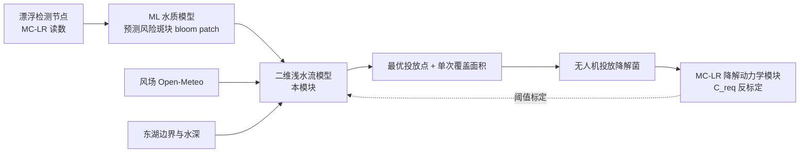
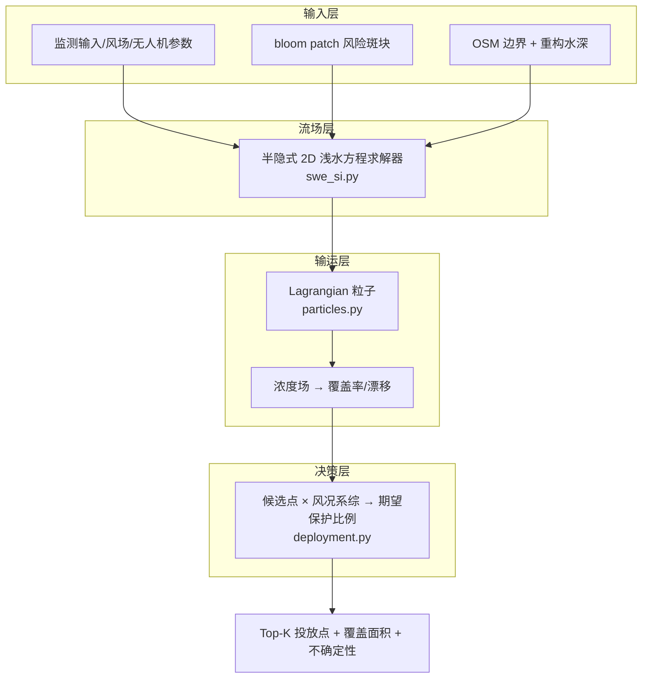

# 教学文档：二维浅水流模型（武汉东湖）——从方程到投放决策

> 本文是 `model_Two-dimensional_water_flow/` 的**教学版说明书**：逐层讲清"这个模型在算什么、每个模块为什么这样选、各模块之间如何衔接"。
> 目标读者：第一次接手该模块的队员、想复现或评审的评委、希望理解代码的读者。
> 前置知识：偏微分方程的基础直觉、Python + numpy 基本读写、数值方法入门（CFL 条件、隐式/显式的区别）。
> 配套阅读：`README.md`（结论速览）｜`MODEL_ARCHITECTURE.md`（正式架构文档）｜`ARCHITECTURE_ITERATIONS.md`（25 轮审查日志）｜`REVIEW_REPORT.md`（独立审查报告，含已知问题清单）。
>
> **v2 修订说明（2026-08-24）**：① §5 数值已随演进更新——当前域标定 均值 2.21 m/最大 4.75 m（MIKE21 论文值）、L≈381 m、场上实际最大 4.64 m（原"5.8/5.47/L≈498"为旧版本）；② 默认参数已对齐 MIKE21 校准（n=0.0238、use_adv=True）；③ `batch_sim_drops` 阈值重抽样 bug 已修复；④ 新增 E0–E6 六组文献驱动的实验（38→42 实测点水深标定、波依赖 Cd、湖陆风、表层风漂移、C_req 联标、风场景库、多航次接口），完整记录见 `report/实验记录_EXPERIMENTS.md`，结论与建议见 `report/优化方案与不足_OPTIMIZATION_PLAN.md`。

---

## 1. 模型在 iGEM 系统中的位置

整个干实验闭环是：**监测（工程菌检测节点）→ 预警（ML 水质模型）→ 投放（本模型）→ 降解（动力学模型）→ 回收**。



本模型只回答两个工程问题：

1. **投放到哪里？**——菌团投下去之后会被水流带到哪，能否覆盖风险斑块；
2. **单次投放能覆盖多大面积？**——决定需要多少架次、多少载荷。

这两个问题都依赖水流，所以模型的"心脏"是一个求解**二维浅水方程（2D SWE）**的数值求解器，外面再套上**粒子输运**和**投放点优化**两层。

---

## 2. 总体架构：四层数据流



对应到代码文件：

| 文件 | 职责 | 一句话解释 |
|---|---|---|
| `src/swflow/domain.py` | 计算域 | 把 OSM 矢量边界变成 50 m 栅格掩膜，再生成一个"形状合理"的水深场 |
| `src/swflow/swe.py` | 显式求解器（参考实现/教学用） | 用简单显式方法验证物理与网格，证明"为什么显式不行" |
| `src/swflow/swe_si.py` | **生产求解器** | 半隐式求解 2D 浅水方程，输出稳态风生流场 (u,v,η) |
| `src/swflow/particles.py` | 输运 | 菌团=粒子群，RK4 平流 + 随机游走 + 岸线反射，输出浓度场 |
| `src/swflow/deployment.py` | 投放决策 | 计算单次覆盖面积、风险斑块、投放点优化目标函数 |
| `src/swflow/viz.py` | 通用绘图 | 中文字体、交错网格→格心速度换算 |

---

## 3. 物理层：浅水方程在讲什么

### 3.1 两个方程

模型求解的是深度平均的二维浅水方程（见 `MODEL_ARCHITECTURE.md` §3.1 的完整公式）：

```
连续性：  ∂η/∂t + ∂(H u)/∂x + ∂(H v)/∂y = 0
u 动量：  ∂u/∂t = -g∂η/∂x + f·v - (平流) + τ_wx/(ρH) - g n²|u|u/H^(4/3) + ν∇²u
v 动量：  ∂v/∂t = -g∂η/∂y - f·u - (平流) + τ_wy/(ρH) - g n²|v|v/H^(4/3) + ν∇²v
```

逐项"翻译"成水文直觉：

| 项 | 含义 | 对应东湖情景 |
|---|---|---|
| ∂η/∂t + ∇·(Hu) | 水不可压缩：水面升高的地方必有水流入 | 体积守恒的数学保证 |
| −g∇η | 水面倾斜产生压力差，驱动水流 | 风把水推向一边→水面倾斜→环流 |
| τ_w/(ρH) | **风应力**：风通过水面摩擦把动量传给水体 | 本模型的**发动机**（τ = ρ_air·Cd·W²） |
| g n²\|u\|u/H^(4/3) | **Manning 底摩阻**：湖底粗糙度刹车 | n=0.022，来自浅湖文献区间 0.02–0.04 |
| f·v / −f·u | **科氏力**：北半球运动物体右偏 | f=2Ωsinφ≈7.4×10⁻⁵ s⁻¹（东湖纬度） |
| ν∇²u | **涡黏**：把没解析的小涡流参数化为扩散 | ν=0.5 m²/s 工程常用值 |
| −(u∂u/∂x+…) | 非线性**平流**：水流"搬运"自己的动量 | 生产脚本中开启（`use_adv=True`） |

风应力公式在代码里是 `swe.py` 的 `wind_stress()`：气象学惯例"风从哪来"（0°=北风），`τ = 1.225 × 1.3e-3 × W²`，分量取 `(-sinθ, -cosθ)`。

### 3.2 为什么是二维（而不是 3D）

- **湖盆条件**：东湖平均水深 2.11–2.46 m、最大近 6 m，风混合强烈、基本不分层 → 垂向结构弱，二维深度平均是合理近似（Fenocchi et al. 2016 的结论：垂向混合好时 2D 误差主要限于流速幅值）。
- **先例**：已有东湖 MIKE 21 二维水动力-水质研究（ISPRS IJGI 2020, 9(2):94）。
- **代价（诚实）**：2D 看不见垂向过程——蓝藻昼升夜沉、表层流速偏大等问题只能靠粒子层参数化补偿，不能由方程本身给出。

---

## 4. 数值层：怎么把方程变成可运行的循环

这是整个模型技术含量最高、也是最值得学习的部分。

### 4.1 Arakawa C 网格（交错网格）

把湖面切成 50 m×50 m 的格子，但**不同的物理量放在不同的位置**：

```
        v[j+1,i]        v[j+1,i+1]
      ●────────●────────●
      │        │        │
u[j,i]│   η[j,i]  u[j,i+1] │   η[j,i+1]
      ●────────●────────●
      │        │        │
u[j,i+1]│        │        │
      ●────────●────────●
        v[j,i]          v[j,i+1]
```

- η（水面高度）在**格心**；
- u 在**东西向格边**，v 在**南北向格边**；
- 好处 1：连续性方程里的流量差天然对齐（η 的变化正好等于周围四个面的净流入）；
- 好处 2：压力梯度 `-g(η_east−η_west)/dx` 天然取在速度点两侧；
- 好处 3：闭湖边界"边界面流速=0"只需把最外圈面掩掉，不用额外边界公式。

对应数组形状：`eta(ny,nx)`、`u(ny,nx+1)`、`v(ny+1,nx)`；`viz.cell_velocities()` 负责把面速度平均成格心速度供绘图/粒子插值用。

### 4.2 显式方案的翻车（重要教训）

最初实现用的是显式 Heun（RK2）时间推进（`swe.py`），思路最直白：每个时间步把所有项按当前值算一遍。结果在 `dt=2 s` 时矩形盆实验**指数失稳**（η 从 10⁻³ 级涨到 4 m 后爆炸），只有 `dt=1 s` 才稳定。

原因是一条数值规则——**重力波 CFL 条件**：浅水方程里信息以速度 c=√(gH)≈4.7 m/s（H≈2.3 m）传播，显式格式要求 `c·dt/dx ≤ O(1)`，即 dt 不能超过 ~10 s 量级；加上摩擦/平流项的更严限制，实际只能跑 1–2 s。36 小时自旋需要 13 万步，太慢且脆弱。

### 4.3 半隐式：只把"危险"的项隐式化（`swe_si.py`）

关键洞察：**失稳的根源是重力波（压力项），而不是风、摩擦、涡黏这些"慢"项**。所以不必全部隐式——只把压力项隐式化即可，这就是 Casulli 型半隐式自由面格式：

1. 先把"慢"项显式算成一个中间速度 u*（风应力、科氏力、涡黏、平流——都不含压力）；
2. 动量方程对压力项隐式：`u^{n+1} = u* − g·dt·∇η^{n+1}`；
3. 代进连续性方程 `η^{n+1} = η^n − dt·∇·(H u^{n+1})`，消去 u^{n+1}，得到**只关于 η^{n+1} 的椭圆方程**：

```
η^{n+1} − dt²·g·∇·(H ∇η^{n+1}) = η^n − dt·∇·(H u*)
```

4. 离散后这是一个**对称正定（SPD）的五点线性系统**，用共轭梯度法（CG）解出 η^{n+1}；
5. 再用 `u = u* − g·dt·∇η^{n+1}` 更新速度，最后施加半隐式底摩擦（分母 `1 + dt·g·n²·|u|/H^{4/3}` 保证摩擦再大也不会让速度反向）。

代码对应位置（`swe_si.py`）：

- `_explicit_u/_explicit_v`：算 u*（第 70–117 行）；
- `_assemble_system`：组装五点 SPD 矩阵 `A`（第 119–148 行），对角元 `1 + α(He+Hw+Hn+Hs)`，`α = dt²g/dx²`；
- `step()`：RHS → CG 求解 → 压力修正 → 摩擦（第 150–179 行）。

**收益**：重力波模态无条件稳定，dt 从 1–2 s 放大到 **20 s**（10 倍以上），36 h 自旋只要 6480 步；SPD 系统用 CG 求解稳健且不需要大型库。

**代价与细节**：底摩擦在 η 求解之后才施加，严格说是"半隐式近似"——`volume()` 测到的机器精度守恒针对的是 η 方程本身；摩擦修正后的通量守恒是近似满足（本参数范围影响可忽略，但表述上要分清，见 REVIEW_REPORT P2-5）。另外默认构造参数 `use_adv=False`，生产脚本全部显式传 True——直接 new 一个默认配置会静默丢掉平流项，这是当前代码的一个"坑"（REVIEW_REPORT P3-4）。

### 4.4 验证：凭什么相信这个求解器

没有东湖实测流速可比对，模型建立了一条"解析解+物理守恒+收敛性"的验证链（全部可重跑）：

| 验证 | 预期 | 实测 |
|---|---|---|
| 闭盆驻波周期 vs 解析式 T=2L/√(gH) | 一致 | 误差 **0.16%**（`scripts/test_si.py`） |
| 体积守恒 | 漂移≈0 | **<1e-15**（机器精度） |
| 矩形盆风生环流解析平衡 | η 坡降 ≈ τ/(ρgH) | 同量级，净流速→0 |
| dt 收敛性（10/20/40 s） | dt 减小解收敛 | dt=20 与 dt=10 的 rms(u) 差 **4e-5 m/s**（`scripts/08_dt_convergence.py`） |
| 量级对照 | 浅湖风生流 0.03–0.07 m/s | SE 2.5 m/s 风 → max **0.058 m/s** ✅ |

教学要点：**"没有实测数据"不等于"无法验证"**——解析解验证（验证方程实现对了）+ 量级对照（验证参数区间合理）是 iGEM 场景下的标准做法。

---

## 5. 计算域模块：`domain.py`

### 5.1 湖面掩膜（OSM 矢量 → 栅格）

- 数据源：OpenStreetMap 东湖 multipolygon（Overpass API 抓取，`data/raw/osm_rings.json`）。
- 难点 1：OSM 的 multipolygon 外边界由**多条 way 拼接**，直接逐条填充会得到花斑（首次栅格化只有 14.5 km²）。`assemble_rings()` 按首尾节点把 way 串成闭合环。
- 难点 2：东湖旁边还有沙湖、南湖、严西湖、杨春湖等水体。`select_polys()` 用白名单（郭郑湖、汤菱湖、后湖…）/黑名单（沙湖、南湖…）/包围盒/面积阈值过滤。
- 栅格化：`matplotlib.path.Path.contains_points` 对 205×231 个格心做点在多边形内判断，多湖瓣取并集。
- **结果**：31.22 km²（官方正常高水位 31.75 km²，吻合 98%），湿格 12,487。

### 5.2 水深重建（没有实测等深图的降级方案）

东湖实测等深图是付费论文、DEM 对湖内无信号、HydroLAKES 只给统计估值。模型的解法是**形态学重建**：

```
d(x) = D_max · (1 − e^(−dist(x)/L))
```

- `dist(x)` = 格点到最近岸线的距离（`scipy.ndimage.distance_transform_edt`）；
- 两个未知量用两条文献约束定：**平均水深 2.30 m、最大水深 ~5.8 m**（湖北湖泊志：均值 2.11–2.46 m、最大近 6 m）；
- 固定 D_max=5.8 后，用二分法找 L 使场均值=2.30 → 得到 **L≈498 m**。

**为什么选指数剖面**：参数少（只有 L）、自动满足"边浅中深"的浅水湖形态、且单调光滑不会给求解器制造假梯度。它**不是**实测等深，只能保证环流"模式/方向"可信、"幅值"待标定——这是模型文档反复强调的第一局限。

**注意**：指数函数在湖内达不到渐近值，实际场上最大水深是 **5.47 m** 而非 5.8 m（5.8 是标定目标）——REVIEW_REPORT P2-4 已指出文档口径问题。

---

## 6. 风场模块与场景设计

- 数据：Open-Meteo 历史再分析，东湖中心 (30.557N, 114.404E) 2023–2024 逐时，17,544 时次（注意：**API 返回单位是 km/h**，`fetch_wind.py` 只做存储不做换算）。
- 场景设计：选三个基态（SE 2.5 m/s 夏季东南风基线、N 3.0 m/s 冬春北风、W 2.0 m/s 西风），每个场景用半隐式求解器自旋 24–36 h 到准稳态。
- 不确定性：5 成员风况系综（2.0–3.0 m/s、120–150°），每个成员都是**真实求解**（`scripts/02b_ensemble.py`），不用线性缩放近似——因为风生流与风速的响应不是严格线性的（底摩擦非线性）。

**为什么需要系综**：投放决策是一次性的、不可撤销的，而风是最大的不确定源。只给一个确定性答案会误导决策；给"每个可能风况下的覆盖 + 期望值"才能做稳健决策。

教学提醒（当前已知问题）：文档引用的"静风概率 21.8%、年均 1.8–2.3 m/s"来自另一个气象统计平台，与本项目自己下载的 Open-Meteo 数据（年均 2.87 m/s、静风(<0.5 m/s)仅 1.5%）冲突；夏季 SE 场景恰好被 Open-Meteo 夏季均值（来自 142°、2.75 m/s）支持，但"静风"论证需要重写。详见 REVIEW_REPORT P1-2。

---

## 7. 输运层：`particles.py`

### 7.1 为什么用 Lagrangian 粒子而不是欧拉浓度方程

投放的菌团是**一团高浓度物质**，且未来要给它加生物属性（存活、浮力、降解）：

- 欧拉方法（对流-扩散方程）在 50 m 网格上对"一坨几米大小的菌团"有严重数值弥散，还不好加个体属性；
- 粒子方法：菌团=粒子群，位置随流场积分，浓度用粒子直方图统计——直观、无弥散、和 Wang et al. (2017) 的 agent-based 蓝藻输运范式兼容。

### 7.2 运动学：RK4 平流 + 随机游走

每个时间步（粒子子步 dt=5 s，比流场 dt 细）：

1. **平流**：`_flow()` 用双线性插值取粒子所在位置的格心速度 (uc,vc)，然后做四阶龙格-库塔积分——比简单欧拉一步在弯曲流线上精度高很多；
2. **湍流扩散**：加一个高斯随机位移 `sqrt(2·D·dt)`（D=0.3 m²/s 水平扩散系数，保守小值；真实浅湖 1–100 m²/s 待标定）——这就是把"没解析的小涡"参数化成随机游走；
3. **岸线处理**：粒子若落到岸上，沿位移方向**二分回溯**（最多 10 次）找到最后一个水上位置，相当于"岸线反射"；仍失败则留在原处（kill fallback）。

### 7.3 浓度场与覆盖阈值

`density(pos, sigma_m=30)` 把粒子按格点直方图计数 → 30 m 高斯核平滑 → 掩膜截断 → 归一化到 ∫C dA=1（概率密度，单位 1/m²）。

覆盖面积定义（`deployment.py`）：

```
cov(t) = { x ∈ 湖面 : C(x,t) ≥ thr_rel · C_peak(t=0) }，默认 thr_rel = 5%
```

- `C_peak(t=0)` 是**初始**峰值浓度——阈值不随时间衰减，物理含义是"局部菌浓度还保有多少初始剂量强度"；
- 5% 是演示默认值：真正的阈值应由降解动力学模块的 **C_req（最小有效菌浓度）** 反算。因为覆盖面积对阈值极敏感（1%→5% 面积减半、5%→20% 缩到 1/6.5），**没有标定之前所有面积数字只能当演示**——这是文档反复强调的。

---

## 8. 投放与优化：`deployment.py`

### 8.1 `sim_drop()`：一次投放实验

伪代码流程：

```
pos0 ~ N(drop_xy, σ0²)          # 无人机投放精度 σ0=25 m 的高斯菌团
pos_end = tracer.run(pos0, T)   # 在流场中积分 T 小时
C = density(pos_end)            # 终态浓度场
thr = thr_rel * max(density(pos0))  # 用初始峰值定阈值
cov = (C >= thr) & mask         # 覆盖掩膜
area = cov.sum() * dx²          # 覆盖面积
诊断量 = 质心漂移、散布椭圆主轴/方位（PCA 特征值分解）
```

### 8.2 投放点优化：目标函数

对候选投放点 p、风况 w，覆盖收益定义为**保护斑块的比例**：

```
J(p) = Σ_w p(w) · |cov(p,w) ∩ bloom| / |bloom|
```

- `bloom_patch()`：风险斑块 = 椭圆掩膜（由 ML 水质模型预测/监测节点 IDW 插值给出）；
- 候选点：200 m 网格上的湿格（792 个）；
- 风况系综：5 成员等概率；
- 输出：期望保护比例场 + Top-K 投放点 + 各成员分位数。

### 8.3 批量向量化（`batch_sim_drops`）

直接对每个候选点分别跑一次粒子积分太慢；实现把所有候选点的粒子群**首尾拼接成一个大数组一起积分**（k×n 个粒子，单次循环），最后按组切分统计。这是"普通笔记本能跑优化"的关键。

### 8.4 结果怎么读（教学解读）

- 最优投放点位于斑块中心**偏上风侧**——流场会把菌团吹向斑块，优化器自动实现了"漂移预补偿"。这正是"必须推演水流才能选对投放点"的证据。
- 5 成员下最优点的保护比例区间仅 [0.050, 0.053]——**决策对风况稳健**。
- 单点覆盖天花板 ~5% 斑块面积（1.41 km² 斑块）→ 大面积水华不能靠单点，多点投放（600 m 间距贪心）前 3–4 点累计可达 15.5%→18.8%（无重叠上界估计）。
- 工程推论：把"处置单元"定义为 100–300 m 尺度热点（0.05–0.3 km²），每单元 1–3 架次。

### 8.5 已发现的教学案例（bug 剖析）

`batch_sim_drops()` 计算阈值时**重新抽样**了一组初始粒子来算 C0（`deployment.py:71`），而不是用真正参与模拟的那组——RNG 状态已被推进，两组初始群不是同一次实现。实测使个别候选点覆盖面积偏移 ±4%，而 Top-5 得分间距只有 0.1%，可能翻转排名。教训：**阈值、基准值这类"参照系"必须与实际模拟数据来自同一次随机实现**；修复后应做多种子稳健性检验。详见 REVIEW_REPORT P1-1。

---

## 9. 管线脚本：端到端数据流

| 脚本 | 输入 → 输出 | 耗时 |
|---|---|---|
| `fetch_osm_*.py` / `fetch_wind.py` | 网络 → `data/raw/` | 一次性 |
| `src/swflow/domain.py` | OSM 矢量 → `domain.npz` + fig01 | 秒级 |
| `scripts/02_run_circulation.py` | domain → 3 场景流场 `flow_*.npz` + fig02 | ~20 分钟 |
| `scripts/02b_ensemble.py` | domain → 4 个系综成员流场 | ~15 分钟 |
| `scripts/03_run_particles.py` | 流场 → 单次投放/覆盖曲线 + fig03 | ~5 分钟 |
| `scripts/04_run_optimization.py` | 5 流场 + 斑块 → `opt_result.npz` + fig04 | ~10 分钟 |
| `scripts/05_run_sensitivity.py` | 流场 → 风况/阈值/Manning 敏感性 + fig05 | ~15 分钟 |
| `scripts/07_multidrop_estimate.py` | opt_result → 多点贪心累计上界 | 秒级 |
| `scripts/08_dt_convergence.py` | domain → dt 收敛验证 | ~10 分钟 |
| `scripts/test_si.py` | 求解器解析验证 | 秒级 |

数据目录：`data/raw/`（原始下载）→ `data/processed/`（npz 中间产物）→ `figures/`（图件）。

---

## 10. 模块选型原因总表

| 选择 | 选它的原因 | 被放弃的方案及原因 | 支撑 |
|---|---|---|---|
| 2D 深平均 SWE | 东湖浅、混合好、有 MIKE21 东湖先例、算得起 | 3D/分层：东湖垂向结构弱，代价大收益小 | Fenocchi 2016；ISPRS IJGI 2020 |
| 半隐式 + CG | 只隐式化"危险"的重力波项，dt 放大 10 倍；SPD 系统稳健 | 显式 RK2：dt≤1–2 s 才稳，36 h 需 13 万步（实测翻车） | 迭代日志第 4 轮 |
| Arakawa C 网格 | 压力-速度解耦抑制、闭湖通量边界自然实现 | 同位网格：需要人工交错/压力滤波 | 数值分析通识 |
| Manning + 常数 Cd + 常数 ν | 参数少、可复现、落在浅湖文献区间 | 波依赖 Cd/Smagorinsky：数据不足，列为未来 | Hydrology Research 2020（鄱阳湖） |
| Lagrangian 粒子 | 无数值弥散、可加生物属性、覆盖统计直观 | 欧拉 ADE：50 m 网格弥散严重 | Wang 2017；H1 |
| 系综期望优化 | 风况不确定性大，单一答案误导决策 | 单场景确定性：给不出风险区间 | Nam & Aral 2007 |
| OSM + 形态学水深 | 免费可复现、面积吻合 98%；实测等深拿不到 | 实测等深/DEM/GLOBathy：付费或分辨率不足（失败记录在案） | DATASETS.md |
| 自研轻量求解器 | 可解释、可嵌入决策链、已验证 | MIKE21/TELEMAC：授权/黑箱/无法嵌入 iGEM 闭环 | 迭代日志第 21 轮 |

---

## 11. 关键参数速查

```
dx=50 m | dt=20 s（流场）/ 5–10 s（粒子）| n=0.022 | Cd=1.3e-3 | ν=0.5 m²/s
f=7.42e-5 s⁻¹ | D=0.3 m²/s | σ0=25 m | thr_rel=5% | 自旋 24–36 h | KDE σ=30 m
```

---

## 12. 常见误区与已知问题（对照 REVIEW_REPORT）

1. **误把"覆盖面积 0.065 km²"当工程数字**：阈值 thr_rel=5% 未与降解动力学 C_req 标定，当前所有面积都是演示值（这是模型自己的声明，不是审查新发现）。
2. **误以为"体积守恒<1e-15"覆盖全部**：严格说那是 η 方程积分的机器精度守恒；摩擦步在 η 求解后施加是半隐式近似（影响可忽略，但表述要精确）。
3. **直接 new `SweConfigSI()` 会静默丢掉平流项**（默认 `use_adv=False`），生产脚本都显式传 True。
4. **`batch_sim_drops` 阈值重抽样 bug**：修复前优化排名只能当"初步结果"引用（P1-1）。
5. **风场统计口径**：项目文档引用的"静风 21.8%"与 Open-Meteo 实测 1.5% 冲突，引用前先修（P1-2）。
6. fig01 标题的"成都东湖"错字、fig05 的 Manning 占位面板——图件交付前需重绘。

---

## 13. 与相邻模块的接口

| 接口 | 方向 | 形式 | 状态 |
|---|---|---|---|
| bloom patch | ML 水质模型 → 本模块 | 椭圆/栅格掩膜（`deployment.bloom_patch`） | ✅ 已实现 |
| C_req | 降解动力学模块 → 本模块 | 标量或浓度场，用于反算 thr_rel | ⏳ 接口预留（thr_rel 参数），未联标 |
| 输出 | 本模块 → 前端/中控 | Top-K 投放点坐标、期望覆盖分数、不确定性带 | ⏳ 数据可导出，未接前端 |
| 开边界 | 水文站 → 本模块 | 武丰闸/青山港流量序列 | ⏳ 接口预留（0 流量=闭湖），数据未获取 |

---

## 14. 深入学习路线图

1. **先跑一遍**：`test_si.py` → `domain.py` → `03_run_particles.py`，把 README 的"快速复现"走通；
2. **读懂求解器**：对照 §4.3 的推导读 `swe_si.step()` 的 30 行，手推一遍椭圆系统；
3. **读懂优化**：先读 `sim_drop`，再读 `batch_sim_drops` 的向量化拼接；
4. **读迭代日志**：`ARCHITECTURE_ITERATIONS.md` 第 4/7/8/13/21 轮是含金量最高的决策记录；
5. **进阶方向**（对应 MODEL_ARCHITECTURE §14–15）：表层流放大修正、C_req 联标、多点联合优化、PINN/ConvLSTM 代理、波依赖 Cd、开边界。
