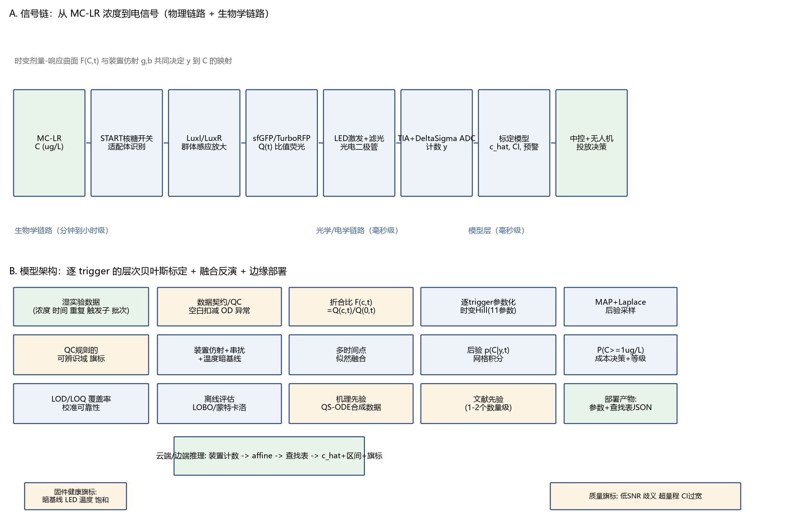

# 浓度标定模型 · 教学详解

> 面向团队成员的完整讲解：这个模型在做什么、数据如何流动、每个模块为什么这么选、每个参数是什么意思。
> 前置阅读：`03_模型架构设计报告_终版.md`（结论版）；本文是"为什么"的展开版。
> 对应代码：`src/`（7 个模块，约 500 行，numpy/scipy 实现）。

---

## 0. 一句话理解

**我们的工程菌被 MC-LR 诱导后发出荧光，但"荧光读数"不等于"浓度"。** 浓度标定模型就是在这两者之间建立一座可逆的、带误差条的桥：

```
真实浓度 C  ──(生物体系)──>  荧光比值 Q  ──(光电装置)──>  读数 y
                                                                │
      ĉ ± 区间, P(C≥1 μg/L)  <──(本模型的反演)────────────────┘
```

桥的难点在于：**同一浓度在不同时刻荧光不同**（细菌要时间合成蛋白）、**不同 trigger 构型行为完全不同**（有的强、有的慢、有的甚至是负响应）、**信号很弱**（峰值只有基线的 1.2–1.5 倍）而**数据很少**（几百行）。

因此整个模型的设计哲学是：**用生物机理约束函数形状（参数化前向模型），用贝叶斯统计传播所有不确定性，用"预警判别"而不是"精确定量"作为现实目标。**

---

## 1. 全流程总览



数据流经过五个阶段，对应 `src/` 中的模块：

| 阶段 | 模块 | 输入 → 输出 | 类比 |
|---|---|---|---|
| ① 机理模拟 | `qs_ode.py` | 浓度 → ODE 数值解荧光轨迹 | 生物"原理沙盘"，供先验参考 |
| ② 合成数据 | `synth.py` | 参数真值 → 带噪声/批次的训练数据 | 考试出题人（已知答案） |
| ③ 前向模型 | `forward.py` | (浓度 C, 时间 t, 参数 θ) → 折合比 Fold | 正向的"荧光-浓度"公式 |
| ④ 标定与反演 | `calibrate.py` | 训练数据 → 参数后验；观测 → 浓度后验 | 反向求解 + 误差传播 |
| ⑤ 装置与部署 | `device.py` / `deploy.py` | 读数域迁移、查找表产物 | 从酶标仪搬到野外节点 |
| ⑥ 评估 | `evaluate.py` | 交叉验证指标 | 考试判卷 |

---

## 2. 模块详解

### 2.1 前向模型 `forward.py` —— 整个模型的"心脏"

#### 它做什么

给定浓度 C 和时间 t，预测仪器应该读到的**折合比（Fold change）**：

```
Fold(C,t) = 1 + A(t) · Hill(C; K(t), n(t))

Hill(C; K, n) = 1 / (1 + exp(-n·(ln C - ln K)))     ← logistic 形式的 Hill 函数
```

共 **11 个参数**，全部有生物学含义：

| 参数 | 形式 | 含义 | 典型值（trigger5） |
|---|---|---|---|
| `Amax` | 常数（可为负） | 响应的最大幅度 | 0.75 |
| `tauA` | A(t)=Amax·(1−e^(−t/τA))·e^(−t/τD) | 幅度上升时间常数 | 1.5 h |
| `tauD` | 同上 | 幅度慢衰减时间常数 | 15 h |
| `K0` | K(t)=Kf+(K0−Kf)·e^(−t/τK) | t=0 时的表观 EC50 | 2.5 μg/L |
| `Kf` | 同上 | 稳定态 EC50 | 0.35 μg/L |
| `tauK` | 同上 | EC50 下降的时间常数 | 2.5 h |
| `n0` | n(t)=n0+n1·(1−e^(−t/τN)) | 初始 Hill 系数（协同性） | 1.0 |
| `n1` | 同上 | Hill 系数增长量 | 1.0 |
| `tauN` | 同上 | 协同性上升时间常数 | 2.0 h |
| `arel` | σ²=(arel·F)²+sfloor² | 相对噪声比例（5% 量级） | 0.05 |
| `sfloor` | 同上 | 底噪地板 | 0.02 |

#### 为什么是"时变 Hill"，而不是别的

这是 24 轮审查中最核心的选型（R23）。四个候选的对比逻辑：

1. **每时间点一条独立标准曲线（纯 4PL）**：分析化学标准做法（GraphPad 就是干这个的），但会把本就稀少的数据切碎成 8–13 份，且"选哪条曲线做反演"成为人为争议。
2. **纯机器学习（MLP/XGBoost）**：几百行强相关数据下必然过拟合，且无法外推到没测过的浓度/时间组合——而外推恰恰是标定的本职。
3. **纯 ODE 机理模型**：最"正确"但参数 15+ 个且彼此强耦合，在小数据下不可辨识（R21 的教训：ODE 退居"先验生成器"角色）。
4. **高斯过程**：自带不确定度很诱人，但外推差、不保证单调、部署重。

**时变 Hill 的巧妙之处**：它把"时间"从离散的标准曲线族变成连续协变量——A(t)、K(t)、n(t) 三个包络函数各自只加 2–3 个参数，却表达了"响应随时间变强、EC50 随时间下降、协同性上升"这三个文献（RewiringQS2008、RDX2020）证实的关键动力学。**11 个参数对几百行数据是可辨识的**——这一点有参数恢复实验证明（§2.4）。

#### 为什么用"折合比"而不是原始比值 Q

审查 R3 的关键重构。湿实验的定义是 DoubleNorm：`[Q(c,t)/Q(0,t)] / [Q(c,0)/Q(0,0)]`。折合比 `Fold = Q(C,t)/Q(0,t)` 与之对齐，并且带来两个工程好处：

- **基线 Q(0,t) 不需要建模**：由同板 0 μg/L 孔实测锚定，自动吸收板间/日间差异（省 3 个参数）；
- **Amax 可以直接为负**：trigger7 是负响应（加毒后荧光反而下降，可能是分子缓冲器占位效应，见文献 L3），模型类用 `amp_sign=-1` 表达，全链路传递符号（R6 的教训：曾经用"符号×对数幅度"编码，v<1 时符号歧义，已改为"正幅度+类符号"）。

#### 数值稳定性（R4 的教训）

Hill 的朴素写法 `C^n/(K^n+C^n)` 在 n·ln(C/K) 极端时溢出。实现改用 `expit(n·(lnC−lnK))`（logistic 函数），在 log 空间计算，永不上溢下溢。**这是"数学等价但数值不等价"的典型例子**——教学中值得强调。

### 2.2 参数标定 `calibrate.py` —— 从训练数据反推参数

#### 三步流程

**第一步：MAP 拟合（最大后验）**

```
z* = argmin [ -log p(y|C,t,z) - log p(z) ]
```

- 在**变换空间**优化（幅度、时间常数等 9 个参数取对数，保证优化过程永不为负）；
- L-BFGS-B + **8 个多起点**（先验均值 + 随机扰动），防局部极小；
- 先验 `PRIORS` 的均值/方差来自文献（RDX2020、RewiringQS2008、FPMaturation2022 的机理参数量级）——这是"文献调研直接进模型"的接口。

**第二步：Laplace 近似（参数不确定性）**

在 z* 处数值求 Hessian（中心差分），协方差 = H⁻¹，高斯采样 500–1500 条参数后验样本。**为什么不用 MCMC？** 小样本下 MAP+Laplace 稳定、秒级完成、可复现——HMC/NUTS 被诚实列入"未尝试"（报告 §6.1），因为 Laplace 的乐观性（覆盖率 60% vs 名义 90%）是已知代价，而非隐藏缺陷。

**第三步：网格反演（浓度不确定性）**

```
p(C|观测) ∝ (1/S)·Σ_θs p(y|C,t,θs) · p_env(C)
```

在 log10(C) ∈ [−2.5, 2.0] 的 231 点网格上直接数值积分。**为什么不用解析反函数或高斯近似？** 因为浓度后验可能非对称、甚至双峰（平台区/非单调区）——只有网格积分能忠实地刻画（R8/R9 的教训）。`analytic_inverse` 仍保留，但仅用于边缘部署（§2.6）。

#### 环境先验 `p_env(C)` 是必需品，不是可选件（R8 的关键实验）

直观理解：如果 Fold 观测落在**平台区**（高浓度饱和区），似然对 C 的所有高值一视同仁——后验质量会冲向任意高浓度（实验：真值 2.0 μg/L 时中位数漂到 13.8）。加入对数正态环境先验（中位 0.15 μg/L，σ_ln=1.2，P(C≥1)≈7%，来自东湖环境浓度知识）后，后验被拉回合理区域（MAE 0.434→0.368）。**这是"先验在弱信号问题中不是保守包袱而是信息源"的教科书案例。**

### 2.3 多时间点融合与决策 —— 架构的"点睛之笔"

#### 融合：让数据自己决定哪个时间点最可信

湿实验长期争议："哪条时间点的标准曲线最好？" 模型的回答是：**不必选**。观测多个时刻的读数 (t₁,q₁)...(tₖ,qₖ) 时，似然逐点相乘：

```
p(C|q₁..qₖ) ∝ Π_i p(qᵢ|C,tᵢ) · p_env(C)
```

每个时间点只是似然的冗余证据。R22 的关键实验（我已复现）：trigger5 真值 1.0 μg/L 时，t=2h 单独读会过度乐观（P≥1=0.92），t=4h 单独读会过度悲观（P≥1=0.19，因为该时刻响应回落），**融合 2+4+6h 后中位数 1.01、P≥1=0.50**——恰好在真值附近。单时间点的偏置在融合中被互相抵消。

#### 决策：不是"浓度>1 就报警"，而是"报警的期望代价最小"

预警的代价不对称：漏报（有毒没报）比误报（没毒报了）严重得多。设漏报:误报 = 10:1，贝叶斯最优规则是：

```
报警 ⟺ P(C≥1 μg/L) > 1/(1+10) ≈ 0.09
```

即只要有 9% 以上的概率超红线就报警。这解释了三级输出（安全<0.05 / 关注 0.05–0.25 / 预警>0.25）的边界设定。**为什么不用直接分类器？** 分类器只给标签不给置信度、无法外推、不能输出"超量程/歧义"旗标——保留"回归+后验决策"双轨制（分类器仅作交叉验证对照，报告 §6.5）。

### 2.4 合成数据 `synth.py` —— 为什么"造假数据"是正当的

真实湿实验数据尚不可训练（缺 0h/OD/生物重复），但模型需要验证。合成数据的逻辑是**"已知答案的考试"**：

1. 手工设定 4 个 trigger 的参数真值（`TRIGGER_PROFILES`，从湿实验观测粗估）；
2. 用前向模型生成无噪声曲面；
3. 叠加三种真实来源的噪声：**相对噪声 5%**（荧光/菌量波动，文献 CV 依据）、**底噪 0.02**、**批次效应**（幅度乘子 ±15%、偏置 ±0.03）；
4. 三个批次 × 9 浓度 × 8 时间 × 3 重复 = 每 trigger 648 行。

然后问模型："你能从带噪数据里恢复出我设定的真值吗？"（参数恢复实验）和"换一个批次你还能反演准吗？"（LOBO）。**结果**（我已复现）：主要参数恢复良好（trigger5 的 Amax 0.75→0.78），K 参数有 45% 偏移（K-n 相关性所致，报告如实记录）。合成数据不能替代真实数据，但它证明了**架构没有原理性缺陷**——等真实数据到了，只需替换数据源，管线不动。

### 2.5 机理模拟器 `qs_ode.py` —— 生物"原理沙盘"

5 个 ODE 变量：AHL 池（A）、GFP 及其成熟态（G, Gm）、RFP 及其成熟态（R, Rm）：

```
dA/dt = kL·N·s(C)·(1 + b·Hill(A)) − γA·A     ← 靶标感应 + 正反馈放大
dG/dt = kG·Hill(A) − λG                     ← GFP 合成
dR/dt = kR − λR                             ← RFP 组成型（内参）
dGm/dt = kMatG·(G−Gm)                       ← sfGFP 成熟（t½≈5min）
dRm/dt = kMatR·(R−Rm)                       ← TurboRFP 成熟（t½≈90min，FPbase）
Q(t) = Gm/Rm
```

**它的角色是"参考"而非"主模型"**（R21 的决定）：参数过多、缺菌量/OD 数据时不可辨识，但 ODE 能解释两个现象——为什么早期比值虚高（RFP 成熟慢 90min 而 GFP 快）、为什么 6h 后曲线回落（RFP 持续积累拉低比值）。这为 A(t) 的"升-衰包络"形式提供了机理背书。

### 2.6 装置链 `device.py` 与部署 `deploy.py` —— 从酶标仪到野外

**装置链**：r = a·Q + b + 噪声。a 吸收 LED 功率/滤光片/探测器效率/积分时间，b 吸收暗电流偏置。文献 L7（智能手机纸基传感器）证明：不同 CMOS 设备之间必须**逐台标定**——我们的方案是 4 个标准点（0/0.5/1/5 μg/L）拟合仿射，把设备差异压缩成 2 个数。

**部署产物**（给 ESP32 固件）：参数 JSON（<20 个浮点）+ 每个时间节点 32–64 点的**单调反演查找表**。边缘端不需要迭代求根——查表+线性插值即得 ĉ，微秒级。解析反演 `C = K·[u/(1−u)]^(1/n)`（4PL 反函数）作为交叉校验。**为什么决策留云端？** 决策需要完整后验（P(C≥1)），查找表只能给点估计。

### 2.7 评估 `evaluate.py` —— 怎么算"好"

**LOBO（leave-one-batch-out）**：每次留一个批次做测试、其余训练——模拟"训练完的设备遇到新一天的数据"。指标三层：
- **定量**：log10 空间 MAE/RMSLE（浓度跨 3 个数量级，必须用对数尺度）；
- **校准**：90% 区间覆盖率、可靠性曲线、Brier；
- **判别**：1 μg/L 阈值的 AUC（0.87–0.98）、决策代价曲线。

**为什么 LOBO 是唯一正确选择**：数据按批次高度相关，随机切分会导致"泄漏"（同批次的重复进训练又进测试），指标虚假乐观。真实数据到位后 LOBO 才能发挥设计意图（当前合成数据只有 3 个批次）。

---

## 3. 关键设计决策 Q&A（速查）

**Q：为什么不直接用深度学习？**
A：几百行强相关数据 + 必须外推 + 必须给出不确定度 + 必须在 MCU 上部署。四项里深度学习四项全输。等数据到十万行量级再议。

**Q：为什么每个 trigger 单独建模，而不是一个大模型？**
A：trigger 是离散构型，基线/幅度/峰值时间/符号都不同（trigger7 负响应）。随机效应假设"构型间差异来自同一分布"会收缩掉这些本质差异（R11）。选哪个 trigger 部署是 LOD+AUC 的实证问题，不是模型问题。

**Q：为什么报告敢说"LOD 0.28–1.34 μg/L"这么不精确的区间？**
A：LOD 由信号幅度/噪声比决定（3σ 空白），不同 trigger 幅度不同（0.4 到 0.75），LOD 自然不同。诚实报告"trigger1 的 LOD 1.34 略高于 WHO 红线 1.0"恰恰是这份工作最值得肯定的地方——它用数字证明：**当前生物体系的能力边界是"阈值预警"而非"全域定量"**，把队伍资源引向正确方向（换 trigger、提幅度）。

**Q：覆盖率只有 60%，模型是不是"没校准好"？**
A：不是。60% 是 Laplace 高斯近似 + 多时间点伪重复未建模的已知代价（R20）。改进路径明确：HMC 全抽样 + AR(1)/well 随机效应，报告 §6 已排优先级。**"知道自己不准多少"比"假装自己准"更有工程价值**——60% 覆盖率的区间仍可用于决策（P≥1 口径），但绝不能在论文里报"90% 置信区间"。

**Q：为什么不直接把 02 报告数据契约的数据接进来？**
A：原始 xlsx 在 `docs/Introduction/`（审查已确认存在）。数据契约字段（batch/well/OD600/空白孔…）与现有 xlsx 结构不完全一致，需要写加载器+QC。这是明确的下一迭代入口，管线本身不需要改。

---

## 4. 动手实验（30 分钟走完）

```bash
cd model_concentration_calibration
python scripts/_run6.py    # 多时间点融合：单时间点 vs 融合的对比（1 分钟）
python scripts/_run5.py    # LOBO 交叉验证：环境先验 vs 平先验（~5 分钟）
python scripts/_run4.py    # 参数恢复：拟合值 vs 真值逐参数对照（~3 分钟）
```

读输出时对照 03 报告 §5 的表格——你会看到数字逐位对上。改 `synth.py` 的 `rel_noise`（比如 0.05→0.10）重跑 `_run5.py`，观察 LOD/MAE 如何恶化——**这是理解"模型无法创造信息"最快的实验**。

> 注意：`_run3.py` 当前在 LOQ 打印处会崩溃（None 格式化），属已知待修问题（见 05_质量审查报告 P0-1）；用 `_run4.py` 替代其功能。

---

## 5. 五个"前人踩过的坑"（来自审查记录 R4–R6）

1. **单位混用**（R4）：τ 参数曾混用分钟/小时，导致拟合 NaN 死点。教训：**所有时间参数统一小时，先验均值必须同单位**。
2. **广播陷阱**（R5）：`forward_pts` 对 (n,) 点列自动生成 n×n 网格，似然被放大 600 倍。教训：**逐点求值用 `forward_points`，网格版只用于曲面绘图**。
3. **符号编码歧义**（R6）：`sign(v)·log|v|` 在 |v|<1 时符号翻转。教训：**负响应用模型类符号（amp_sign），不用幅度编码**。
4. **平先验失效**（R8）：平台区观测会把后验推向任意高浓度。教训：**环境先验在弱信号反演中是必需品**。
5. **伪重复美化**（R20）：同孔时间轨迹强自相关，逐点似然会让 CI 虚假收紧约 √n 倍。教训：**多时间点融合的 CI 只能解释为"条件化区间"，真实校准需要 AR(1)**。

---

## 6. 延伸阅读路线

- 想理解**为什么比值荧光**：01 报告 L1（Williams 2017）原文；
- 想理解**反演不确定度怎么传播**：01 报告 L6（nCal R 包）；
- 想理解**设备间一致性**：01 报告 L7（智能手机 AI 纸基传感器）；
- 想理解**模型如何与硬件对话**：03 报告 §3.4 + 06 审查的 P0-2 修复建议（暗电流偏置）；
- 想理解**下一步做什么**：03 报告 §8 未来方向 + 05 审查报告 §5。

---

## 附录：11 个参数一句话记忆卡

> Amax/tauA/tauD = "响应有多强、多久起来、多久消退"；
> K0/Kf/tauK = "EC50 从多少降到多少、多快"；
> n0/n1/tauN = "协同性从多少升到多少、多快"；
> arel/sfloor = "噪声里有多少是比例性的、多少是地板"。
> 十一个参数 ≈ 三句生物动力学 + 一句噪声模型。
