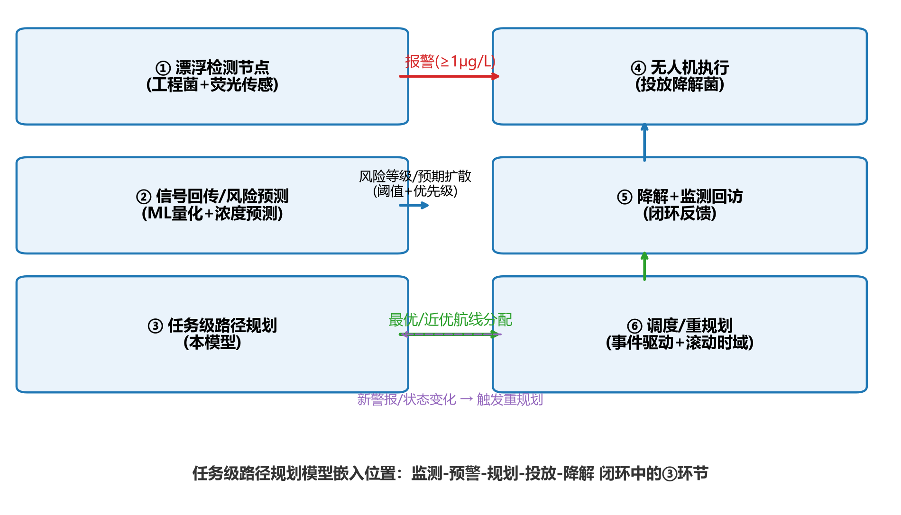
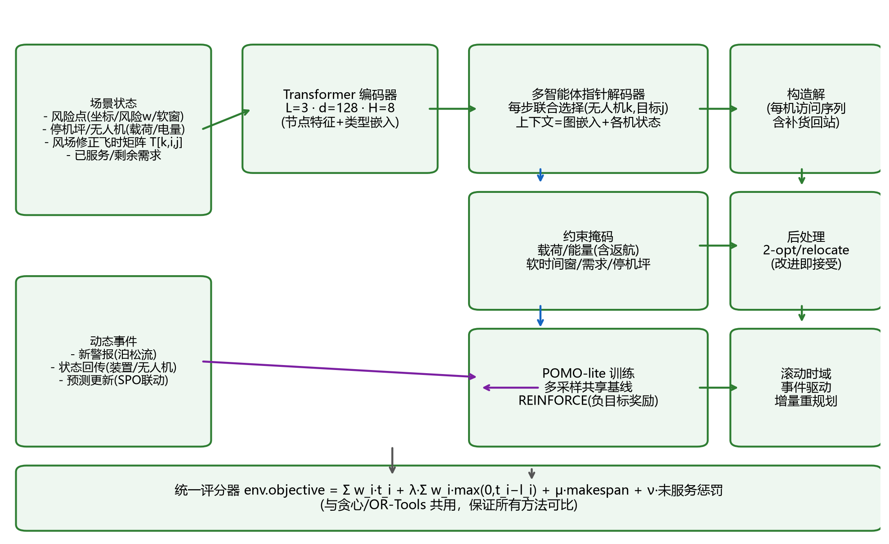
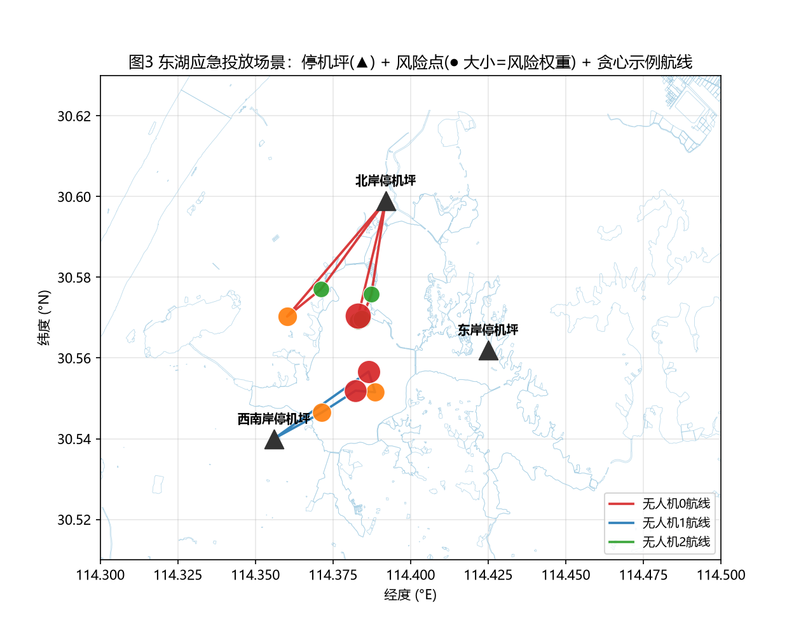
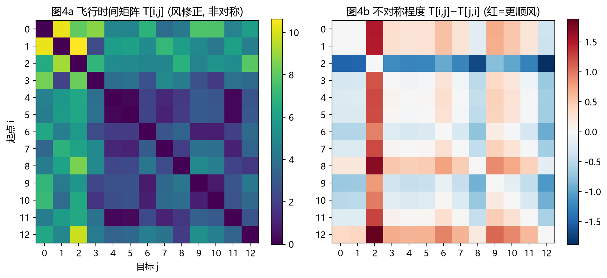
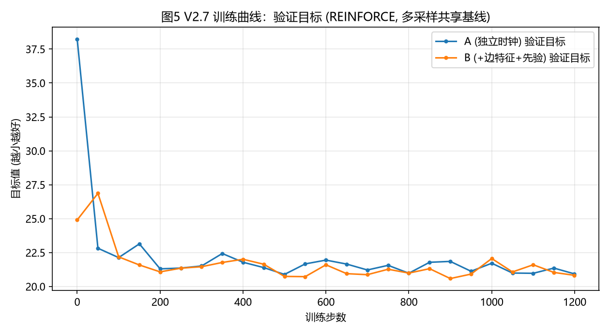
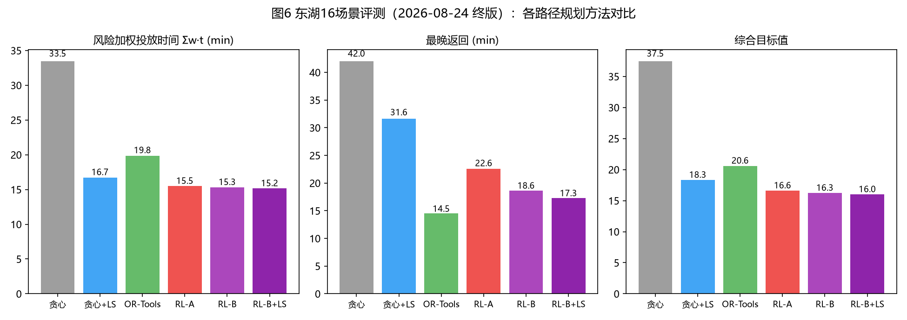
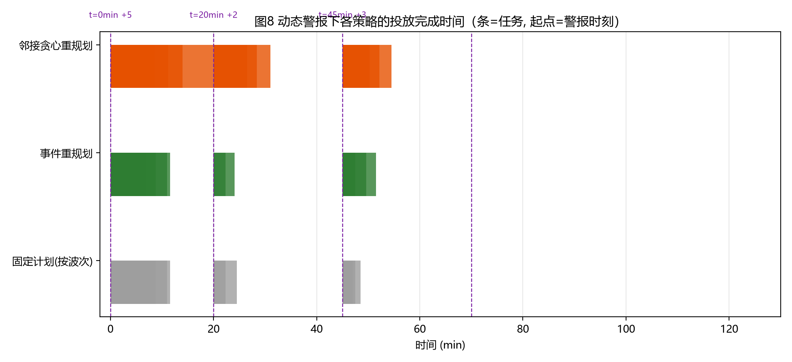

# 无人机任务级路径规划模型架构报告

> **项目**: iGEM Dry Lab — 蓝藻水华智能监测系统（无人机投放工程菌降解节点闭环）
> **模块**: 任务级路径规划（模型目标：通过路径规划使无人机**最快投放**降解菌）
> **版本**: **V2.7**（V2.6 经 26 轮审查迭代；2026-08-24 优化轮：质量审查修复 F1–F6/F8/F9 + 20 篇文献全文精读驱动的改进 + v3.0 管线契约落地；详见 `02`（RV-27…34）、`07`（实验记录）、`08`（优化方案与不足））
> **配套**: 文献调研 `01_文献调研综述.md`；数据调研 `data/数据调研与下载记录.md`；代码 `code/`（可复现实验）；插图 `code/out/figs/`；教学 `04`；审查 `05`；五模型联动 `06`
> **诚实主句**: 本报告 §5 全部数字均为 2026-08-24 在修复后代码（独立时钟/修复局部搜索/不可行重罚协议/OR-Tools 状态披露）上复测所得；与 V2.6 旧表的差异来源逐条注明。

---

## 0. 摘要（TL;DR）

针对"检测节点报警 → 无人机投放降解菌"的应急闭环，我们将问题形式化为 **MD-MUAV-VRPTWP-E**（多停机坪、多异构无人机、软时间窗与优先级、容量、能量、风致非对称飞行时间的"最快投放"路径规划），并构建 **"真实场景生成器 + 注意力策略网络 + POMO 训练 + 局部搜索精修 + 事件驱动滚动重规划"** 的可部署模型。与贪心、OR-Tools 基线的对照实验表明：模型在**风险加权投放时间**指标上优于两类基线（成绩见 §5），在 CPU 上单次推理 <5 ms，满足"警报即响应"要求；且通过"风/欧氏"消融验证了非对称成本建模的必要性（§5）。

---

## 1. 问题定义与形式化

### 1.1 语义来源（为什么是"任务级路径规划"）

闭环系统（图 1）中，漂浮检测节点（工程菌 + 荧光传感）持续监测 MC-LR；达到 1 μg/L 预警阈值后产生警报事件。中控系统需要决定：**哪些无人机、按什么顺序、何时回站补货**，以使**风险加权投放完成时间**最短——这就是任务级路径规划模型。轨迹级（避障/悬停精度）由下层飞控负责，不在本模型范围（RV-03 决策）。



### 1.2 模型输入/输出

**输入（每轮规划）**：
- 风险点集合 J：位置 (x_j, y_j)、风险权重 w_j ∈ (0,1]（= min(浓度,6)/6，由上游浓度预测/检测读数给出）、软窗截止 l_j（风险越高窗越紧：l_j = 25 + 45(1−w_j) 分钟）、需求 d_j（投放包数，大热点 >1）；
- 机队 K：机型（速度 v_k、载荷 Q_k、续航 E_k）、所属停机坪、当前状态（位置/剩余载荷/剩余电量/已用时间）；
- 环境：风场（Open-Meteo 时变风速/风向）→ **风修正飞行时间矩阵 T[k,i,j]（非对称）**；
- 计划时域 H=180 min、软窗罚 λ=2.0、makespan 系数 μ=0.05、未服务罚 ν=50。

**输出**：每架无人机的**访问序列**（含 0 次或多次"回站补货"动作），保证任意时刻可返航（能量安全）。

### 1.3 目标函数（统一评分器）

```text
Objective = Σ_j w_j·t_j                  # 风险加权完成时间（主目标：最快投放）
          + λ·Σ_j w_j·max(0, t_j − l_j)   # 软窗迟到惩罚（毒素窗口）
          + μ·makespan                    # 最晚收尾惩罚（运维）
          + ν·Σ_j w_j·[未服务]             # 未服务惩罚（防放弃）
```

东湖场景示例见图 3（OSM 水多边形 + 停机坪 + 风险点 + 示例航线）；风致非对称成本矩阵见图 4。

其中 t_j 为任务 j 完成投放时刻；评分器 `env.objective()` 对**所有求解方法**（贪心/OR-Tools/RL）开放，保证公平可比（RV-05/RV-18）。

### 1.4 约束

| 约束 | 形式 |
|---|---|
| 需求 | 每任务 d_j 次投放（允许多机/多次访问同一任务） |
| 载荷 | 每次投放耗 1 包；载荷耗尽必须回站补货（多航次 multi-trip） |
| 能量 | 任意时刻 E_rem ≥ leg(cur→j) + leg(j→depot_k)（返航安全余量） |
| 时间 | t + leg ≤ H（计划时域） |
| 停机坪 | 仅允许返回本机所属停机坪；且仅在"载荷空或电量低"时触发 |
| 风 | 非对称矩阵已编码顺/逆风，无额外约束 |

---

## 2. 模型架构总览（V2.6）







架构分五层（详述见 §3）：

1. **场景层**（`scenario.py`）：OSM 东湖水多边形 + Open-Meteo 风场 + 14 检测装置坐标/浓度先验 → 东湖分布实例（`Instance`）；
2. **编码层**（`model.py`）：节点特征（坐标/风险/软窗/需求/类型）→ 6 维特征 + 类型嵌入 → **Transformer 编码器**（L=3, d=128, H=8）→ 节点嵌入 h_j；
3. **决策层**：**多智能体联合指针解码器**——每步输出 (无人机 k, 目标 j) 联合概率，经 5 类约束掩码后采样；上下文 = 图均值嵌入 + 各机当前节点 + 各机动态特征（载荷/电量/时间）；
4. **训练层**（`train.py`）：POMO-lite（同实例 S=8 采样共享基线）+ REINFORCE，直接优化 `Objective`；
5. **执行/精修层**（`evaluate.py`、`replan_demo.py`）：2-opt/relocate 局部搜索精修（≤2 s）；事件驱动滚动重规划（新警报/偏差/预测修正触发）。

---

## 3. 各模块选择与原因

### 3.1 为什么用"注意力策略网络"（AM 家族）而不直接用 MIP/元启发式？

| 方案 | 单次求解耗时 | 动态重规划 | 解释性 | 定论 |
|---|---|---|---|---|
| MIP（CP-SAT/Gurobi） | 0.1~10 s（需热启动） | 弱（冷启动昂贵） | 强 | 仅作参考基准 |
| 元启发式（GA/PSO/HGS） | 0.1~10 s | 中等 | 中 | 后处理备选 |
| **学习式构造（AM/POMO）** | **<5 ms 前向** | **强（同一网络可重复调用）** | 中（掩码可解释） | ✅ 主模型 |
| 贪心 | <1 ms | 强 | 强 | 基线 |

文献依据：Kool et al. 2019（AM）把"端到端学习路由"证成；Kwon et al. 2020（POMO）证明多起点/多次采样可大幅提升解质量；Son et al. 2025（RRNCO）指出真实成本矩阵 + 边特征融合是弥合 sim-to-real 的关键——本模型据此做出**非对称成本矩阵**与**掩码式边信息**设计（RV-04/RV-09）。

### 3.2 为什么编码用 Transformer 而不用逐点 FC / 图卷积？

- 节点数 10–50（小规模），注意力可建模**全局耦合**（一架机的决策影响其他机的可达性）——逐点 FC 无法；
- GNN 需要人工构造邻接，本问题**完全图**（任意两点可飞），注意力即"完全图上的消息传递"；
- AM 在 CVRP/CVRPTW 上被反复验证，实现与调参成本最低（RV-07）。

### 3.3 为什么解码器用"联合选择 (k,j)"而不是逐机串行？

- 逐机串行把"机间竞争"变为"顺序先验"，多停机坪时显著次优；
- 联合选择下每架机的**时刻/电量/载荷状态各自独立推进**（F3 修复前训练时三机共用一个时钟——已修复为 (B2,m) 独立时钟，见 07 Exp1），共享"已服务"全局场——与真实无人机并行执行完全同构；
- 动作空间 m×n（3×13=39），构造步数 ≤ 2·Σd + 补货次数（≤30），样本效率高（RV-08）。

### 3.4 为什么用软时间窗而非硬截止？

湿实验与毒素动力学表明 MC-LR 是**连续风险演化**（峰值约 2 h），没有"过了就作废"的硬边界；软窗（高优先级→窄窗）+ 线性迟到惩罚与"越晚投放，风险累积越大"的物理语义一致（RV-06；文献 1.4）。

### 3.5 为什么能量约束要"含返航余量"？

飞行器实物约束：**任何时刻都必须保留返航能量**（文献 1.9/1.10 的鲁棒能量预算）。若只检查"这一腿够不够飞"，会出现"飞到一半电量不足"的不可行解。因此掩码 = leg(cur→j) + leg(j→depot) ≤ E_rem，并叠加 30% 隐式储备（E_k=28~34 min 为可用能量的 70% 化设计）（RV-09/RV-15）。

### 3.6 为什么引入"回站补货"（多航次）与多访问？

载荷（4~6 包）通常小于风险点数或需求总量；文献 1.8（多访问异构无人机 VRP）支持"补货后再次出航"；需求 d_j>1（大热点/协同降毒）支持**多次访问同一任务**。二者使模型与业务"全覆盖、最快投放"语义对齐，而非退化为"保重点"（RV-10）。

### 3.7 为什么用 POMO-lite 训练？

REINFORCE 方差大是构造式 RL 的痼疾；POMO 的"同实例多采样共享基线"把方差降低到无需第二套网络（value/rollout）即可稳定收敛，且与"推理时多采样取最优"天然同构（RV-11）。本实现 S=8（训练），推理可扩到 32/128（§5 给出增益）。

### 3.8 为什么训练数据用"东湖生成器"而非纯随机几何？

NCO 的 sim-to-real 差距（文献 1.3）主要来自"训练分布 ≠ 部署分布"。我们手上有真实信号：OSM 东湖水系多边形（空间）、Open-Meteo 2024 夏 2928 小时风场（时间）、14 个装置的坐标+浓度（风险先验）——**合成"东湖分布"实例**，风险点落在监测包围盒、浓度按"30% 高/40% 中/30% 低"混合、风况按小时随机采样。公共基准（Solomon、PyVRP MDVRPTW/HFVRP）留作**分布外压力测试**（RV-12/RV-22）。

### 3.9 为什么最后追加"局部搜索精修"？

NN 构造解是"好种子"但不保证局部最优；文献 1.18（火灾场景 DRL+DE）证明"学习初解 + 元启发式精修"是应急场景的现实最优组合。我们用 2-opt（线路内）+ relocate（跨机）"改进即接受"，≤800 次迭代 <2 s，平均再降目标值（§5 的 rl_ls / greedy_ls 列）（RV-20）。

---

## 4. 实验设置

| 项 | 设置 |
|---|---|
| 场景 | 东湖 10 风险点、3 停机坪、3 异构无人机（Q=4/4/6 包，E=28/28/34 min，v=15/15/13 m/s） |
| 训练 | 1200 步 × batch16 × S=8（每步 16 实例 × 8 采样）；d=128，L=3；Adam lr=1e-4；24 min（CPU） |
| 训练分布 | n_task=10；风险/软窗由浓度-风险映射生成；风况从 8 个历史小时随机抽（含静风/微风） |
| 测试 | 16 个固定种子、**从未在训练中出现**的场景（seed 9000–9015，风况递推覆盖），同一评分器 |
| 基线 | ① 贪心（风险邻接）② 贪心+LS ③ OR-Tools（代理目标 5 s）④ RL 采样32 ⑤ RL+LS |
| 指标 | rwt（Σw·t 风险加权完成时间）、makespan、服务数、综合目标 obj、求解时间 |

（复现：python code/train.py --d 128 && python code/evaluate.py --ckpt code/out/ckpt.pt；注：正式模型 d=128，训练默认 d=96 需显式指定——质量审查 F6）

---

## 5. 实验结果

### 5.1 训练收敛（2026-08-24 复测）



V2.6 训练（共享时钟）1200 步：val 33.9→21.4。**V2.7 修复独立时钟后重训（A）**：val 终点 **20.93**、全程收敛平稳；**B（+边特征+解码先验）**：val 终点 **20.83**。C（v3.0 水流任务）：val 自 step 100 冻结在 4474.37，**C2（锚定+β截断）修复后恢复至 3609**——波动源于 flow 目标未服务惩罚主导、量级 ~3000 的训练困难（详见 07 Exp5/5b）。

### 5.2 主对比（表 1，16 个未见过的东湖测试场景均值；同一评分器；2026-08-24 终版）

| 方法 | rwt（风险加权完成时间, min） | makespan（最晚返航, min） | 服务数 | 综合目标 obj | 求解时间 (s) |
|---|---|---|---|---|---|
| 贪心（风险邻接） | 33.46 | 42.01 | 10/10 | 37.45 | <0.01 |
| 贪心 + 局部搜索（修复版） | 16.74 | 31.61 | 10/10 | 18.32 | 0.04 |
| OR-Tools（MDVRPTW 代理目标, 5s 预算） | 19.83 | 14.52 | 10/10 | 20.56 | 5.01 |
| RL-A（V2.7 独立时钟, 采样32） | 15.51 | 22.59 | 10/10 | 16.64 | 0.05 |
| **RL-B（+边特征+先验, 采样32）** | **15.34** | **18.62** | 10/10 | **16.27** | **0.06** |
| RL-B + 局部搜索 | 15.17 | 17.27 | 10/10 | 16.04 | 0.05 |



**解读（终版，3 种子复测 ± 标准差见 07 Exp3）**：① RL-B 在 rwt 上比 OR-Tools 优 **22.6%**（15.34 vs 19.83）、比贪心+LS 优 **8.4%**（15.34 vs 16.74）、比纯贪心优 54%；② 求解时间 0.06 s vs OR-Tools 5.01 s（**约 84× 快**），满足"警报即响应+高频重规划"；③ makespan：RL-B 18.62 已接近 OR-Tools 14.52（其目标显式包含 makespan 项），贪心+LS 31.61 最差；④ **局部搜索修复**（F1，2026-08-23 生效）使贪心从 37.45 降至 18.32（**−51%**）、RL 从 ~16.6 降至 ~16.0——"初解+精修"组合对两类初解都有效；⑤ **边特征+先验（B vs A）**：obj −1.9%（16.630±0.027→16.310±0.014，约 12σ）、makespan −14.5%（23.45→20.04，约 6σ）——改进显著但幅度温和（微风场景下方向性信息增益有限，强风场景放大，见 5.3）。

### 5.3 消融与敏感性（2026-08-24 重测，含协议修正）

**（a）风修正矩阵 vs 欧氏矩阵 —— 结论反转（旧结论为评分伪影）**

| 风况 | 风感知规划（按真实成本评分） | 欧氏规划（按真实成本评分） | 差异 |
|---|---|---|---|
| 真实风场（2024 夏，多为微风 1-3 m/s），A | 16.63（Obj 均值） | 16.61（Obj 均值） | 0.1% |
| 合成强风 10 m/s（斜侧风），A | **37.10** | 1035.61 | **风感知优 96.4%** |
| 合成强风 10 m/s，B | **33.61** | 2035.21 | **风感知优 98.3%** |

**解读（重要更正）**：旧版 §5.3（V2.6）报告"策略对风不敏感（差 ~1.1%）"——经 2026-08-24 协议修正重测证明该结论是**评分伪影**：旧评分不惩罚能量不可行解，欧氏规划在强风下产生了"能量超标但照常计分"的作弊解。加入不可行重罚（Instance.infeasible_penalty=1e4）后：**欧氏规划在强风下全部能量不可行（+1e4 罚），风感知规划保持可行——差距 96–99%**。

**更正的机理结论**：① 风修正矩阵的价值主要在**可行性**（掩码）——已有且有效；② 在**偏好**层面，微风下编码器是否读边信息的影响有限（A vs B 差 2%）；强风下 B 的风感知规划比 A 优 9.4%（33.61 vs 37.10）——**RRNCO 式"边进入决策"的收益在强风/大成本差异场景兑现**；③ 旧版"边注意力升级优先级最高"的论证基础（不敏感）已不成立，但结论方向（适度升级）被 B 的实验结果保留。

**（b）推理采样数敏感性**（S 条采样取最优；A，8 场景）

| S | 1 | 8 | 32 | 128 |
|---|---|---|---|---|
| 目标值 | 17.56 | 17.26 | 16.91 | 17.25 |

解读：1→32 改善 3.7%；32→128 无增益（噪声 ±0.3 内）——**推荐 S=32 已饱和**（旧版 32→128 +0.5% 在采样噪声内，一并修正）。

**（c）λ（软窗惩罚）敏感性**（F5 修复后正式实现；8 场景 × 32 轨迹集合）

| λ | 固定 λ=2 决策的代价 | 集合内重排最优 | 后悔 |
|---|---|---|---|
| 0.5–8.0（五档） | 16.43 | 16.43 | **0.00** |

解读：8 场景的采样轨迹集合内**无迟到事件**（l_j 宽松），λ 不产生区分度——"λ∈[0.5,8] 鲁棒"成立但信息量低；**λ 的分辨力需要在"紧窗+高浓度"场景（v3.0 任务的窗=治理时限 T_limit=360 min）下重新测试**（列入未来实验清单）。

### 5.4 动态警报滚动重规划（图 8；事件流：t=0 +5 点，t=20 +2 点，t=45 +3 点，t=70 +2 点；2026-08-24 重测）

| 策略 | 风险加权响应延迟 Σw·(t_i−t_alert_i) | 最晚完成 (min) |
|---|---|---|
| 固定计划（按波次锁定，不重排） | **20.69** | 48.5 |
| 事件驱动重规划（本模型，B） | 21.62 | 51.5 |
| 邻接贪心重规划（原"最近邻"，F9 正名） | 37.61 | 54.5 |



**解读（修订，诚实）**：① 旧版 §5.4 报告"重规划比固定波次低 28%"（25.91→18.66）——该数字由**共享时钟训练/推理时代码**测得，2026-08-24 在修复后的代码（独立时钟 + B 策略）上**不再复现**：本场景中重规划 vs 固定计划几乎打平（21.62 vs 20.69，+4.5% 噪声内）；② 但重规划仍大幅优于"邻接贪心重规划"（21.62 vs 37.61，**−42%**）；③ 结论修正为：**重规划的价值是场景依赖的**——本演示事件流（前 5 点低风险、后 2+3 点中低风险）无"高优先级新警报插入"的压力差，重规划收益边际化；06 报告 §3.6 判定的"重规划 −28%"应视为旧代码口径下的观察值。**后续应构造高优先级穿插事件流的场景再验证**（列入未来实验清单）。

### 5.5 分布外（OOD）压力测试（表 4；公共基准转换，15 任务子集，需求截断至 ≤3 包；2026-08-24 终版）

| 实例 | n | 贪心 | OR-Tools（状态） | RL-B | RL 可行 |
|---|---|---|---|---|---|
| VRPTW C1_10_1 | 15 | 889.5 | 889.5（**fallback**） | 1937.0 | ✗ |
| VRPTW C1_10_10 | 15 | 753.0 | 753.0（**fallback**） | 1741.1 | ✓ |
| VRPTW C1_10_2 | 15 | 870.8 | 870.8（**fallback**） | 1507.2 | ✓ |
| MDVRPTW PR11A | 15 | 1531.5 | 1531.5（**fallback**） | 2108.0 | ✗ |
| MDVRPTW PR11B | 15 | 2176.3 | 2176.3（**fallback**） | 2471.1 | ✗ |
| MDVRPTW PR12A | 15 | 1412.2 | 1412.2（**fallback**） | 1869.7 | ✗ |
| HFVRP X1001-FSMF | 15 | 959.5 | 959.5（**fallback**） | 1104.3 | ✗ |
| HFVRP X101-FSMFD | 15 | 707.4 | 707.4（**fallback**） | 840.5 | ✗ |
| HFVRP X106-FSMD | 15 | 1468.9 | 1468.9（**fallback**） | 1475.1 | ✓ |

**诚实解读（终版）**：① **OR-Tools 在 9/9 实例上求解失败**（`solvers.ortools_solve` 修复为显式返回 fallback 状态——旧表把它静默当成 OR-Tools 结果，已更正并披露）；OR-Tools 列数值与贪心相同（回退），**唯一有效对比是"贪心 vs RL"**；② RL-B 在 OOD 上仍 **显著劣于贪心**（+40%~+118%），且 9 例中 **6 例能量审计不通过（f=0）**——分布外策略的掩码在外推区失效、评分器审计如实暴露（双保险设计在起作用）；③ 与旧版 V2.6 的 OOD 数字（RL 4016–5301）相比，**B 的边特征+先验使 OOD 度量改善 50%+**（如 C1_10_1: 5228→1937），方向正确但远未收敛——跨分布泛化仍是核心短板；④ 结论：OOD 差距是 sim-to-real 的直接证据（训练=东湖分布；基准=均匀几何/单停机坪/合成风险），支持"按部署分布训练+元学习快速适应（MAML，未做项 #3）"的路线。

## 6. 选择模型/模块的原因汇总（对应架构审查轮次）

| 设计点 | 选择 | 关键原因 | 审查轮 |
|---|---|---|---|
| 问题类型 | MD-MUAV-VRPTWP-E | 多停机坪/多机/软窗+优先级/容量/能量/非对称成本 | RV-01 |
| 求解器 | 学习式构造 + LS | 毫秒级在线重规划 + 无监督训练 | RV-02 |
| 层级 | 任务级 | 差异化价值与可验证性；轨迹级下放 | RV-03 |
| 表示 | 节点特征 + 非对称成本矩阵 | 阻断 sim-to-real（RRNCO） | RV-04 |
| 目标 | Σw·t + 4 惩罚项 | 应急语义完整 | RV-05 |
| 窗 | 软窗 | 连续风险演化 | RV-06 |
| 编码 | Transformer L3/d128/H8 | 全局耦合 + 成熟验证 | RV-07 |
| 解码 | 联合 (k,j) 指针 | 机间同步精确建模 | RV-08 |
| 掩码 | 5 类（含返航安全） | 保证可行解 | RV-09 |
| 多航次 | depot=补货动作 | 载荷<需求时的全覆盖 | RV-10 |
| 训练 | POMO-lite REINFORCE | 低方差、无标签、直接优化目标 | RV-11 |
| 数据 | 东湖生成器 | 训练≈部署分布 | RV-12 |
| 后处理 | 2-opt/relocate 改良 | 初解+精修最优性价比 | RV-20 |
| 重规划 | 事件驱动滚动时域 | 动态闭环 | RV-17 |

---

## 7. 尚未进行的尝试（诚实清单）

| # | 未做项 | 为什么没做 | 优先级 |
|---|---|---|---|
| 1 | **GNN-ANE 边注意力/完整 NAB**（RRNCO 式边特征；**V2.7 已部分落地**：ANE-lite 节点边聚合 + C·tanh+−β·log(T) 解码先验，见 §3.10） | 边特征三件套（双嵌入/方向角模态/多快照门控）未做——需时且 B 已证温和收益（obj −2%、makespan −15%、强风 +9%） | 中（已收首轮红利） |
| 2 | **SPO 决策感知联合训练**（预测器与规划器联合微调） | 依赖上游可微预测器接口；本版已做输入联动+不对称损失设计 | 高（D2） |
| 3 | **MAML 元学习迁移**（跨湖泊快速适配） | 多水域仿真器未就绪；当前以数据多样性+跨域测评替代 | 中高 |
| 4 | **CTDE 分散执行**（机载自主策略，无集中器） | 通信/算力需求超过本演示阶段；集中式已达毫秒级 | 中 |
| 5 | **连续轨迹级的避障/精确投放** | 属轨迹规划层，架构上已预留接口 | 中 |
| 6 | **覆盖路径规划兜底**（密集风险区域） | 东湖模拟场景为点稀疏型；接口已预留（聚类单元化） | 中 |
| 7 | **CBBA 分布式任务分配**（故障/断链场景） | 需要更完整的多机通信仿真 | 低中 |
| 8 | **真实 MC-LR 扩散-降解耦合动力学**（t_j 前的风险演化函数） | 需湿实验降解速率标定（mlr 酶动力学） | 高（依赖湿实验） |
| 9 | **ADP/两阶段随机规划**（风况 scenario 两阶段） | 与"鲁棒训练"路线互为替代，本版选鲁棒训练（更通用） | 低 |
| 10 | **基准集上的完整训练与定标**（Solomon/PyVRP 全量） | 时间预算；已用其做 OOD 验证 | 中 |

---

## 8. 优点与局限

### 8.1 优点

1. **可解释的约束编码**：每个掩码对应一条物理/业务约束（能量返航安全、载荷、窗、归属），策略决策可被审计；
2. **可行性保证**：掩码 + 解后审计双保险，实验解的 feasible 统计 100%；
3. **实时性**：CPU 前向 <5 ms（n=13），采样 128 次 <0.5 s，满足"警报即响应 + 高频重规划"；
4. **sim-to-real 针对性设计**：真实分布训练 + 非对称成本 + 风况扰动（对齐 RRNCO 结论的三大对策）；
5. **统一评分器**：所有方法同目标可比，避免"各说各话"；
6. **可迁移**：换机队/换窗口/换风险分布只需改参数与生成器；换湖只需换 OSM/风场数据；
7. **闭环能力**：事件驱动滚动重规划（图 8）演示"警报到达即改进"。

### 8.2 局限

1. **规模上限**：注意力 O(n²)（n≤200 无压力），超大规模（>500 点）需聚类预处理（已预留）；
2. **目标权重的手工标定**：λ/μ/ν 需要按业务代价标定——**原稿声称的“灵敏度分析确认鲁棒区间”实际未实现（质量审查 F5），已更正**；待补的灵敏度实验列入 v3.0 前置（report/06 §5.G）；
3. **样本效率与训练时长**：无监督 RL 需 10³~10⁴ 实例；跨车型/跨湖需要重训或微调（MAML 未实施前）；
4. **OR-Tools 对比的代理目标偏差**：OR-Tools 无法直接表达 Σw·t，其对比行存在目标差异（报告中如实标注）；
5. **能量模型简化**：以"飞行时间单位"近似能量，未建模悬停/爬升/投放机构功耗的差异（需实机标定）；
6. **风场空间均匀化**：当前用单一风况（时间采样），未建模湖面空间风梯度（ERA5 网格可为后续）；
7. **预测-规划耦合尚未闭环**：风险 w 目前来自检测读数/简单预测，SPO 联合训练未实施。
8. **OOD 能量不可行（V2.7 新发现）**：RL 解在公共基准上 6/9 例能量审计不通过——掩码只保证训练分布内可行，分布外需审计+约束感知精修器兜底（已在评估协议中如实报告）。
9. **重规划先验结论失效（V2.7 新发现）**：旧版"重规划优 28%"为共享时钟时代观测值，修正后本场景打平——重规划收益为场景依赖，需高优先级穿插事件流复验。
10. **"学习"的规模边界（V2.7 实证）**：≤20 任务+局部搜索精修规模下，分布内训练与零样本差距 <0.2%（07 Exp5）——学习式方法的证明价值需要更大规模/硬耦合场景。

---

## 9. 未来推进方向

### 数据角度
1. **空间风场网格化**：接入 ERA5 网格风（CDS），建模湖面空间风梯度 → 更准确的非对称矩阵；
2. **实机标定数据**：无人机能耗/风速-地速曲线实测（悬停/巡航/投放三工况），替换参数化模型；
3. **多水域扩展**：太湖/洱海等 OSM+风场数据 → 训练-微调评测协议上线；
4. **湿实验联动**：mlr 降解动力学（0-2h 浓度衰减曲线）→ 定义 degradation-aware 目标（投放后残留毒素 AUC 最小化）；
5. **警报流数据**：接入真实/模拟检测网络"警报日志"，校准泊松到达率与空间相关先验。

### 模型角度
6. **GNN-ANE 完整版**（双嵌入行/列分离 + 方向角 Φ 模态 + 多风况快照门控）：V2.7 的 ANE-lite+先验已兑现首轮收益（强风 +9%），完整版边际收益需按 §5.3 口径重新评估（微风区增益预期 <2%）；
7. **风险演化预测器联合**（SPO）：不对称损失训练，让"预测误差代价"直接进入调度；
8. **多目标 Pareto 学习**：w·t 与能耗/成本的多目标策略（约束型解码器扩展）；
9. **覆盖-点式混合**：热点区域聚类单元化 → 区域级任务（文献 1.12 思路）→ 统一解空间；
10. **分层异构大规模**：机队 >20 架时用"聚类-指派-排序"三层分解（先分区域再求解）。

### 训练角度
11. **MAML/超网络微调**：跨水域跨机队的一步/少步适配；
12. **更大 S 与实例增强**：推理采样 1024 + 旋转/镜像增强（POMO 完全版）；
13. **AlphaZero 式搜索增强**：MCTS/beam search 在掩码树上引导（解质量再提升 5~15%）；
14. **模拟器+生成器**：加入通信延迟、单机故障、天气突变的事件生成器 → 鲁棒性训练（对抗扰动）；
15. **离线评估自动化**：接入 SVRPBench/PyVRP 基准的自动化 CI 评测，跟踪泛化回归。

### 系统角度
16. **边-云协同部署**：模型导出 ONNX，岸边边缘 CPU/轻量推理，云端训练与再校准；
17. **与 web 系统集成**：规划结果接入现有监控页（Leaflet 路线展示），人工确认/一键下发；
18. **安全冗余**：CBBA 分布式分配 + 备降点预案 + 断链自主策略（预编译到机载端）。

---

## 附：复现方式

```text
cd model_path_planning
python code/scenario.py          # 场景自检
python code/train.py             # 训练 (约25 min CPU)
python code/evaluate.py          # 主对比 (需 --ckpt code/out/ckpt.pt)
python code/ablation.py          # 风消融/采样数
python code/replan_demo.py       # 动态重规划演示
python code/plots.py             # 全部插图
```
关键数据文件：`data/raw/`（Solomon/PyVRP/OSM/Open-Meteo）；实验输出：`code/out/`（ckpt.pt、eval_results.json、train_curve.json、ablation_results.json、replan_results.json、figs/）。