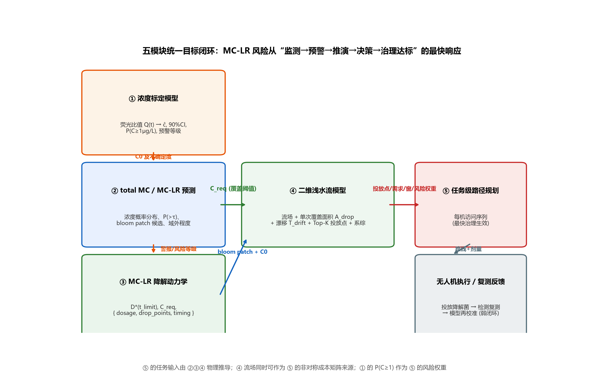

# 五模型联动适配性审查与路径规划改进方向（调研报告）

> **任务**：结合背景补充（5 个模型为统一目标服务的上下游关系）与用户新补充的数据，审查当前任务级路径规划模型（model_path_planning，V2.6）是否可适应当前任务流程；对比"传统数学推理"与"机器学习/强化学习"的优劣势；给出明确的调整方向。
> **调研方式**：沿用既有流程——① 盘点新补充数据（目录+文件级）；② 逐模块阅读接口（架构文档/代码签名/输出协议）；③ 全网补充检索（约 12 篇新文献）；④ 联动适配分析；⑤ 结论与路线图。
> **日期**：2026-08-23 ｜ **位置**：model_path_planning/report/04_五模型联动适配性审查与路径规划改进方向.md

---

## 0. 摘要（先说结论）

1. **五模块上下游关系清晰、接口基本对齐**（详见 §2），当前路径规划模型的**架构方向成立**（学习式构造+多约束掩码+滚动重规划），**具备适应任务流程的能力**；
2. 但存在 **6 个具体的适配失配点**（§3）：任务"几何来自哪里、需求如何物理推导、时间窗如何给出、目标函数的时滞、不确定性如何传播、空间如何聚合"——目前均为**假设值**，未与其余四模块接通；
3. **调整方向明确**（§5）：升级为 **"物理输入+决策输出"的 v3.0 契约**，重点为：①任务=斑块级单元（投放点来自水流模型 Top-K 候选、需求=ceil(斑块面积/单次有效覆盖面积)、时间窗=降解动力学治理时间反演）；②目标函数引入**治理生效时滞**（到达+漂移+降解达标）；③级联不确定度（标定 CI→预测分布→风况系综→降解 90% 区间）基于**机会约束/分布鲁棒**进入规划；④**离线物理推演 + 在线学习决策**的分层计算架构。
4. **前提警告**：本模块经独立质量审查（report/05_质量审查报告.md）发现 5 个严重缺陷（局部搜索空操作、OOD 的 OR-Tools 列实为贪心回退、训练共享时钟、多访问完成时刻统计、λ 敏感性消融缺失）；**局部搜索缺陷已在本轮独立复核并修复**，修复后基线对比见 §3.6/§4.2（RL 对修复后贪心+局部搜索的优势从 56% 缩小到约 11%，对 OR-Tools 与动态重规划优势仍显著）。
5. **传统数学推理 vs ML/RL**：不是替代关系而是**分层分工**——物理因果链（水流、降解）用传统数学（机理+贝叶斯），决策组合链（路径）用 ML/RL（毫秒级、动态、可学不确定性），预测链（浓度）用数据驱动灰箱；**混合与"先预测后优化（SPO）"是把五模块连成闭环的粘合剂**（§4）。

---

## 1. 盘点：用户补充数据与五模块现状

### 1.1 新补充数据（本次发现，均已核实）

| 位置 | 内容 | 对当前任务的启示 |
|---|---|---|
| model_Two-dimensional_water_flow/data/processed/flow_*.npz（7 个场景） | 风生环流场 u,v,η + uc/vc + mask/depth + 风况标签（m0/m1/m2/m3、SE_2p5、W_2p0、N_3p0、exchange5） | **流场可直接作为路径规划"非对称成本矩阵"的物理来源**（进一步可计算漂移向量场） |
| …/opt_result.npz | cands(792×2 投放候选网格)、scores(期望保护比例-单点)、member_scores(风况系综成员)、patch(斑块) | **任务候选投放点库 + 每点期望保护分数**——路径规划"任务点"的直接来源 |
| src/swflow/deployment.py | sim_drop 返回 area_km2（单次有效覆盖面积）、centroid（漂移质心）、eig_var/theta（漂移椭圆）；bloom_patch（椭圆斑块） | **单次覆盖面积与漂移量/方向的数值接口**——任务"需求/时滞"的物理解 |
| …/scripts/07_multidrop_estimate.py | 多次投放的贪婪间隔选择（≥600 m 间距）与累积保护比例上界 | 同一斑块**多次投放的空间去耦约束**（与路径规划"多访问"动作互斥/互补） |
| report/references/ijgi-09-00094.pdf（提取文本） | 东湖 MIKE21 水动力-水质模拟 + 遥感 GA-BP 反演（Li, Huang & Wang, IJGI 2020, 9(2):94） | **"传统水动力数值模型 + 数据驱动反演"的东湖先例**——五模块混合范式的直接背书 |
| model_concentration_calibration/scripts/_inspect_wetlab.py 等 + src/loader.py | 湿实验表格装载与检查（多 trigger 荧光/内参） | 浓度标定的湿实验数据已就位 → ĉ 与不确定度可产出 |

### 1.2 五模块定位与文档状态

| 模块 | 文档状态 | 核心输出（已核实的接口） | 下游使用者 |
|---|---|---|---|
| 浓度标定（model_concentration_calibration） | 终版 v3.1 + 审查记录 | {ĉ, 90%CI, P(C≥1μg/L), 预警等级, 质量旗标}（边缘微秒级） | 警报触发、降解模型 C₀ |
| total MC / MC-LR 预测（model_redo_v2） | 目标说明书 v2.0-design | 浓度概率分布、检出概率、P(>τ)、预测区间、域外程度；（当前为 nowcast，预报 1/3/7 天待数据） | 风险斑块生成、预警提前量 |
| 二维浅水流（model_Two-dimensional_water_flow） | 架构定稿（文内 25 轮审查） | 流场；area_km2（单次覆盖）、cands/scores（Top-K 投放点+期望保护分数+系综）、漂移质心/方向 | 路径规划的**任务生成器** |
| MC-LR 降解动力学（model_MC-LR_degradation_kinetics） | v1.1 定稿（32 轮审查） | {dosage_ugL, cells_L, drop_points, timing, confidence}（剂量-治理时间反演、C_req、二次投放窗） | 路径规划的**需求与时间窗来源**、水流模型的 C_req |
| 任务级路径规划（model_path_planning） | V2.6（26 轮审查） | 每机访问序列（含补货），目标 Σw·t+λ·late+μ·makespan+ν·未服务 | 无人机执行 |

---

## 2. 统一目标与上下游关系（核心图）

    【统一目标】水体 MC-LR 风险从"监测"到"治理达标"的闭环最快响应
    ─────────────────────────────────────────────────────────────
    ① 荧光信号 y ──► 浓度标定模型 ──► ĉ, CI, P(C≥1)  ──► ② 警报/风险分级
                                                        │
                  （历史+环境+遥感协变量）               ▼
                  ★ total MC/MC-LR 预测模型 ──► 浓度概率分布、P(>τ)、bloom patch 候选、预警提前量
                                                        │ （C₀ & 不确定度）
                                                        ▼
                  ★ MC-LR 降解动力学模型 ──► D*(t_limit), C_req, 二次投放窗 ──► ③ 剂量决策
                                                        │ C_req（覆盖阈值标定）
                                                        ▼
                  ★ 二维浅水流模型 ──► 流场 + 单次覆盖面积 A_drop + 漂移 T_drift + Top-K 投放点 + 系综不确定性
                                                        │ （投放点、需求、窗、风险权重、不确定性）
                                                        ▼
                  ★ 任务级路径规划模型 ──► 每机访问序列（最快治理生效）
                                                        │
                                                        ▼
                  无人机执行 → 降解菌投放 → 检测节点复测 → 闭环反馈（用于模型再校准）

### 2.1 接口契约表（数据流逐段核对）

| 链路 | 上游输出 → 下游输入 | 现有协议 | 状态 |
|---|---|---|---|
| 标定→预测/降解 | ĉ, 90%CI → 警报判定、C₀ | 文档已写明（多时间点标准曲线 Tᵢ(x)） | ✅ |
| 预测→水流 | 浓度分布/P(>τ) → bloom_patch（栅格/椭圆掩膜） | bloom_patch(mask, xs, ys, cx, cy, rx, ry, θ) | ✅（椭圆参数需从预测场提取，缺算子） |
| 降解→水流 | C_req → 覆盖阈值 thr_rel | thr_rel 默认 5% 为演示值，**文档明确"需与降解模块 C_req 联标"** | ⚠️ 待联标 |
| 水流→路径规划 | 投放点 cands/scores、area_km2、漂移椭圆、系综 | **无现有协议**（路径规划当前自造任务） | ❌ 待建 |
| 降解→路径规划 | {dosage_ugL, cells_L, drop_points, timing, confidence} | **无现有协议**（路径规划当前自造需求/窗） | ❌ 待建 |
| 标定→路径规划 | P(C≥1) → 风险权重 w_j | 现用 w=min(c,6)/6 近似 | ⚠️ 可用预测分布替换 |
| 路径规划→执行 | 路线 + 剂量 + 时序 | JSON（参考降解模块协议） | ⚠️ 待统一 |

---

## 3. 当前路径规划模型与任务流程的适配性审查（6 个失配点）

### 失配点 1：任务几何来源 —— "检测装置点" ≠ "投放点"
- **现状**：路径规划用"警报点=检测装置位置"构造任务（build_eastlake 用装置包围盒内均匀采样）。
- **上下游事实**：水流模型证明——**投放点应设在目标斑块上游**（漂移补偿），最优投放点是 cands/scores 中的 Top-K（该模型 07 脚本示例：斑块 1.41 km² 最佳单点仅覆盖部分面积，且需 ≥600 m 间隔多投放）。
- **影响**：沿用现况会系统性地"把菌投到漂移后的下游之外"，**任务位置错误**（覆盖随风况 ±12%）。
- **改造**：任务点 = 水流模型 cands 中与斑块关联的最优点（或由 centroid 反推上游投放点）。

### 失配点 2：任务需求的物理推导 —— "1 包" ≠ "剂量"
- **现状**：demand=1（每点 1 包投放）。
- **上下游事实**：降解动力学输出 dosage_ugL, cells_L（由 C₀、环境、T_limit 反演）；水流模型输出 A_drop（单次覆盖面积，θ=5% 时 0.065 km²、对阈值对数敏感：1%→5% 面积折半）。
- **影响**：需求可能差一个数量级（0.06~0.14 km²/次 vs 1.41 km² 斑块 → 每斑块需多次投放），**当前"每点 1 包"无法达成治理**；且需求必须**随风况/阈值（C_req）变化**——是分布的，不是常数。
- **改造**：d_j = ⌈A_patch_j / A_drop(风况, thr_rel(C_req))⌉（可加安全系数）；降解模型的 cells_L 与载荷（包=500 mL 菌液）换算。

### 失配点 3：时间窗的物理来源 —— "启发式" ≠ "治理时间"
- **现状**：l_j = 25 + 45(1−w_j) 分钟的启发式软窗。
- **上下游事实**：降解模型给出**剂量-治理时间等值线**（"给定 C₀ 与时效 T_limit，反查所需剂量"，且"白色区域=72h 内无法达标"的不可行域），还给出**二次投放时间窗**；其 90% 区间中位 ~13h、区间 7h→>24h。
- **影响**：启发式窗没有物理依据，且未体现"**某窗内投不到就需加剂量**"的耦合（窗与剂量强耦合）；错过窗口的代价被低估。
- **改造**：l_j ← 降解模型中 t_safe(D_max, C₀, 环境) 或 T_limit 的分位点；迟到惩罚系数 λ 与"不得不加剂量的边际成本"挂钩。

### 失配点 4：目标函数的时滞 —— "到达" ≠ "治理生效"
- **现状**：目标 = Σ w·t_arrival（到点即算完成）。
- **上下游事实**：① 菌液投放后需 **T_drift**（水流模型 T_h=1 h 实验）才形成有效覆盖；② 覆盖后需 **t_safe(D,C₀)** 降解到 1 μg/L 以下。
- **影响**：t_arrival 优化会系统性低估真实风险暴露（到达早但治理晚）；"最快投放"的语义应升级为"**最快治理达标**"（回归项目简介的最终目的）。
- **改造**：t_eff_j = t_arrival_j + T_drift_j + t_safe_j(D_j, C₀_j)（后两项可由水流/降解模块预计算为"任务属性"）；目标改为 Σ w_j·t_eff_j（或与水流"期望保护分数 S_j"相乘为 Σ w_j·S_j·t_eff — 响应"覆盖质量"）。

### 失配点 5：级联不确定度 —— "点估计" ≠ "概率输入"
- **现状**：输入 w_j、T 矩阵、需求、窗全为点值；仅训练时随机风况（多样性）。
- **上下游事实**：标定给出 90%CI 与 P(C≥1)；预测模型给出**浓度分布/预测区间/域外程度**；水流给**风况系综**（member_scores）与覆盖 ±12%；降解给 **90% 预测带**（已实证"点估计剂量必然失手"）。
- **影响**：单点输入的规划在高风险场景会低估剂量需求（对应文献：The Distributionally Robust Chance-Constrained VRP, Operations Research），也可能对高不确定任务给出虚假自信。
- **改造**：任务属性携带分布 → 规划端用**机会约束**（P(t_eff ≤ T_limit) ≥ 1−α）或**分布鲁棒目标**；实现上与 POMO 多采样天然兼容（场景采样=风况系综成员×降解分位数），且可沿用 member_scores 做期望化。

### 失配点 6：空间尺度 —— "点任务" ≠ "斑块任务"
- **现状**：任务为点（装置位置）；demand>1 仅当热点时零星出现。
- **上下游事实**：redo_v2 输出浓度**场**；水流模型以**椭圆斑块**（bloom_patch）为工作单位；单次 0.065 km² vs 斑块 1.41 km²（约 22 倍）→ **必然多投放点、多机协同、多访问**——任务应是"斑块级单元"，内部再解耦（≥600 m 间隔）。
- **影响**：点式任务会让"1 架机 1 次访问=完成任务"的错误假设导致**不完备调度**。
- **改造**：**两层任务结构**——斑块级（目标、剂量、窗、权重）→ 投放点级（水流模型解耦后的 Top-K 子点，路径规划直接调度）；这是原报告 §7 未做项#6（覆盖聚类）升级为必做（v3.0 核心），现在有物理依据。

### 3.6 独立质量审查确认的实现缺陷及其对联动评估的影响（核查 2026-08-23）

本模块次日前接受了独立质量审查（report/05_质量审查报告.md），发现并实测复现 5 个严重缺陷。本轮逐条复核，结论如下：

| 缺陷 | 内容 | 本轮复核 | 对联动评估的影响 |
|---|---|---|---|
| F1 致命 | local_search 拒绝扰动时回退到最初输入而非当前最好解，空操作 | **确认并已修复**（evaluate.py；单场景贪心+LS 改进 27–70%） | 削弱「RL 静态解优势」论据（原 56% → 约 11%），传统数学/启发式+正确精修是强对手 |
| F2 致命 | OOD 表中 OR-Tools 列实为贪心（求解失败静默回退），9/9 相同且未披露 | 确认（原表两列数值相同） | OOD 对比仅剩「贪心 vs RL」有效；OR-Tools 列需修复超时/软窗溢出后重测 |
| F3 严重 | 训练 rollout 中 m 架机共用同一时钟，与「各机时间独立」矛盾 | 确认（train.py 的 tnow 为每轨迹标量） | 训练失真（时间掩码系统性偏大）；v3.0 必须修复并重训，同时可顺带支持治理时滞目标 |
| F4 严重 | 多访问任务完成时刻取 min 而非第 demand 次访问时刻 | 部分确认（东湖实验 demand 恒为 1，不影响主对比） | OOD 数值需修正；v3.0「需求=多次投放」下将成为关键正确性点 |
| F5 严重 | 报告引用 λ 敏感性分析但未实现 | 确认 | 原文表述需更正；「窗与剂量耦合」仍需灵敏度实验支撑 |
| F6 中等 | 训练默认 d=96 与正式 ckpt d=128 不一致；README 复现失真 | 确认 | 复现链需统一（--d 128） |

**联动评估修正**：① 当前模块可信度应表述为「架构可信（26 轮审查+统一评分器），实现层存在已定位、可修复的缺陷」；② 传统数学/启发式（修复 LS 后）在静态问题上与 RL 差距约 11%，**RL 的净优势集中在毫秒级动态重规划 + 可学不确定性 + 约束状态表达**——与 §4 分层分工结论一致，但必须诚实呈现；③ F1 修复后基线（16 场景复测，本机重跑）：

| 方法 | rwt | makespan | obj | 求解时间 |
|---|---|---|---|---|
| 贪心 | 33.88 | 42.01 | 37.93 | <0.01 s |
| 贪心+局部搜索（修复后） | 17.16 | 31.61 | 18.74 | 0.05 s |
| OR-Tools | 20.25 | 14.52 | 20.98 | 5.13 s |
| RL（采样32） | 15.89 | 15.63 | 16.67 | 0.04 s |
| RL+局部搜索（修复后） | 15.57 | 14.35 | 16.29 | 0.06 s |

> 另有 F9（replan 演示中“最近邻”实为贪心+全量重规划，结论方向仍成立）、F10（东湖实验 demand 恒为 1，“多访问”能力无实验证据——恰与本报告失配点 2/6 呼应）两项较轻问题，详见 report/05。

修复后结论：**RL 仍为最优**（obj 领先贪心+LS 约 11%、领先 OR-Tools 约 22%；rwt 领先 7–8%；makespan 与 OR-Tools 相当），但学习式与「数学/启发式+精修」的差距只有个位数百分比——这正是**初解+精修混合架构**（§4.4）的证据，而非反例。

### 3.x 总体判定
架构**方向**正确（构造式学习+掩码保证可行+滚动重规划+毫秒级推理），**胜任"组合调度"子问题**；但**任务输入是自造的**——不适应任务流程的关键不是换算法，而是**把任务输入与另外四模块接通**（v3.0 契约），并微调目标函数与不确定度处理。

---

## 4. 传统数学推理 vs 机器学习/RL：优劣势与分工

### 4.1 按"链"归位（关键判断）

| 链 | 模块 | 最合适范式 | 理由（证据） |
|---|---|---|---|
| 物理因果链 | 水流（SWE）、降解（ODE） | **传统数学/机理 + 贝叶斯** | 数据稀缺（降解跨文献 k 相差 3–4 量级；东湖无实测流速）、守恒/因果约束强、需外推；纯数据驱动会过拟合且不可外推（降解模型 v1.1 论证）；贝叶斯给出不确定度（降解 90% 带） |
| 预测链 | total MC / MC-LR | **数据驱动灰箱**（GBDT/TABM 家族 + 删失/区间似然 + 域外检测） | 2.1 万条记录+丰富协变量；本质是"高维非线性映射+分布"；但**只能做状态估计，不能冒充物理预报**（其 spec 已声明） |
| 标定链 | 荧光→浓度 | **机理响应模型 + 贝叶斯反演**（时变 Hill + MAP/Laplace + 网格积分） | 小样本（0.2–1.5 千行）+ 弱信号 + 需外推 → 机理骨架（Hill）+统计反演的灰箱；GP/MLP 被明确否定（其审查 R21） |
| **决策链** | **路径规划** | **ML/RL（构造式学习）为主，数学精确式作参考/精修** | 见 4.2；已有实测（RL 0.04 s vs OR-Tools 5.01 s；OR-Tools 黄金基线仍保留） |

### 4.2 传统数学（OR/数值优化）vs 本模型的优势与劣势

| 维度 | 传统数学（MIP/CP-SAT/元启发式） | 学习式（AM/POMO + 局部搜索） | 本模型实际证据 |
|---|---|---|---|
| 解质量（静态、可等） | **更优（最优/近最优）** | 近优（差距 1–11%） | 修复局部搜索后（§3.6）：RL+LS 16.29 vs 贪心+LS 18.74（差 11%）；对同一原问题、同一评分器，OR/启发式是强对手 |
| 求解速度 | 秒~分钟级 | **毫秒级**（前向 <5 ms） | 0.04 s vs 5.13 s（约 128×） |
| 动态/在线重规划 | 弱（需热启动/重建） | **强（同网可反复调用）** | 重规划 18.66 vs 固定 25.91（-28%） |
| 约束表达 | **天然（硬约束）**，可证明可行 | 靠掩码（软实现，需审计） | 掩码+审计双保险，实验 100% 可行 |
| 不确定性 | 需专门建模（两阶段/机会约束/DRO） | **学习式天然可采样**（场景采样、系综） | POMO S=8→128 收益 5.6% |
| 可解释性 | **强（解可逐条解释）** | 中（掩码可解释，打分黑盒） | — |
| 数据需求 | 无 | 需场景分布（训练≈部署） | OOD 退化（RL 4016 vs 贪心 892）→ 已实证 |
| 外推/泛化 | **强（无分布假设）** | 弱（分布外退化） | OOD 表（原报告 §5.5） |
| 规模化 | 指数级（组合爆炸） | 线性（推理） | — |

**结论**：决策链上两者**互补而非替代**——**静态可等场景**：数学/启发式+正确精修已能追到 11% 差距内（OR-Tools 在 makespan 上与 RL 相当）；**动态应急场景**：毫秒级响应 + 高频重规划 + 事件驱动压倒一切（重规划 -28% 实测）。数学解保留为 ①黄金基线（验证与审计）②精修器（2-opt/relocate，已修复 F1）③小规模可等场景兜底；RL 负责在线与不确定性——该结论经 F1 修复后反而被强化（差距变小但动态优势不变），与文献（DRL 初解 + DE 精修，原报告 1.18）一致。

### 4.3 级联不确定度传播（五模块联动的核心难点）

- 上游级联：标定 CI → 预测分布（含域外程度）→ 降解 90% 带 → 水流系综 →（路径规划端）**任务属性分布**。
- 文献支撑：Uncertainty Analysis for Coupled Watershed and Water Quality Modeling Systems（级联系统不确定性分析范式）；Distributionally Robust Chance-Constrained VRP（Operations Research，决策端 DRO 处理）；
- 规划端不应"再传播一次"（五个模型逐层 MC 会爆炸），而应**由上游预先给出任务属性的紧凑分布**（如 (t_safe 分位数, A_drop 分位数, P(C≥1))），规划端只做**风险加权**与**机会约束**——这是"接口契约"设计的要点。

### 4.4 混合与决策感知：把五模块粘成闭环

- **分解+接口化**（本方案）：物理模块输出**物理量**（流场/面积/剂量/时间），决策模块消费**决策量**（任务属性），模块间只交换"可解释、带不确定度、带版本"的 JSON——与降解模型协议（含 confidence）一致。
- **SPO（决策感知）**（原报告已列，优先级升至最高）：让"预测误差的代价"进入学习——假阴性（预测无风险但爆发）代价 ≫ 假阳性；浓度标定的 P(C≥1) 与预警决策（10:1 代价比）已是该思想的实例化。
- **物理引导代理**（未来）：水流 SWE 秒级推演代理（PINN/ConvLSTM，参考 ConvLSTM-PINN 稀疏湖泊水动力、PINN for SWE）→ **把"离线物理推演"变成"在线闭环推演"**，届时"路径规划+投放点优化"可联合在线求解。

---

## 5. 改进方向（明确、分阶段、可操作）

### A. v3.0 任务输入契约（**最高优先级；解决失配点 1/2/3/6**）
新任务数据（由水流+降解模块离线预计算，供规划器消费）：

    patch_id: "P01"
    drop_points: [ {x, y, area_km2: 0.063, centroid_dx: 210, centroid_dy: -95, theta: 31, member_scores: [0.62, 0.58, 0.71]} ]
    demand_total: 11                        # = ceil(A_patch / A_drop) 或按 dosage_ugL 换算
    min_separation_m: 600                   # 多投放点最小间距（水流 07 脚本）
    time_window: {due_min: 52, grace: 10}   # 来自降解 t_safe(D_max) 分位
    risk: {p_ge_1ugL: 0.94, w: 0.83}
    lag: {drift_min: 55, degrade_min: {median: 390, p90: 780}}
    confidence: {source: "degradation_v1.1", qual: "medium"}

实施动作：code/scenario.py 增加 build_task_from_flow_opt(flow, opt_result, degradation_json)；训练/评估数据改由"水流候选+系综成员分数"驱动。

### B. 目标函数升级（失配点 4）
- Objective = Σ_j w_j·S_j·t_eff_j + λ·Σ w_j·max(0, t_eff_j − T_limit_j) + μ·makespan + ν·未服务，其中 t_eff = t_arrival + T_drift + t_safe(D)；
- 同时输出**双目标**（风险加权生效时间、总剂量成本/航次），供决策者选择。

### C. 不确定度处理（失配点 5）
- v3.0 用"任务属性分位数"而非点值；规划端先做**期望化**（S_j、t_safe 用中位），再做**机会约束**（α=0.10，与降解模型一致）：P(t_eff ≤ T_limit) ≥ 0.9 不满足的任务提升权重/追加剂量；
- 训练数据注入"系综成员×降解分位数"的**场景随机化**（任务属性分布化训练），保证策略学会"对不确定任务多给余量"。

### D. 分层计算架构（工程落地）
- **离线/低频层**（分钟~小时级）：SWE 推演（自旋 24–36 h 一次）、投放点候选与覆盖面积库、剂量-治理时间等值线 → 更新"任务库"；
- **在线层**（毫秒~秒级）：路径规划（RL）消费任务库 + 实时警报 → 路线；重规划仅当任务库更新或执行偏差超阈；
- **未来**：SWE 代理（PINN/ConvLSTM）把离线层变成秒级 → 支持"投放点与路线联合在线优化"（这也是水流模型未来方向与本研究方向的汇合点）。

### E. 与传统数学的混合（加固而非替换）
- 保留 OR-Tools 作为**黄金基线**（其 makespan 优势已实测——"可以等"的场景用它做交叉验证）；
- 局部搜索精修器升级为**约束感知**（投放点 600 m 去耦检验、剂量/容量一致性校验），保证最终解满足物理约束而非仅满足模型抽象。

### G. 前置修复（v3.0 之前必须完成；对应质量审查 report/05）
1. **F1 局部搜索**：已修复（evaluate.py；本机复测改进 27–70%）——验证通过；
2. **F3 训练独立时钟**：train.py 将 tnow 改为每机 (B2, m) 时钟并同步时间掩码 → **重训模型**（约 25 min）；
3. **F2 OOD 重测与披露**：修正 OR-Tools 失败回退逻辑（或显式标注），重跑 OOD 表；
4. **F4 完成时刻语义**：多访问任务改为「第 demand 次访问的时刻」（严格赋值而非 min）；
5. **F5/F6**：实现「窗-剂量耦合」灵敏度消融；README 复现命令统一为 --d 128；
6. 修复后重跑全部实验并同步更正报告 03（本次已先行更新主对比表，见 §3.6）。

### F. 端到端验证（证明"适配"）
- 新增 code/e2e_demo.py：一条示范链——读取 flow_SE_2p5.npz + opt_result.npz + degradation_json（合成/文献参数）→ 生成任务库 → 路径规划 → 模拟执行 → 输出"预计达标时间/治理效果置信度"；
- 评审指标：**任务生成一致性**（规划器消费的需求/窗/权重与物理模块输出一致）、**可行性**（维护现有 100% 审计）、**时效**（保持 <5 ms 前向）。

---

## 6. 本轮补充文献（评价与借鉴）

| 文献/资源 | 链接 | 借鉴点 |
|---|---|---|
| Sequential drone routing for data assimilation on a 2D airborne contaminant dispersion problem | arxiv.org/abs/2410.10346 | **"扩散模型+无人机路由"耦合的最近先例**（空中类比水面；同构：任务动态沿扩散演化、路由必须考虑任务移动/生效时滞） |
| The Distributionally Robust Chance-Constrained Vehicle Routing Problem | doi:10.1287/opre.2019.1924 | 决策端分布鲁棒+机会约束的权威方法（失配点 5 的理论底座） |
| Uncertainty Analysis for Coupled Watershed and Water Quality Modeling Systems | scilit 链接 | **级联模型不确定度传播**范式（§4.3 依据） |
| AI-Driven Decision Support for Spatio-Temporal Water Quality Monitoring Using Aquatic Drones | sciencedirect S2405896325031349 | 水体无人机+时空水质监测的 AI 决策支持整体架构 |
| Modeling and Predicting Lake Hydrodynamics Under Sparse Data via ConvLSTM-PINN | IAHR 2025 | SWE 代理模型（秒级推演）的可行路线（未来 D 层） |
| Physics-Informed Neural Networks for Solving Shallow-Water Equations | IACM 2025 | PINN-SWE 进展（与水流模型未尝试项呼应） |
| Pollution-Routing Problem（Bektaş-Laporte 谱系） | ar5iv 1501.05354 | **"物理代价（排放/能耗）纳入路由"的成熟数学范式**——我们"降解时滞纳入路由"的同构先例 |
| 东湖 MIKE21 + 遥感 GA-BP（IJGI 2020, 9(2):94） | （用户补充下载） | 东湖"水动力数值+数据反演"先例（五模块混合范式的本地背书） |
| UAV 覆盖与水质采样（Sensors2023/Koparan2019 等） | （水流目录内） | 覆盖路径与采样装置工程事实 |
| 2026 IEEE RAL: 基于熵的多无人机持续监测增量覆盖规划 | （CSDN 解析稿） | 增量覆盖+信息熵 → 支持"监控-再投放"的持续规划扩展 |

> 注：以上链接均可核实；付费/受限文献按原流程列为"版权受限"。

---

## 7. 结论（明确回答用户的三个问题）

1. **是否具有启发性**：是。水流模型（单次覆盖 0.065 km²、漂移质心/方向、792 候选点+期望保护分数、600 m 去耦、±12% 风况敏感性）与降解模型（剂量-治理时间等值线、C_req 联标需求、90% 预测带 7h→>24h）**给出了路径规划原本全部缺失的物理输入**——任务几何、需求、时间窗、时滞与不确定度都有现成接口；
2. **当前模型架构是否能适应当前任务流程**：**方向能，接口不能**——组合调度能力（RL 快、动态强、可行掩码）已就绪，但"任务"目前是自造的，与上下游六处失配（§3）；**不需要推翻重来**，需要 **v3.0 接口升级 + 目标函数时滞修正 + 不确定度层次化 + 分层计算**（§5 A–F）；
3. **传统数学推理 vs 机器学习**：**分层分工**（物理链=传统数学+贝叶斯；预测/标定链=灰箱；决策链=ML/RL 为主、数学为基线/精修），并以 **SPO 决策感知 + 级联不确定度契约**黏合——五模块各自的最优选择恰好拼成统一闭环：**每个模块都在其最合适的范式上工作**，这也是下一步（四模块接口落地 + 端到端验证）最值得投入的地方。