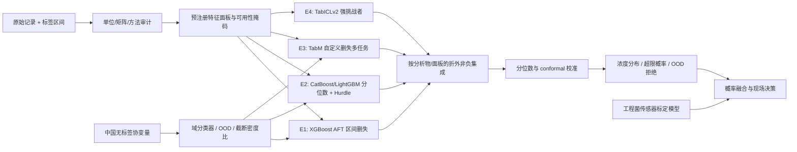

# 模型架构八轮设计迭代与最终判断

本文件记录的是在当前数据约束与最新论文证据下完成的**架构设计迭代**。它们不是八轮已训练实验；每轮的收益仍必须按 `MODELING_ROADMAP.md` 在锁定切分上验证，禁止把设计判断写成实验结果。

## 统一优化原则

每轮都按以下目标函数判断是否保留：

1. 首先降低跨来源、跨湖泊和未来时间的误差，而不是随机切分误差。
2. 保留删失信息和概率校准。
3. 分别评价 total MC 与 MC-LR，不以主任务提升掩盖 MC-LR 退化。
4. 复杂模块只有在重复外层折上产生稳定增益且未恶化最差来源时才保留。
5. 任何使用部署时不可得变量的增益必须单列，不能计入 core 模型成绩。

## 第 1 轮：泄漏安全的强表格基线

### 架构

- 面板：`core_field`、`static_context` 分开训练。
- 模型：Dummy、ElasticNet、Random Forest、CatBoost、LightGBM、普通 XGBoost。
- 目标：`log1p(concentration)` 点预测；ND 分别做删除、0、LOD/2 敏感性，仅作对照。
- 切分：来源、湖泊和时间外层切分，内层分组调参。

### 相比旧项目的改进

- 不再以随机切分为主要证据；
- total MC 与 MC-LR 完全分开；
- 特征白名单和 bloom proxy 消融固定；
- 建立真正可击败的强树基线。

### 暴露的问题

点回归无法正确利用大量 `<LOD`；删除 ND 会训练成“已检出条件模型”，LOD/2 又把未知区间伪造为精确值。该轮只能做性能地板，不能成为最终统计模型。

### 决策

保留 CatBoost、LightGBM 和 XGBoost 作为永久基线；淘汰“普通回归即最终模型”的想法。

## 第 2 轮：Hurdle 两阶段模型

### 架构

1. 分类头 `P(detected | X, LOD)`；
2. 检出样本条件浓度头 `p(Y | Y>LOD, X)`；
3. 组合出检出概率、条件浓度和超阈值概率。

分类器与回归器使用相同外层折；阈值和 LOD 只进入观测模型，不作为普通环境预测特征。

### 改进

- 不再丢弃未检出信息；
- 对零膨胀/低浓度与正浓度过程分开建模；
- 容易解释检出驱动与浓度驱动的差异。

### 暴露的问题

- “未检出”不等于真实结构零，只表示测量低于限值；
- 不同来源 LOD 不同，二元标签具有方法依赖；
- 两头独立训练可能产生概率不一致。

### 决策

保留 Hurdle 作为可解释基线和风险头，但不能代替连续潜变量的区间删失似然。

## 第 3 轮：区间删失概率回归

### 架构

每个标签保存 `[L_i, U_i]`。对条件分布 `Fθ(y|x)`：

- 精确样本损失：`-log fθ(y_i|x_i)`；
- 区间/左删失样本损失：`-log(Fθ(U_i|x_i)-Fθ(L_i|x_i))`；
- 无穷边界使用相应生存概率。

候选实现：

- XGBoost AFT，比较 log-normal、log-logistic、extreme 分布；
- 自定义 PyTorch/TabM 异方差 log-normal；
- 零质量 + 连续分布的 mixture，作为是否存在真正零值的敏感性方案。

### 改进

- ND 不再被伪造为单点；
- 直接输出分布和任意阈值的超限概率；
- 可比较不同 LOD 下的一致性。

### 暴露的问题

- 单一 log-normal 可能不足以拟合 5–6 个数量级的长尾；
- MC-LR 极端值和来源方法差异会拉动分布参数；
- AFT 的分布假设需要 PIT、尾部和来源分层诊断。

### 决策

将**区间删失似然设为最终架构的统计核心**。Hurdle 和 LOD/2 退居对照；增加分位数/混合分布分支避免单一分布失配。

## 第 4 轮：分析物感知的多任务迁移

### 架构

- 共享环境编码器 `h(X)`；
- 分析物 token：`total_mc`、`mc_lr`；
- 独立分布头和独立校准器；
- 来源均衡批次，MC-LR 损失不因 total MC 样本更多而被淹没；
- 单任务模型同步训练作为负迁移对照。

可选训练顺序：total MC 预训练 → MC-LR 微调；或混合批次联合训练。只有同一样本同时检测 total MC 与 MC-LR 时，才允许测试 `MC-LR ≤ total MC` 的软一致性约束。

### 改进

- 利用 total MC 约 2.1 万条记录学习温度、营养盐、季节与湖泊背景表示；
- MC-LR 保留自己的尺度、删失和方法差异；
- 比固定“MC-LR/total MC 比例”更灵活。

### 暴露的问题

- total MC 的检测方法和生态规律可能与 MC-LR 不同；
- 特征缺失模式差异会让共享编码器识别数据源而非生态规律；
- 无配对标签时不能施加全局浓度约束。

### 决策

多任务迁移成为**有条件模块**：只有 MC-LR 来源外验证相对单任务提升，且最差来源未下降时启用；否则保持两个模型完全独立。

## 第 5 轮：引入最新强模型竞争层

### 架构

在相同特征、相同外层折、相同训练预算下增加：

- TabICLv2：免调参回归/量化回归挑战者；
- TabM：可训练深度骨干，接自定义删失似然；
- RealMLP：强默认与多分位数基线；
- TabPFN-3：仅在许可接受后作为研究对照；
- TabR：仅在严格来源/湖泊检索隔离下消融。

### 改进

- 不再局限于旧 XGBoost/LightGBM；
- 同时覆盖 TFM、MLP ensemble、retrieval 和 GBDT；
- 把最新论文的能力放进本任务协议，而不是引用通用排行榜。

### 暴露的问题

BeyondArena 表明基础模型在 grouped/temporal 非 IID 任务上不稳定占优；TabICLv2 原生接口也不直接接收浓度删失区间。直接以 LOD/2 喂给 TFM 会破坏第 3 轮的统计改进。

### 决策

- TabM 进入核心可训练分支；
- TabICLv2 进入强挑战者，可用检测值/多重插补和量化微调，但必须与删失核心分开审计；
- TabPFN-3 不作为默认生产依赖；
- FT-Transformer、TabNet 不进入最终主赛道。

## 第 6 轮：跨来源与中国域稳健化

### 架构

- 外层验证显式为 `dataset/source`、`waterbody/site`、`time` 三类；
- 训练目标同时考虑平均损失与来源最差损失；
- 来源均衡采样、GroupDRO、强正则三种策略比较；
- 在共同协变量上训练域分类器 `P(China | X)`，生成 OOD 和密度比；
- CORAL/MMD/对抗域适配只作为消融，不假定对齐协变量后条件关系必然相同。

### 改进

- 避免 WQP/NARS/Uruguay 等大来源支配模型；
- 将 42.5 万中国无标签记录用于可验证的域信息，而非伪标签；
- 将“平均准确”升级为“最差来源仍可用”。

### 暴露的问题

只有协变量偏移假设 `P(Y|X)` 不变时，密度重加权才足够；中国湖泊可能存在 concept shift。极端密度比也会增加方差。

### 决策

- 来源均衡和非 IID 验证为强制项；
- 密度比进行截断并只用于校准/敏感性分析；
- OOD 分数用于拒绝和主动采样；
- 在获得东湖标签前，不把无监督对齐当成精度证明。

## 第 7 轮：不确定度、校准与风险一致性

### 架构

- 各基模型输出分位数或完整条件分布；
- 使用完全独立的校准折做 CQR；
- 来源/季节样本足够时做 Mondrian/分组校准；
- 中国域尝试截断密度比的 weighted conformal；
- 对每个法规阈值从同一浓度分布计算 `P(Y>τ)`，不单独训练互相矛盾的阈值分类器；
- 增加 OOD 拒绝和预测区间宽度门控。

### 改进

- 单点预测升级为可用于告警决策的风险分布；
- 多阈值输出天然单调；
- 能明确告诉用户何时模型不可靠。

### 暴露的问题

普通 conformal 的理论保证不覆盖严重时间/国家偏移；分组校准在小来源上区间会很宽。过度追求窄区间会破坏覆盖率。

### 决策

概率校准、分来源经验覆盖和拒绝机制为最终交付必需项；“区间过宽”是诚实的不确定性，不通过偷偷缩窄解决。

## 第 8 轮：最终 CMADRE 架构

最终设计命名为 **CMADRE：Censored Multi-Analyte Domain-Robust Ensemble（删失感知、多分析物、跨域稳健集成）**。

### 8.1 三类核心专家

1. **删失专家 E1**：XGBoost AFT，使用精确上下界，是最低可交付统计核心。
2. **树/分位数专家 E2**：CatBoost MultiQuantile 或 LightGBM quantile；Hurdle 头增强检出解释。
3. **深度专家 E3**：TabM + 自定义区间 NLL + 分析物独立头 + 来源均衡/GroupDRO。

TabICLv2 是 E4 挑战者。只有其折外预测能提升非 IID 组合目标时才进入最终 ensemble；否则保留为研究结果，不增加部署依赖。

### 8.2 面板门控

不训练一个会被缺失模式操纵的黑箱 gate，而是按预注册可用性规则选择：

- core 动态输入 → `core_dynamic` 专家集；
- 只有地点/季节 → `static_context` 专家集，并输出更高不确定度；
- 有合法 bloom proxy → `bloom_augmented` 专家集，同时保留 core 预测作对照；
- 域外或关键变量缺失 → 拒绝/建议采样。

### 8.3 多任务损失

概念形式为：

`L = λ_total L_interval,total + λ_lr L_interval,lr + λ_det L_detection + λ_group L_worst-source + λ_reg L_regularization`

- `λ_total` 与 `λ_lr` 按有效来源和任务均衡，不按原始行数直接比例设置；
- `L_worst-source` 只在足够样本来源上计算，并与正则化共同调参；
- 标签分布头完全独立；共享编码器是否启用由负迁移实验决定。

### 8.4 集成与校准

- 每个外层训练集内部生成严格折外预测；
- 以非负、和为 1 的权重做简约 stacking；
- 优化目标是来源宏平均 interval NLL/MAE 与最差来源惩罚的组合；
- 权重按 `target_kind × feature_panel` 分开，不按数据集 ID 在部署时切模型；
- locked test 不学习任何权重、阈值或校准参数。

## 最终架构判断

### 立即推荐实现

1. XGBoost AFT 区间删失基线；
2. CatBoost/LightGBM 分位数与 Hurdle；
3. 单任务 TabM 区间 NLL；
4. 来源/湖泊/时间三类锁定切分；
5. CQR + OOD；
6. 通过后再加多任务与 TabICLv2 ensemble。

### 暂不进入主架构

- TabPFN-3：许可/认证和非 IID 证据不足以做默认依赖；
- TabR：邻域泄漏与推理成本风险较高；
- TFT/LSTM/Chronos：缺密集、严格滞后的序列；
- 时空 GNN：缺稳定图、传播标签和东湖连续真值；
- 纯大 Transformer：当前没有证据表明其复杂度优于 TabM/树模型。

### 失败回退原则

如果 CMADRE 的复杂模块不能在重复非 IID 外层折上显著优于单个 XGBoost AFT/CatBoost，最终交付应回退为表现最稳的简单概率模型。模型“先进性”由可复现实验决定，不由组件数量决定。
