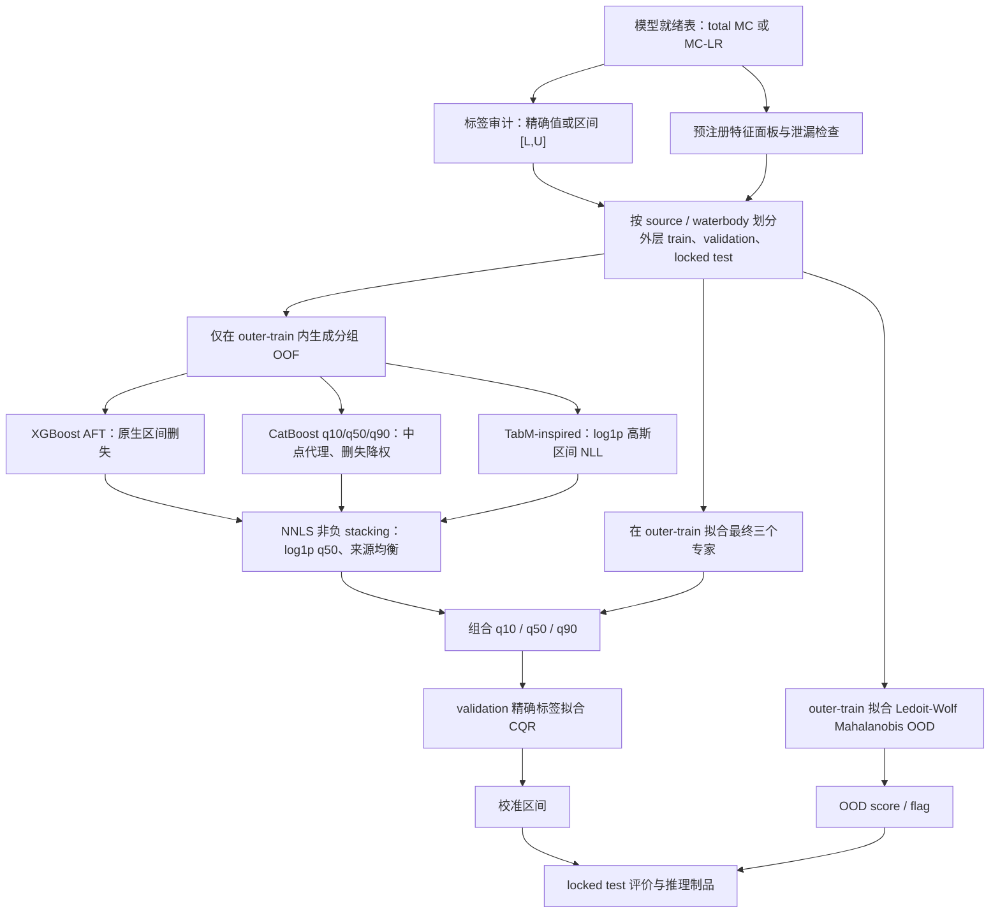
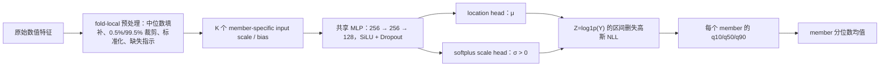
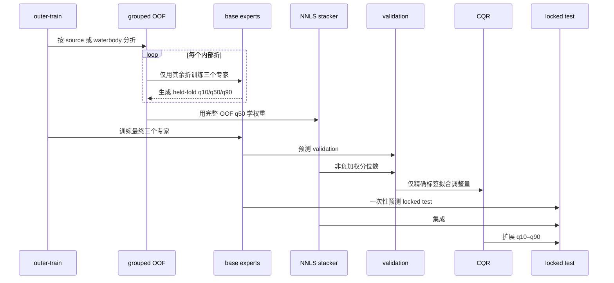

# CMADRE v2 模型架构、结果解析与反思

版本：v2.0-analysis  
分析日期：2026-08-11  
适用项目：`model_redo_v2/`  
证据范围：当前代码、GPU 正式运行配置、服务器锁定测试结果及可回载模型制品

## 1. 文档结论

当前已经完成并在 RTX 4090 上正式训练、测试的模型，是一个面向 **total microcystins（总微囊藻毒素）** 与 **MC-LR** 的删失感知概率表格模型系统。它以三个异构专家为基础：

1. XGBoost AFT 区间删失专家；
2. CatBoost 三分位数专家；
3. TabM-inspired MiniEnsemble 删失概率专家；

三个专家通过来源/水体分组的折外预测学习非负 stacking 权重，再经 CQR 扩展 `q10–q90` 区间，并使用训练域 Mahalanobis 距离标记 OOD。当前候选版本为 **stacking v2**。

正式结果证明 v2 相对 v1 的训练与集成策略更合理：三项任务的 `log1p MAE`、来源宏平均及最差来源指标均改善。但它尚不能被描述为“已达到东湖部署精度”的最终模型，主要原因是：

- total MC 外部测试中 99.3% 样本被判为 OOD；MC-LR static 外部测试为 100% OOD；
- 三项任务的原尺度 `R²` 都为负，说明对总体方差，特别是高浓度尾部的解释仍不足；
- MC-LR static 的 1.000 区间覆盖率只基于 134 条精确标签，且对应区间较宽，不能单独视为高准确度证据；
- MC-LR core 的中位绝对误差仅 0.103 µg/L，但平均绝对误差高达 32.07 µg/L，表明少量极端浓度预测失败；
- 当前没有东湖本地 MC-LR 真值、严格时间滞后序列和已冻结的风险阈值。

因此，最准确的项目判断是：

> CMADRE v2 已经是一个可复现、可审计、能正确利用删失标签的跨来源建模基线；它证明了架构方向可行，但当前证据更支持“外域研究候选”，尚不支持“东湖精准部署模型”。

## 2. 模型究竟解决什么问题

### 2.1 当前已实现任务

当前模型回答的是：

> 给定采样时刻已经可获得的水质、季节或静态环境特征，当前水体中的 total MC 或 MC-LR 浓度分布可能是多少？

这是 **nowcast / 当前状态估计**，不是 1、3、7 天未来预报。大多数标签与水质变量来自同日或同次采样，代码中也没有滞后窗口、递归状态或时间序列编码器。只有取得严格早于预测时刻的连续气象、水文、遥感和历史毒素序列后，才具备构建未来预报的统计条件。

### 2.2 分析物必须分开

- `total_microcystins` 表示总微囊藻毒素，不等于 MC-LR；
- `mc_lr` 只使用明确标记为 MC-LR 的标签；
- 当前三个正式任务分别训练，未共享标签头；
- total MC 可以在未来作为 MC-LR 表征预训练来源，但不能直接改名为 MC-LR 预测。

### 2.3 当前输出

正式模型核心输出为：

- `median_ug_l`：预测中位数，单位 µg/L；
- `q10_ug_l`、`q90_ug_l`：经校准的约 80% 预测区间；
- `ood_score`、`ood_flag`：相对训练特征域的距离与域外标记；
- 基模型预测、集成预测、标签上下界和来源元数据；
- 配置、数据哈希、切分清单、权重、校准器、模型文件和指标。

虽然接口支持阈值超限概率，但正式配置中的 `risk_thresholds_ug_l` 为空，因此当前没有经过锁定测试验证的风险阈值概率指标。三个正式专家也未形成统一、已校准的 `p_detected` 输出。

## 3. 正式训练数据与任务矩阵

| 任务 | 数据表/面板 | 有效行 | 精确/删失 | 有效特征 | 来源数 | 外层测试协议 | 测试集结构 |
|---|---|---:|---:|---:|---:|---|---|
| total MC core | dynamic-ready / `core_field` | 20,852 | 9,528 / 11,324 | 20 | 16 | source OOD | 4,298 行；1,876 精确、2,422 删失 |
| MC-LR static | static-ready / `static_context` | 6,409 | 2,992 / 3,417 | 35 | 4 | source OOD | 3,551 行；134 精确、3,417 删失 |
| MC-LR core | dynamic-ready / `core_field` | 2,837 | 2,837 / 0 | 14 | 3 | waterbody OOD | 568 行；全部精确 |

注意：

- `core_field` 预注册 20 个字段；MC-LR core 中只有 14 个字段存在有效值；
- `static_context` 预注册 43 个字段，当前 MC-LR static 中 8 个 WorldCover 字段全缺失，实际使用 35 个；
- MC-LR dynamic-ready 全部为检出值，它描述的是“有动态特征且已检出”的选择后人群，不能独立学习未检出机制；
- MC-LR static 测试来源几乎完全由 Sacramento 数据构成，只有 134 条精确值，其余 3,417 条是左删失区间。

## 4. 数据契约与标签统计表达

### 4.1 标签不是一个强行填补的点

令潜在真实浓度为 `Y ≥ 0`。模型将观测表达为区间 `[L, U]`：

- 精确检测值 `y`：`[L,U]=[y,y]`；
- `< LOD` 或其他有效上限：`[L,U]=[0,LOD]`；
- 删失上限依次从 `censor_limit_ug_l`、`detection_limit_ug_l`、`reporting_limit_ug_l`、`target_raw` 中解析；
- 缺少有效限值、负值、上下界颠倒或明确标记为负值异常的数据不进入连续模型。

这比把 ND 全部填成 0 或 LOD/2 更符合测量事实。LOD/2/区间中点只在不支持删失似然的挑战模型和 stacking 中作为透明代理，并降低权重。

### 4.2 特征白名单与泄漏防护

`core_field` 包括月份周期、水温、DO、pH、浊度、电导率、TN、TP、氮形态、DOC/TOC、TSS、Secchi、水深和硅酸盐。`static_context` 包括经纬度、湖泊形态、流域属性和 CHELSA 长期气候等。

以下内容禁止作为部署特征：目标值及其派生字段、`detected`、删失标记、LOD/LOQ、风险标签、记录 ID、来源行号、数据集 ID、站点 ID和水体名称。数据集与水体字段只用于切分、加权、审计和分层评价。

## 5. 当前已实现总体架构

关键防泄漏原则是：stacking 权重只来自 outer-train 内的 OOF 预测；CQR 只在 validation 上拟合；locked test 不用于权重、阈值、早停或校准。

## 6. 三个基模型专家

### 6.1 XGBoost AFT：删失统计核心

XGBoost AFT 把浓度区间作为 accelerated failure time 目标。为了处理零浓度，代码只使用训练折标签确定正偏移量：

`offset = max(P1(positive bounds)/10, 1e-8)`

随后将标签写为 `[L+offset, U+offset]`，采用 `survival:aft` 目标和 AFT 负对数似然。正式配置使用 normal 潜变量分布、固定 scale=1.0、hist tree 和 GPU。

优点：

- 原生使用精确/删失区间；
- 树模型适合异构缺失表格数据；
- 在 MC-LR static 和 core 的锁定测试上，单独 XGBoost 的 `log1p MAE` 实际略优于最终 stacking。

限制：

- q10/q90 来自固定 AFT 分布与 scale，而不是独立学习的异方差尾部；
- normal/logistic/extreme 分布尚未完成系统消融；
- 对极高浓度的尾部表达能力不足。

### 6.2 CatBoost Quantile：稳健分位数树专家

CatBoost 分别训练 0.1、0.5、0.9 三个 quantile 模型，目标位于 `log1p(Y)` 空间。精确值权重为 1；删失值使用区间中点并以 0.25 权重进入训练，再乘来源均衡权重。

优点：

- 对非线性、缺失值和变量交互通常稳定；
- 直接学习三个分位点，不受单一高斯尾部假设约束；
- total MC v2 中是主要专家，权重为 0.8304。

限制：

- 它不是真正的区间删失模型；
- validation 早停目标同样使用删失中点代理；
- 三个分位数独立训练，分布并不完全相干。统一输出类会排序以消除 quantile crossing，但排序只是数值修复，不等于学习了完整概率分布。

### 6.3 TabM-inspired Censored MiniEnsemble：深度概率专家

当前实现是受 TabM 参数高效 MiniEnsemble 思想启发的独立紧凑实现，并非官方 TabM 仓库的直接复制。每个 ensemble member 有独立输入缩放和偏置，共享 MLP 主干，然后输出对数浓度潜变量的位置 `μ` 与尺度 `σ`。

对精确样本，损失为高斯密度负对数：

`L_exact = -log f_Z(log1p(y) | μ,σ)`

对区间删失样本：

`L_interval = -log[F_Z(log1p(U)|μ,σ) - F_Z(log1p(L)|μ,σ)]`

左删失 `[0,U]` 简化为 `-log F_Z(log1p(U))`。正式 GPU 配置使用 24 个成员、AMP、AdamW、梯度裁剪和 early stopping；矩阵乘法使用 FP16，而 CDF 差值损失强制回到 FP32，以减少数值下溢。

优点：

- 真正利用删失区间；
- 显式建模样本相关的不确定度；
- 参数共享降低多个成员的训练成本。

限制：

- 当前是单任务网络，没有实现设计文档中的 total MC/MC-LR 共享编码器与独立任务头；
- 取“成员分位数的平均”并不等于混合分布的严格分位数；
- 长尾仅由 log-normal 组件表达，仍可能低估极端事件。

## 7. 训练、集成、校准和 OOD

### 7.1 非 IID 外层切分

- source OOD：整个数据来源只能出现在 train、validation 或 test 之一；
- waterbody OOD：整个水体组只能出现在一个角色中；
- temporal OOD：同来源按时间块切分，新时间进入 test。

正式运行使用 total MC source OOD、MC-LR static source OOD、MC-LR core waterbody OOD。切分是确定性的、组大小近似均衡，并验证组交集为零。

### 7.2 来源均衡

每条样本的初始权重与其来源样本数成反比，再归一化并裁剪到 `[0.1,10]`。这避免 NARS、Uruguay 或 Sacramento 等大来源完全支配目标，但不能替代真正的 worst-group 优化；当前代码尚未实现 GroupDRO。

### 7.3 stacking v2

v1 的内部 OOF 使用水体组，且在原始浓度尺度拟合 NNLS，三个任务均过度偏向 TabM。v2 的修改是：

- 外层为 source OOD 时，内部 OOF 也整来源留出；
- 以 `log1p(q50)` 拟合非负最小二乘；
- 使用来源均衡权重；
- 删失中点代理只取 0.25 权重；
- 权重归一化为和 1。

当前 stacking 仍有一个重要统计折衷：基模型中 XGBoost AFT 与 TabM 能使用区间似然，但权重学习仍把删失区间变成中点。它是“删失降权的近似 stacking”，不是完整的删失似然 stacking。

### 7.4 CQR 区间校准

`alpha=0.2`，目标是 q10–q90 的约 80% 区间。CQR 只使用 validation 中的精确标签，计算：

`score = max(q10-y, y-q90, 0)`

然后用有限样本修正的高分位数作为统一加性调整量，令下界减去、上界加上该值。

该做法在 exchangeability 成立时具有良好意义，但 source/country shift 会破坏交换性；而且删失样本没有参与 coverage 校准。因此报告中的“observation interval compatibility”与精确标签 coverage 必须分开解释。

### 7.5 OOD 检测

OOD 检测器在训练折上完成中位数填补、稳健裁剪、标准化和缺失指示扩展，使用 Ledoit-Wolf 收缩协方差计算平方 Mahalanobis 距离，训练分布第 99 百分位为阈值。

它能提示“当前输入不像训练数据”，但不能说明偏移原因，也不能证明 OOD 样本预测错误。单高斯椭球还可能把来源特有的缺失模式当成生态异常，无法识别 `P(Y|X)` 已改变的 concept shift。

## 8. 锁定测试结果

下表均为 v2 校准后 ensemble。`log1p MAE`、R²、Spearman、MedianAE 与 factor-of-2 只在精确标签上计算；区间距离和 compatibility 使用全部有效区间。

| 指标 | total MC core | MC-LR static | MC-LR core |
|---|---:|---:|---:|
| 测试行数 | 4,298 | 3,551 | 568 |
| 精确 / 删失 | 1,876 / 2,422 | 134 / 3,417 | 568 / 0 |
| `log1p MAE` | **0.3488** | **0.1318** | **0.2972** |
| Spearman | 0.3190 | 0.0831 | **0.5091** |
| R² | -0.0107 | -3.0590 | -0.0045 |
| MedianAE (µg/L) | 0.1470 | 0.1462 | **0.1029** |
| factor-of-2 | 0.3811 | 0.1045 | 0.5408 |
| 来源宏平均 `log1p MAE` | 0.2931 | 0.1318 | 0.2403 |
| 最差来源 `log1p MAE` | 0.4656 | 0.1318 | 0.3339 |
| 区间距离 MAE (µg/L) | 0.5988 | 0.1633 | **32.0704** |
| 精确值 q10–q90 coverage | 0.8321 | 1.0000 | 0.7905 |
| 精确值平均区间宽度 (µg/L) | 3.6205 | 1.8986 | 2.2673 |
| 观测区间 compatibility | 0.9267 | 1.0000 | 0.7905 |
| OOD 比例 | **0.9930** | **1.0000** | 0.1620 |

### 8.1 基模型与 stacking

| 任务 | XGBoost AFT | CatBoost quantile | TabM censored | v2 ensemble | stacking 权重 `(XGB, Cat, TabM)` |
|---|---:|---:|---:|---:|---|
| total MC | 0.4188 | 0.3536 | 0.3746 | **0.3488** | `(0, 0.8304, 0.1696)` |
| MC-LR static | **0.1267** | 0.1318 | 0.1785 | 0.1318 | `(0, 1, 0)` |
| MC-LR core | **0.2918** | 0.2966 | 0.3471 | 0.2972 | `(0.6848, 0.0846, 0.2306)` |

表内为锁定测试精确样本 `log1p MAE`。total MC 的集成确实优于所有单专家；但 MC-LR static 与 core 上，测试最优单模型是 XGBoost，ensemble 并未胜出。不能据此回头用 test 重选模型；正确结论是 stacking 稳定性需要重复外层来源折验证。

## 9. 分任务结果解析

### 9.1 total MC core：有实质改善，但排序与外推仍弱

v2 相对 v1：

- `log1p MAE`：0.3746 → 0.3488，下降约 6.9%；
- 来源宏平均：0.3249 → 0.2931，下降约 9.8%；
- 最差来源：0.4787 → 0.4656；
- 区间距离：0.6463 → 0.5988；
- coverage：0.8060 → 0.8321；
- Spearman：0.3085 → 0.3190。

这些变化方向一致，说明“内部 source OOD + log1p stacking + 来源均衡”比 v1 更贴合外层任务。CatBoost 权重 0.83、TabM 权重 0.17，二者有一定互补。

但 R² 为 -0.0107、Spearman 仅 0.319、factor-of-2 仅 38.1%，说明模型对样本排序和浓度幅度的辨别力仍有限。99.3% OOD 更表明测试来源与训练来源的联合特征/缺失模式差异非常大。当前成绩证明的是“在强分布偏移下仍有一定稳健性”，不是“跨国家浓度预测已经准确”。

### 9.2 MC-LR static：低 log 误差不等于有效风险排序

v2 的 `log1p MAE=0.1318`、区间距离 0.1633 和 coverage=1.0 表面上很漂亮，但必须结合以下事实：

- 测试 3,551 行中只有 134 条精确值；点指标只由这 134 条决定；
- 3,417 条删失样本只要求预测区间与 `[0,LOD]` 相容；
- Spearman 只有 0.083，factor-of-2 只有 10.4%，R² 为 -3.059；
- 平均 q10–q90 宽度 1.899 µg/L，相对该数据大量低浓度观测并不窄；
- OOD 比例为 100%；
- source macro 与 worst-source 相等，是因为测试中只有一个可评价来源，并不代表多个外部来源都稳定。

因此 coverage=1.0 很可能同时受到宽区间、低浓度聚集和精确样本少的影响，不能称为“完美校准”。本任务当前更像静态背景先验，而不是可区分站点风险高低的精确模型。

此外，stacking 权重把 XGBoost 设为 0、CatBoost 设为 1，但锁定测试中 XGBoost 的 0.1267 略优于 CatBoost 的 0.1318。这不是使用测试集改权重的理由，而是说明仅有少量训练来源时，来源级 OOF 权重方差很大。

### 9.3 MC-LR core：中位样本尚可，极端尾部失败

v2 相对 v1：

- `log1p MAE`：0.3385 → 0.2972，下降约 12.2%；
- Spearman：0.4299 → 0.5091；
- 来源宏平均：0.2675 → 0.2403；
- 最差来源：0.3886 → 0.3339；
- coverage：0.8169 → 0.7905，略低于名义 80%。

中位绝对误差 0.103 µg/L、Spearman 0.509，说明模型能在多数普通样本上学到一定排序关系。但平均绝对误差 32.07 µg/L、R² 接近 0，说明少量超高值产生了巨大误差。数据最大 MC-LR 达 26,105.59 µg/L，且 24 条记录被标为 `extreme_review_gt_1000`；若这些值的单位和样品矩阵正确，当前单一 log-normal/quantile 专家仍没有足够尾部容量和有效高值样本。

本任务 stacking 的测试误差 0.2972 也略差于 XGBoost 的 0.2918。下一轮应优先解决极端值审计、尾部建模与集成稳定性，而不是简单扩大网络。

## 10. 工程与复现评价

工程闭环是当前项目最扎实的部分之一：

- 服务器数据 98 个文件与本地清单逐项校验，缺失 0、SHA-256 不一致 0；
- 13 项测试全部通过；
- 三项正式运行保存配置、数据摘要/哈希、切分清单、三个基模型、stacking、CQR、OOD、预测和 metrics；
- 完整回载后，total MC 4,298 行最大绝对差约 `2.99e-4 µg/L`，MC-LR static 为 0，MC-LR core 约 `1.77e-4 µg/L`；
- OOD 标记逐行完全一致；
- RTX 4090 正式训练观测峰值为 100% 利用率、约 16.1 GiB 显存。

这证明制品可重放、GPU 路径生效、数值差异可忽略。但 GPU 利用率只反映工程效率，不会自动改善统计泛化或数据质量。

## 11. 设计蓝图与当前实现的差距

“CMADRE”全称是 **Censored Multi-Analyte Domain-Robust Ensemble**。名称表达的是最终设计方向；当前 v2 只完整落地了其中一部分。

| 设计能力 | 当前状态 | 判断 |
|---|---|---|
| 精确/左删失区间标签 | 已实现 | 核心优势 |
| XGBoost AFT + CatBoost + TabM 集成 | 已实现并正式训练 | 当前候选主体 |
| source/waterbody 非 IID 验证 | 已实现 | 比随机切分可信 |
| OOF 非负 stacking | 已实现 | 仍需稳定性验证 |
| CQR 与 OOD | 已实现 | 严重域偏移下保证有限 |
| total MC/MC-LR 共享编码器、多任务头 | 未实现 | 当前实际为分任务单模型 |
| GroupDRO / worst-group 训练目标 | 未实现 | 当前只有来源均衡权重 |
| 中国协变量域分类器、密度比 | 未实现 | 425,530 条中国协变量尚未进入正式模型 |
| Mondrian / weighted conformal | 未实现 | 当前为全局精确值 CQR |
| TabICLv2 正式挑战实验 | 接口已支持，未进入正式 v2 | 不应写成已使用 |
| Hurdle 检出头 | 代码支持，未进入正式 v2 | `p_detected` 尚未验证 |
| 未来 1/3/7 天预报 | 未实现 | 缺严格滞后数据 |
| 东湖本地校准 | 未实现 | 缺本地毒素真值 |

若严格按已实现内容命名，当前模型更接近 **Censored Domain-Robust Ensemble**。只有多分析物迁移和中国/东湖域模块通过消融后，才应完整使用 CMADRE 的全部含义。

## 12. 方法层面的主要反思

### 12.1 负 R² 与低 log 误差可以同时存在

`log1p` 指标降低了极端值影响，适合跨数量级浓度；R² 在原尺度上对高值平方误差非常敏感。因此当前模型可以对多数低浓度样本有较小相对误差，同时对少数高值严重低估，最终得到负 R²。两者不矛盾，反而准确暴露了“普通样本尚可、尾部失败”的结构。

### 12.2 coverage 必须与宽度、精确样本数和域偏移一起读

预测区间足够宽就容易获得高 coverage。static 的 100% coverage 不代表信息量高，因为精确样本只有 134 条、宽度约 1.9 µg/L、OOD 为 100%。需要同时报告 interval score、分来源覆盖率、区间宽度和高风险区间召回。

### 12.3 当前集成权重存在边界化和不稳定信号

三项权重分别出现 XGBoost=0、CatBoost=1 等边界解，说明部分专家的 OOF 贡献高度相关，或来源折太少。MC-LR 两个任务的测试最优基模型又不是最终 ensemble。这要求使用 repeated outer folds、bootstrap 权重置信区间和跨 seed 稳定性，而不是再用 locked test 调整。

### 12.4 概率分布还不完全相干

CatBoost 三分位点、TabM 成员分位数均值和线性 stacking 的 q10/q50/q90 并不保证来自同一个严格概率密度。系统会排序分位数避免 crossing，也能通过分段 CDF 近似超限概率，但若要用于高风险决策，应升级到可计算 NLL/CRPS 的一致分布或混合分布。

### 12.5 OOD 标记尚不能指导具体采样

Mahalanobis 分数只能说“远”，不能回答是温度、营养盐、地理、来源方法还是缺失模式导致。需要增加最近邻训练样本、逐特征贡献和域分类器，才能把 OOD 转化为“缺什么数据、应该在哪里采样”的行动建议。

### 12.6 正式验收条件尚未全部完成

当前正式报告没有给出 Dummy、ElasticNet、来源先验等简单基线的同切分结果；风险阈值为空；没有 repeated outer folds；也没有东湖本地锁定验证。因此目标说明书中的“稳定击败简单/强基线、风险校准、东湖前瞻验证”仍未完成。

## 13. 推荐的下一轮重构路线

### P0：在继续使用 locked test 前必须完成

1. **冻结当前 v2**：保留三项运行及哈希，不再用这三份 test 反复选模型。
2. **增加必要基线**：同一 split 下加入 Dummy median、来源先验、ElasticNet/Huber 和单独 XGBoost AFT。
3. **重复外层验证**：对来源、水体和随机种子做 repeated nested CV；报告均值、标准差、最差折与 stacking 权重分布。
4. **极端值审计**：逐条核查 MC-LR >1000 µg/L 的单位、样品组分、湿重/干重、细胞内外组分与重复记录；审计不等于自动删除。
5. **补充尾部指标**：高浓度分位召回、条件 MAE、log interval score、top-k 风险召回；平均指标不能掩盖高风险漏报。
6. **冻结风险阈值配置**：按饮用水、娱乐接触或工程菌触发场景分别版本化，评价 Brier、ECE、PR-AUC、召回和决策曲线。

### P1：优先的统计架构升级

1. **删失感知 stacking**：直接最小化 OOF 区间似然或 interval score，替代删失中点 NNLS；保留非负和正则约束。
2. **尾部/混合分布头**：比较 log-normal mixture、Tweedie/GB2、极端事件二阶段专家，避免单一分布压缩高值。
3. **可相干概率集成**：组合完整 CDF/密度，而非只线性平均三个分位点；以 CRPS、NLL 和校准共同选择。
4. **分组校准**：样本足够时使用 source/season Mondrian conformal；严重 covariate shift 下研究截断密度比 weighted conformal。
5. **可解释 OOD**：加入训练域 vs 中国域分类器、截断 density ratio、最近邻和特征贡献；明确区分 covariate shift 与 concept shift。
6. **多任务迁移消融**：只在 repeated source OOD 中比较“MC-LR 单任务”与“total MC 预训练→MC-LR 微调”。若最差来源退化，则不启用共享编码器。

### P2：数据具备后再启动

1. 获取东湖按站点、深度、季节覆盖的 MC-LR/total MC 精确值及 LOD/LOQ；
2. 获取严格滞后的气象、水文、湖表温度、遥感和历史毒素序列，采用 rolling-origin 评估未来 1/3/7 天预报；
3. 单独训练工程菌传感器剂量—响应与批次漂移模型，再与环境浓度分布做概率融合；
4. 依据 OOD 与预测区间宽度设计主动采样，而不是用无标签中国水质生成伪毒素标签。

## 14. 最终评价

从统计设计看，当前模型最大的进步不是“用了更多神经网络”，而是：

- 把未检出值保留为测量区间；
- 用来源/水体外推而非随机 IID 切分检验泛化；
- 用 OOF 学习集成，隔离 validation 校准与 locked test；
- 同时报告稳健误差、最差来源、区间覆盖和 OOD；
- 保留全部模型、数据哈希、切分和回载证据。

从结果看，v2 已经明显优于 v1，total MC 集成也表现出真实互补性；但 MC-LR static 的弱排序、MC-LR core 的极端尾部误差、两个任务中单 XGBoost 测试优于 ensemble，以及极高 OOD 比例，都说明模型还未达到“精准且完美”的科学标准。

下一阶段最有价值的工作不是盲目增加 Transformer、GNN 或扩大 TabM，而是建立新的重复外部验证、获得东湖本地毒素真值、修复高浓度尾部、让 stacking 与 calibration 真正删失感知，并把风险阈值纳入正式验收。只有这些证据完成后，模型才应从“研究候选”升级为“部署候选”。

## 15. 证据与代码入口

- 目标与边界：`MODEL_OBJECTIVE_SPEC.md`
- 数据能力评估：`CURRENT_DATA_ASSESSMENT.md`
- 架构设计迭代：`ARCHITECTURE_ITERATIONS.md`
- 服务器正式结果：`SERVER_RUN_REPORT.md`
- 默认及 GPU 配置：`configs/default.json`、`configs/server_gpu.json`、`configs/mc_lr_static_gpu.json`、`configs/mc_lr_core_gpu.json`
- 主训练闭环：`src/cmadre/pipeline.py`
- 标签区间：`src/cmadre/labels.py`
- XGBoost AFT：`src/cmadre/models/xgb_aft.py`
- CatBoost/LightGBM quantile：`src/cmadre/models/quantile_trees.py`
- TabM-inspired 删失模型：`src/cmadre/models/tabm_censored.py`
- OOF stacking：`src/cmadre/ensemble.py`
- CQR：`src/cmadre/calibration.py`
- OOD：`src/cmadre/ood.py`
- 指标：`src/cmadre/metrics.py`

