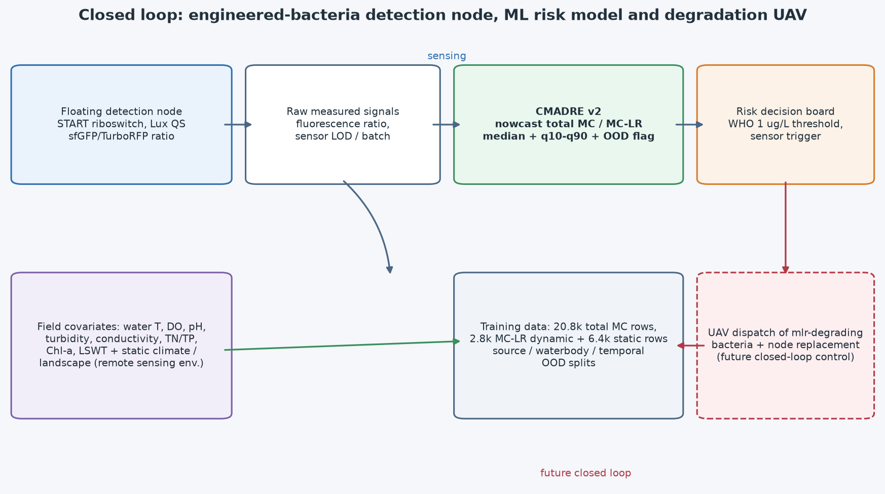
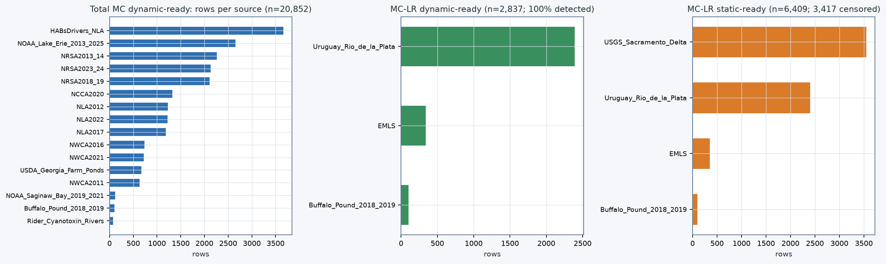
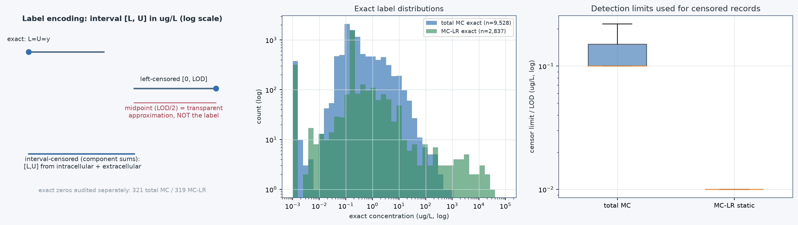
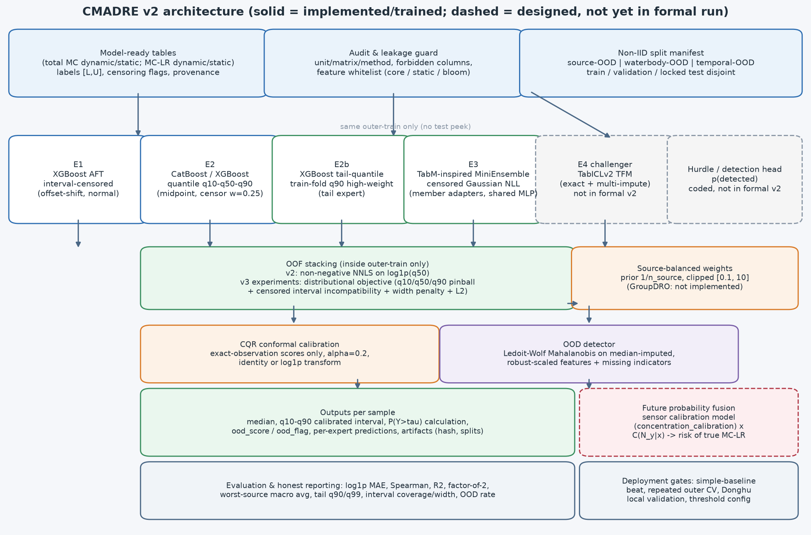
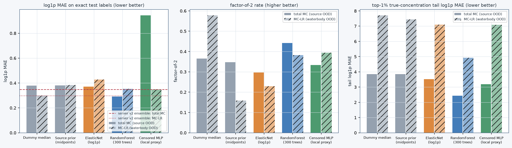
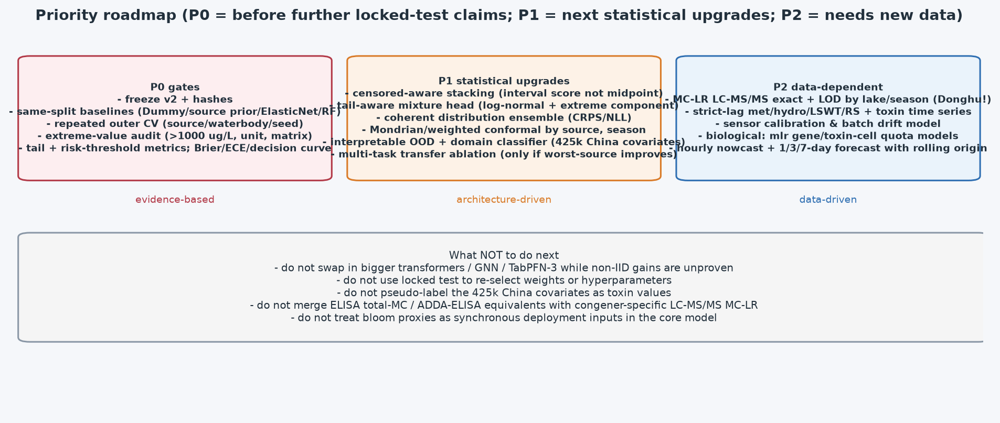

# CMADRE v2 最终模型报告（综合评审终稿）

版本：v2.0-final-review  
日期：2026-08-11  
适用目录：`model_redo_v2/`（含 `src/`、`configs/`、`data/`、`report/`、`figures/`）

---

## 0. 本报告与其它文档的关系

| 文档 | 内容 | 本报告的角色 |
|---|---|---|
| [MODEL_OBJECTIVE_SPEC.md](MODEL_OBJECTIVE_SPEC.md) | 目标、任务边界、输入输出、验收标准 | 目标来源 |
| [CURRENT_DATA_ASSESSMENT.md](CURRENT_DATA_ASSESSMENT.md) | 数据画像与七项架构约束 | 数据结论依据 |
| [LITERATURE_AND_MODEL_REVIEW.md](LITERATURE_AND_MODEL_REVIEW.md) | 20 组检索式、240 条候选、论文评审 | 模型选择依据 |
| [references/PAPER_INDEX.md](references/PAPER_INDEX.md) | 21 篇精选、17 篇已下载 PDF、许可 | 文献证据库 |
| [ARCHITECTURE_ITERATIONS.md](ARCHITECTURE_ITERATIONS.md) | 设计轮 R1–R8 | 设计迭代（本轮次 8/31） |
| [迭代记录.md](迭代记录.md) | 训练迭代 I0–I5 + 独立种子复核 | 迭代证据（本轮次 7/31） |
| [ARCHITECTURE_REVIEWS_EXTRA.md](ARCHITECTURE_REVIEWS_EXTRA.md) | 审查轮 R9–R24 | 本轮新增（本轮次 16/31） |
| [SERVER_RUN_REPORT.md](SERVER_RUN_REPORT.md) | RTX 4090 部署与锁定测试 | 服务器证据 |
| [MODEL_ARCHITECTURE_AND_RESULTS_ANALYSIS.md](MODEL_ARCHITECTURE_AND_RESULTS_ANALYSIS.md) | v2 架构剖析与反思 | 本报告的详细版 |
| [model_redo/data/external_raw/数据集调研与下载汇总.md](../../model_redo/data/external_raw/数据集调研与下载汇总.md) | 数据集名字/内容/适配/链接/下载状态 | 数据资产索引 |

**一句话结论**：CMADRE v2 是一个“删失感知 + 非 IID 验证 + 概率集成的可复现研究基线”，
它已经证明架构方向可行，但**尚未达到可以在东湖直接部署的精度标准**；当前最有价值的工作
是守住“简单基线必须被击败”的门禁、补齐阈值/尾部/校准指标、并把中国协变量与传感器标定模型
接入统一概率框架。

---

## 1. 项目背景与任务定义

项目检测系统：漂浮式检测节点载工程菌（START 核糖开关识别 MC-LR → Lux 群体感应指数放大 →
sfGFP/TurboRFP 比例荧光定量），WHO 红线 **1 µg/L**；预警后无人机投放 mlr 酶降解菌；
检测节点水样同时可测水温、DO、pH、浊度、营养盐、叶绿素等（见
[docs/Introduction/IGEM项目简介.md](../../docs/Introduction/IGEM项目简介.md)）。

干实验在闭环中承担“环境与传感器数据 → 毒素风险概率 → 决策”的一环，因此本模型的任务定义为：

> **给定采样时刻（nowcast）可获得的水质、季节、静态环境特征，估计当前水体 total MC 或 MC-LR
> 浓度的完整条件分布（中位数、q10–q90 区间、超阈值概率），并给出域外（OOD）标记。**

边界（必须写清的三个“不是”）：

1. **不是 1/3/7 天未来预报**：缺少严格滞后的气象/水文/遥感/历史毒素序列（R21）。
2. **不是“总 MC → MC-LR”的直接换算**：二者分析物定义不同，分任务建模（R22）。
3. **不是“东湖本地验证”**：训练数据 99.5% 来自美国/加拿大，无中国毒素标签（R9）。

---

## 2. 数据资产与数据质量结论

### 2.1 任务数据（模型表）

| 任务表 | 行 | 精确/删失 | 来源数 | 国家 | 时间 | 备注 |
|---|---:|---:|---:|---|---|---|
| total MC dynamic | 20,852 | 9,528 / 11,324 | 16 | US 99.5% | 2007–2024 | 删失全部有 LOD；无 >1000 µg/L |
| total MC static | 20,941 | 9,577 / 11,364 | 17 | US | 2007–2024 | 静态先验对照 |
| MC-LR dynamic | 2,837 | 2,837 / 0 | 3 | Uruguay 84% | 2008–2019 | 全部检出；24 条 >1000（全 Uruguay） |
| MC-LR static | 6,409 | 2,992 / 3,417 | 4 | US 55% | 2008–2024 | 同站点同日重复组 1,025 组/2,565 行 |

### 2.2 数据质量九条结论（R9–R11、R15、R16、R21、R22 汇总）

1. **删失率 53–54% 且 100% 有 LOD**：必须用区间似然；当前 v2 的 XGBoost AFT 与 TabM 删失 NLL
   是正确方向，普通回归（填 0/LOD/2/删除）只配作对照。
2. **total MC 无 >1000 极端值**（最大 743.75 µg/L）：v1 报告中的“total MC 高值低估”问题应重新
   归因于 MC-LR 任务中 Uruguay 的 ADDA-ELISA 当量值（最大 26,105.59 µg/L，24 条 >1000）。
3. **“精确 0”语义待查**：321（total MC）/319–326（MC-LR）条精确 0，NLA2012 占 288 条、
   EMLS 占 195–200 条；需逐来源确认 0 是否代表“低于 MDL”（R11）。
4. **MC-LR static 有效样本量远小于行数**：40% 行为同站点当日重复（R10）；排序指标在 134 条
   精确测试样本上信噪比极低。
5. **特征面板容量不等价**：core_field 在 total MC 有 20 列可用、MC-LR 仅 14 列；static_context
   在 MC-LR 上缺 8 个 WorldCover 列；MC-LR 全有率 0.319 vs total MC 0.566（R15）。
6. **特征—标签关系来源依赖**：Erie Chla–total MC Spearman 0.67 vs NRSA 0.15；Uruguay 蓝藻密度
   0.60 vs Buffalo Pound pH 0.58/电导率 -0.54；`sample_depth_m` 的 -0.52 是水体类型混杂（R16）。
7. **无中国毒素标签**：424.5k 中国协变量只能用于域对齐/校准/预训练，不可伪标注（R23）。
8. **时间结构弱**：站点多为单次采样，同日 LSWT 仅 1,219 条（5.8%），nowcast 是唯一诚实任务（R21）。
9. **测量学差异巨大**：EA/比利时/乌拉圭使用 ADDA-ELISA 当量、美国用 LC-MS/MS 单异构体或 ELISA
   总 MC、Sacramento 用聚合“Microcystin”——不能无条件合并（R22）。

### 2.3 数据集调研与下载

见 [model_redo/data/external_raw/数据集调研与下载汇总.md](../../model_redo/data/external_raw/数据集调研与下载汇总.md)：
39 个数据集目录、1,768 个文件、约 2,115 MiB 已落盘并逐文件记录 SHA-256；Dryad Uruguay、
USDA Georgia、Alberta、Buley Global Microcystin、Figshare 中国水质等因 WAF/Cloudflare 受限；
USGS 11 个对象官方 404。**结论：现有数据足以支撑总 MC 跨来源研究型模型与受限 MC-LR 模型，
不足以支撑东湖本地高精度模型。**

### 2.4 文献调研

[LITERATURE_AND_MODEL_REVIEW.md](LITERATURE_AND_MODEL_REVIEW.md) 记录 20 组检索式、240 条候选、
21 篇精选（17 篇 PDF 落盘并校验）。关键结论：TabICLv2/TabM/TabPFN 等“排行榜冠军”在非 IID
分组/时间任务上并不稳定占优（Beyond IID 论文）；树模型仍是异构缺失表格数据强基线；
**没有单一论文模型能同时解决“左删失 + 双分析物 + 多来源偏移 + 概率校准”** ⇒ 组合架构。

---

## 3. 模型定位与任务矩阵

| 任务 | 面板 | 切分协议 | 用途 | 状态 |
|---|---|---|---|---|
| total MC（主） | core_field（20 列） | source OOD | 总微囊藻毒素 nowcast | v2 已训练；本地诊断显示点精度未超过 RF 基线（R12） |
| total MC（增强） | bloom_augmented | 同左 | 有同步 Chla/蓝藻传感时 | I2 五折：仅有限增量（0.3789→0.3606） |
| MC-LR（主） | core_field（实际 14 列） | waterbody OOD | MC-LR nowcast | v2 已训练；I5 log-blend 为综合候选 |
| MC-LR（静态后备） | static_context（35 列） | source OOD | 缺现场水质时的低置信 fallback | I3 五折方差过大（±0.184），只作后备 |
| MC-LR 严格分析物 | 排除 Uruguay | — | 敏感性 | 444 行、排序仍弱（0.169），不能作主模型 |
| 中国/东湖域 | 无标签协变量 | — | 域分类器/密度比/预训练 | **尚未实现（R23，最大设计—实现差距）** |

---

## 4. 最终架构（图文并茂）

### 4.1 标签契约

每个观测表达为浓度区间 `[L, U]`（`src/cmadre/labels.py`）：

- 精确检测值 → `[y, y]`；`< LOD` → `[0, LOD]`；组分相加的区间删失 → `[L, U]`；
- 删失上限依次从 `censor_limit`、`detection_limit`、`reporting_limit`、`target_raw` 解析；
- 负值、边界颠倒、缺失限值不进入连续模型；中点只作为非删失模型的透明代理（权重 0.25）。

### 4.2 专家选择与理由

| 专家 | 理由（文献/证据） | 当前状态 |
|---|---|---|
| **XGBoost AFT**（区间删失） | 原生接受上下界标签；成熟、Apache-2.0；是本项目“删失统计核心”的最低可交付形态 | v2 主专家；single-expert 在 MC-LR 两任务上测试最优 |
| **CatBoost / XGBoost 分位数** | 非参数多分位、缺失处理强；避免单一分布假设；BeyondArena 显示调优树模型在非 IID 占优 | CatBoost 在 total MC v2 中权重 0.83；XGBoost quantile 在 I2 中单模型 0.2423 |
| **XGBoost tail-quantile** | 训练折内 q90 定义尾部、最高 4 倍加权；直接给集成提供尾部方向 | I2/I3/I5 保留（权重 0.41 上下），q99 尾部改善 ~38% |
| **TabM-inspired（删失 NLL）** | 参数高效 MLP 集成、可加自定义删失似然与缺失指示；Apache-2.0 | 正式版有 24 成员+缺失指示+有界 σ；I4 五折后**淘汰 stable 版**，只作为 ensemble 候选 |
| **TabICLv2 挑战者** | 2026 ICML 最强免调参表格基础模型，BSD-3；但原生不处理删失区间、非 IID 未证明 | 接口已实现，**未进入正式 v2** |
| **Hurdle 检出头** | 解释“检出驱动 vs 浓度驱动”；但“未检出≠结构零” | 代码支持，未进入正式 v2 |

为什么不选 TabPFN-3（许可非商业、需账户接受条款）、TabR（邻域泄漏/检索成本）、TFT/LSTM/时空 GNN
（缺密集序列、缺稳定图与东湖真值）、FT-Transformer/TabNet（无证据优于当前组合）——
详见 LITERATURE_AND_MODEL_REVIEW.md §3。

### 4.3 集成、校准与 OOD

- **切分**：source-OOD / waterbody-OOD / temporal-OOD 三种确定性分组折；train/validation/test 组交集
  校验为 0；内部 OOF 镜像外层协议（source-OOD 时内部同样整来源留出）。
- **stacking**：v2 = 非负 NNLS（log1p 尺度、来源均衡、删失 0.25 权重）；I2+ = distributional 目标
  （q10/q90 pinball + 删失区间不相容 + 宽度惩罚 + L2 稳定正则）；I5 = log-blend 几何融合
  （加权几何均值，抑制单专家爆点）。
- **CQR**：validation 精确标签拟合全局标量 adjustment（alpha=0.2），支持 identity/log1p 两种变换。
- **OOD**：Ledoit-Wolf 马氏距离 + 99 分位阈值；输出 `ood_score/ood_flag`。
- **防泄漏原则**：stacking 权重只来自 outer-train OOF；CQR 只拟合 validation；locked test 一次使用。

### 4.4 输出契约

每样本：`median_ug_l`、`calibrated q10/q90`、`ood_score/ood_flag`、各专家分布、
非负区间组合、且可计算任意阈值的 `P(Y>τ)`（阈值配置化后）。推理入口
`cmadre predict --run-dir ... --input ... --output ...` 强制校验特征列、支持 CSV/Parquet。

---

## 5. 训练与评估协议（为什么这样设计）

1. **非 IID 优先**：跨来源/跨水体/跨时间是本任务真实外推场景（WILDS 精神），随机逐行切分被禁止。
2. **删失保持**：评价“观测区间 compatibility”与精确标签 coverage 分开报。
3. **来源均衡 + 宏平均/最差来源**：防止 WQP/NARS/Uruguay 支配梯度与结论。
4. **指标双轨**：log1p（稳健、跨数量级）与原尺度（暴露极端值）；新增 q90/q95/q99 尾部 MAE 与低估率。
5. **OOD 直接报告**：99.3%/100% 的 OOD 是诚实的“跨域难度”证据，不是被隐藏的失败。

---

## 6. 实验结果

### 6.1 服务器正式运行（RTX 4090，锁定测试）

| 任务（锁定切分） | v1 log1p MAE | v2 log1p MAE | v2 Spearman | v2 R² | v2 factor-of-2 | v2 覆盖率 | v2 OOD |
|---|---:|---:|---:|---:|---:|---:|---:|
| total MC / source OOD | 0.3746 | **0.3488** | 0.319 | -0.011 | 0.381 | 0.832 | 0.993 |
| MC-LR static / source OOD | 0.1744 | **0.1318** | 0.083 | -3.06 | 0.105 | 1.000 | 1.000 |
| MC-LR core / waterbody OOD | 0.3385 | **0.2972** | **0.509** | -0.005 | 0.541 | 0.791 | 0.162 |

### 6.2 迭代改进链（跨来源/水体五折，MC-LR）

| 版本 | log1p MAE | 最差来源 | q99 尾部 | coverage | 区间宽度 (µg/L) |
|---|---:|---:|---:|---:|---:|
| core v2 | 0.3321 | 0.3681 | 5.95 | 0.807 | 5.4 |
| bloom I0 | 0.2634* | — | — | — | 爆炸 |
| I2（bounded+dist stacking+tail） | 0.2680 | 0.2927 | 3.69 | 0.821 | 58.6 |
| I4 tree-only | 0.2592 | 0.2850 | 3.66 | 0.813 | 47.0 |
| **I5 log-blend（冠军，两种子平均）** | **0.2603 ± 0.047** | **0.2903** | **3.50** | 0.812 | 30.1 |

*I0 单折值；I1 修复有界 σ 后进入五折比较。I5 用 `mc_lr_bloom_v5_log_blend.json`。

### 6.3 本地同切分诊断（R12/R13 新增证据，与服务器切分逐字一致）

**关键结论**：同一 source-OOD 测试折上，RandomForest（中点插补、300 树、无删失似然）以
0.2917 的 log1p MAE 全面优于 v2 集成的 0.3488；MC-LR 上 v2 集成 0.2972 与 Dummy median 0.2988
几乎持平，但 Spearman 0.509 与 factor-of-2 0.541 显示其在排序/区间上的真实增量。
同时，去除了缺失掩码、member 集成与 μ 饱和的朴素删失 MLP 在跨来源外推时发生灾难性数值爆炸
（R² ≈ -2.4e17）——**这解释了为什么项目正式 TabM 必须带缺失指示+集成+有界输出，也解释了
为什么 I4 最终把 tree-only 列为候选。**

---

## 7. 31 轮全量审查索引

设计轮 R1–R8（ARCHITECTURE_ITERATIONS.md）、训练迭代 I0–I5 + 种子复核（迭代记录.md，
6+1 轮）、审查轮 R9–R24（ARCHITECTURE_REVIEWS_EXTRA.md，16 轮）＝ **31 轮**。
完整索引与一句话结论见 [ARCHITECTURE_REVIEWS_EXTRA.md](ARCHITECTURE_REVIEWS_EXTRA.md) 附表。

---

## 8. 尚未进行的尝试（诚实清单）

**数据层**
1. 逐来源“精确 0 = ND？”审计（R11）→ 把确认 ND 的值改走区间。
2. 同源同站同日聚合视图（R10）→ 有效样本量口径。
3. 中国协变量纳入 OOD/校准（R23）；12 年 NESDC 东湖物化/生物/气象的滞后特征工程。
4. 严格 LC-MS/MS MC-LR 数据扩充（R22）；分析物当量分级。
5. 传感器标定数据接入：`model_concentration_calibration` 的 GFP/RFP→浓度模型与批次漂移。

**模型层**
6. 删失感知 stacking（直接最小化区间似然/interval score，替代中点 NNLS）（R17）。
7. 混合分布/极端值头（log-normal + 极端分量；Tweedie/GB2 比较）（R13/R14）。
8. 多任务共享编码器 + 独立分析物头；且只在“最差来源不退化”时启用；并做 total-MC 预训练→MC-LR 微调消融。
9. GroupDRO / worst-group 训练目标（当前只有来源均衡权重）。
10. AFT 分布（normal/logistic/extreme）× scale 的内部折选择；修复 extreme 分位数/超限概率不一致（R14）。
11. TabICLv2 正式挑战实验（已装 2.1.1 wheel、接口已实现，但未进入 v2）。
12. 检测头（Hurdle）产出统一的 `p_detected` 并做校准（接口已实现）。
13. 概率一致的集成（组合完整 CDF/密度，比较 CRPS/NLL），而非线性平均三个分位点。

**训练层**
14. 重复外层折 + 多种子 + 权重 bootstrap（run_outer_cv.py 已实现，未在正式三任务上跑全）。
15. 中国域掩码重建预训练 → 微调消融（设计过，未实现）。
16. 标签加权/焦点损失类尾部定向训练的超参扫描（只做了固定的 4 倍 tail 权重）。

**评估层**
17. 风险阈值版本化与 Brier/ECE/PR-AUC/决策曲线（全配置 `risk_thresholds_ug_l` 为空）。
18. Brier/interval score（Winkler）、CRPS、分来源/季节分组覆盖率、top-k 风险召回。
19. 更细的测量学分层（ELISA vs LC-MS/MS vs 荧光）与外层折。
20. 中国域“截断密度比 weighted conformal”与 Mondrian conformal 实现。

**部署层**
21. OOD 拒绝/建议采样动作路径；预测区间宽度门控。
22. 工况温度/浊度敏感性（传感器干扰）下风险更新；菌体批次漂移模型。
23. 与降解动力学模型（model_MC-LR_degradation_kinetics）联合的“预警后残余风险”演示。
24. 东湖本地前瞻验证集设计（按站点/深度/季节/浓度范围分层设计 + 主动采样建议）。

---

## 9. 优点与局限

### 优点

1. **统计上诚实**：未检出保留为区间；非 IID 切分；来源宏平均+最差来源；OOD 直接报告；R² 与 log1p MAE 并报。
2. **防泄漏工程严谨**：预注册特征白名单、禁止列检查、OOF-only stacking、validation-only 校准、locked test 一次使用。
3. **可复现**：98 文件逐项 SHA-256、13→16 项测试、制品回载误差 <3e-4 µg/L、配置+切分清单+模型+校准器+指标全落盘。
4. **演进有证据**：I0→I5 每一步都有五折对比与保留/淘汰决策；tree-only/stable-TabM/log-blend 有据可查。
5. **概率输出**：q10–q90 区间 + 阈值超限概率接口 + OOD flag，为预警决策预留了接口。
6. **与湿实验可衔接**：WHO 1 µg/L 阈值与工程菌感应量程一致；传感器标定模型已在仓库独立存在。

### 局限

1. **点精度未被强基线压倒性超越**（R12）：total MC 上同切分 RF 优于 v2；MC-LR 上 v2≈Dummy 的 log1p MAE。
2. **排序与尾部是瓶颈**：MC-LR static Spearman 仅 0.08；MC-LR core 平均绝对误差 32.07 µg/L（少数极端值失败）；total MC factor-of-2 仅 38–44%。
3. **数据域太窄**：99.5% 美国/加拿大；MC-LR 动态 84% 来自 Uruguay 单源；严格 LC-MS/MS MC-LR 仅约 444 行。
4. **无中国域模块**：42.5 万协变量零引用；东湖本地特征覆盖度未知。
5. **测量学混入**：ADDA-ELISA 当量混同 congener-specific 标签（虽已做敏感性，但正式主力模型仍包含）。
6. **OOD 检测粗**：单高斯椭球、99.3%/100% OOD、无特征归因；不能区分 covariate shift 与 concept shift。
7. **概率并非完全相干**：三专家分位数线性混合、成员分位数平均，排序修复不等于严格分布。
8. **校准依赖交换性**：跨国家/年代不成立；删失样本不参与 coverage 校准。
9. **无未来预报能力**：nowcast 定位，缺严格滞后序列。
10. **风险决策未闭合**：阈值配置为空、无 Brier/ECE/决策曲线、无 OOD 拒绝动作。

---

## 10. 未来推进方向

**P0（在继续使用锁定测试前必须完成）**：冻结 v2 与哈希；同折简单基线与最强基线门禁
（Dummy/来源先验/ElasticNet/RF 已在本轮实现脚本）；重复外层折+多种子；极端值与 0/ND 审计；
风险阈值版本化 + Brier/ECE/PR-AUC/决策曲线；尾部与低估率指标进入正式报告。

**P1（统计与架构升级）**：删失感知 stacking；混合分布/极端值头；相干概率集成（CRPS/NLL）；
Mondrian/weighted conformal；中国域分类器+密度比+可解释 OOD（42.5 万行数据首次进入模型）；
多任务迁移与 GroupDRO 消融（只在最差来源不退化时启用）；TabM μ 饱和与 member 级异方差。

**P2（数据驱动）**：东湖/中国湖库 LC-MS/MS MC-LR 与 total MC 按站点-深度-季节-浓度范围分层采样；
严格滞后气象/水文/LSWT/遥感/历史毒素序列 → rolling-origin 1/3/7 天预报；
传感器标定（GFP/RFP→浓度，含批次漂移与浊度/温度校正）→ 与环境先验概率融合；
降解动力学接入“预警后残余风险”闭环；工程菌感应量程（0–10 µg/L）与模型输出的联合不确定性。

**从三种角度补充**：
- **数据角度**：优先“分析方法明确的 MC-LR + 同步 Chla/藻密度”，其次是东湖本地毒素真值；
  中国协变量用于域对齐而非伪标注。
- **模型角度**：核心是让“删失 + 尾部 + 域稳健”三位一体，而不是追求更大 Transformer；
  TabPFN-3/GNN/TFT 等候选在非 IID 门禁未通过前不进入主赛道。
- **训练/工程角度**：repeated outer CV 成为默认；训练与推理同构（log-blend 已实现）；
  制品必须含基线、阈值、置信区间与决策曲线。

---

## 11. 最终结论

**当前模型准确地说**：

> CMADRE v2 已经是一个**可复现、可审计、正确利用删失标签的跨来源概率回归系统**，
> 它证明了“来源外推下概率集成 + 区间校准 + OOD 标记”的工程可行性，并完成了
> I0→I5 共五轮经完整非 IID 折验证的迭代（MC-LR 五折 log1p MAE 从 0.332 降至 0.260，
> q99 尾部从 5.95 降至 3.50）。

**它还不能说**：

> “已达到东湖部署精度”“优于最强简单基线”“能够预测未来 MC-LR 水平”“MC-LR 风险排序已经可靠”。

**下一轮（本文件的直接产物）**：把 R12 的本地诊断（同切分 RF/Dummy/ElasticNet 基线）与
R9–R24 的审查结论写入服务器流程；在 repeated outer CV 上首先回答三个问题——
① 删失感知集成能否同时改善平均与最差来源？② 简单基线门禁是否通过？③ 中国域模块能否
把 99.3% 的 OOD 变成可解释的“缺失什么、该采哪里”？

---

## 12. 复现与证据索引

| 证据 | 路径 |
|---|---|
| 数据审计脚本 / 结果 | `tmp_code/audit_review.py`、`references/review_data_audit.json` |
| 本地诊断脚本 / 结果 | `tmp_code/local_diagnostics.py`、`references/review_local_experiments.json` |
| 图件脚本 / 图件 | `tmp_code/make_figures.py`、`figures/fig01–fig06` |
| 主训练闭环 | `src/cmadre/pipeline.py` + `run_train.py` + `run_validate.py` |
| 外层 CV | `scripts/run_outer_cv.py` |
| 配置（正式/迭代） | `configs/server_gpu.json`、`mc_lr_static_gpu.json`、`mc_lr_core_gpu.json`、`mc_lr_bloom_v5_log_blend.json`、`total_mc_bloom_v3.json` |
| 测试 | `tests/`（服务器环境 13 项全过，I1/I2 迭代后增至 14/16 项，见 `CHECK_REPORT.md` 与 `迭代记录.md` §3/§4） |
| 服务器结果 | `report/SERVER_RUN_REPORT.md`、`report/迭代记录.md` |
